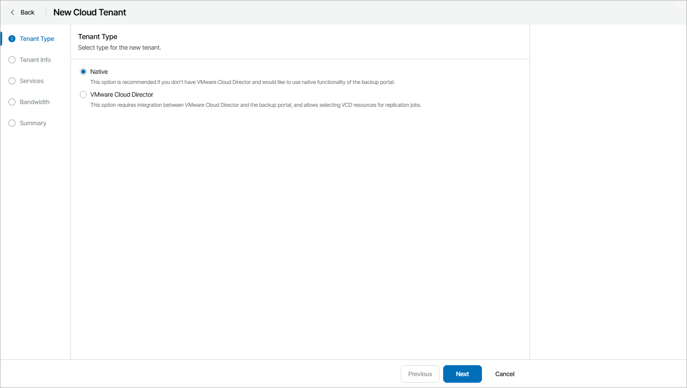

# Step 2. Select Cloud Tenant Type

At the Tenant Type step of the wizard, select the type of cloud tenant account you want to create in Veeam Cloud Connect:

* Native — choose this option to register in Veeam Backup & Replication a Veeam Cloud Connect tenant account.

Tenants with an account of this type can create backups in a cloud repository and create VM replicas on a cloud host provided to the tenant through a hardware plan.

* Cloud Director — choose this option to register in Veeam Backup & Replication a VMware Cloud Director tenant account.

Tenants with an account of this type can create backups in a cloud repository and create VM replicas on a cloud host provided to the tenant through an Organization vDC. For details on VMware Cloud Director tenant accounts, see section [VMware Cloud Director Tenant Account](https://helpcenter.veeam.com/docs/backup/cloud/cloud_vcloud_director_tenant.html) of the Veeam Cloud Connect Guide.

|  |
| --- |
| Note: |
| You cannot change cloud tenant type after the tenant account is created. |

