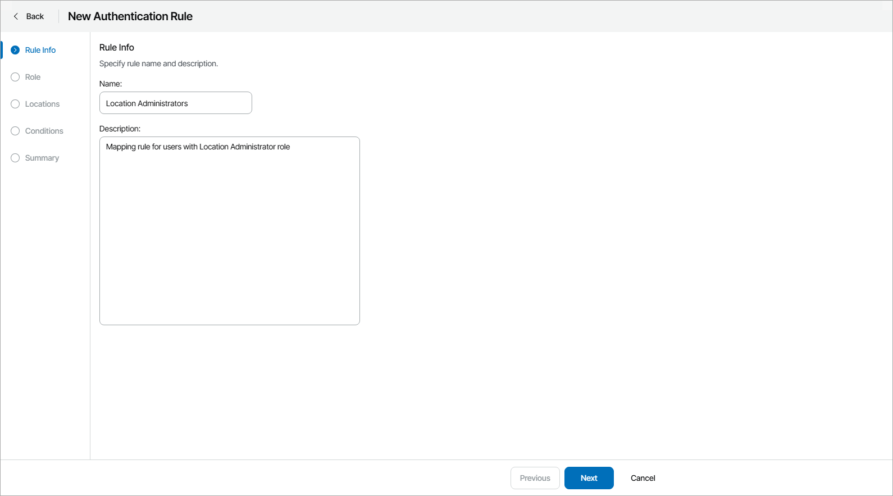
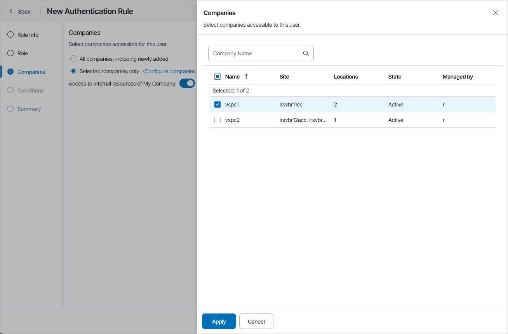
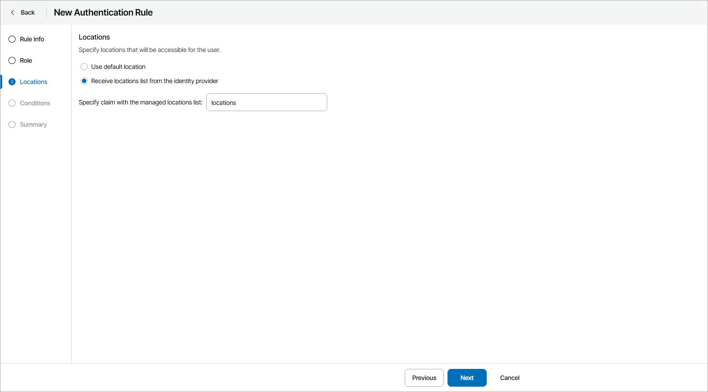
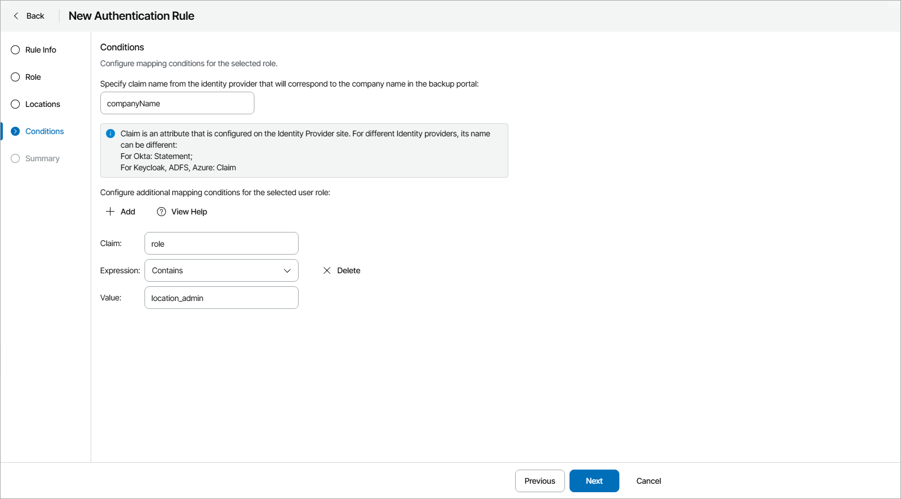
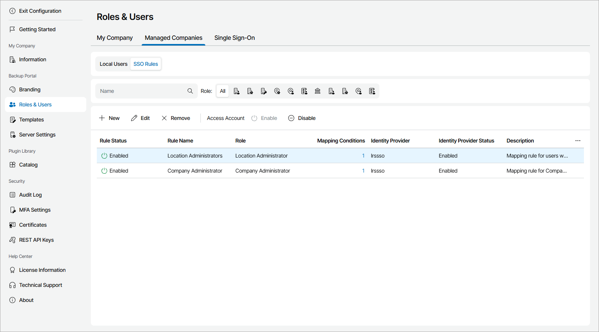

# Managing Mapping Rules

In Veeam Service Provider Console, mapping rule is a set of parameters that identifies a user by claim values in the SAML assertion and apply a specific role to an identity of that user. If a suitable user identity does not exist, Veeam Service Provider Console creates a new user identity with applied role.

Mapping rule is selected by matching claim values in the SAML assertion and in the rule configuration in the following order:

1. All mapping rules.
2. All enabled rules.
3. Rules with matching additional attributes.
4. Rules with matching organization attribute.
5. Rules for roles available in the matching organization.
6. Rules with the highest number of additional attributes.
7. Rule with the maximum privileges.

Required Privileges

To perform the following tasks, a user must have  the following role assigned: Portal Administrator.

Configuring Mapping Rules

To configure a mapping rule:

1. Log in to Veeam Service Provider Console.

For details, see [Accessing Veeam Service Provider Console](access_vac.md).

1. At the top right corner of the Veeam Service Provider Console window, click Configuration.
2. In the configuration menu on the left, click Roles & Users.
3. On the My Company or Managed Companies tab, navigate to SSO Rules.
4. At the top of the rules list, click New.

The New Authentication Rule wizard will open.

1. At the Rule Info step of the wizard, specify a name and description for the user identity.

1. At the Role step of the wizard, from the Role drop-down list, select a role that will be applied to the user.

For details on user roles, see [Managing Administrator Portal Users](manage_admin_portal_users.md).

1. At the next step, select companies or locations that must be assigned to a user:

* At the Companies step of the wizard, you can select, which scope of companies is available to the user. To do that:

1. Select the Selected companies only option.
2. Click the (Configure companies...) link.

The Companies window will open.

1. Select the companies that the user can manage and click Apply.

1. To allow the user access to your internal resources, set the Access to internal resources of My Company toggle to On.

Note that you cannot assign companies managed by resellers to Portal Operators and Read-only Users.

* [For the Location Administrator and Location User user roles] At the Locations step of the wizard, you can assign locations listed in the claim on the IdP side to a user identity. To do that:

1. Select the Receive locations list from the identity provider option.
2. In the Specify claim with the managed locations list field, specify the name of the IdP claim that contains a list of locations separated by semicolons.

Location list is compared with the set of the locations assigned to a company of a user. Matching locations are assigned to an SSO user identity.

1. At the Conditions step of the wizard, specify the name of the attribute that will be matched with the claim attribute containing the alias or name of the user organization.

You can provide additional mappings for more accurate rule selection. To do that:

1. Click Add.
2. In the Claim field, specify the name of the claim attribute.
3. From the Expression drop-down list, select the expression type.
4. In the Value field, specify the claim attribute value.

Note that for Regular expression expression type, you must specify the value in the .NET regular expression format. For details, see [Microsoft Documentation](https://docs.microsoft.com/en-us/dotnet/standard/base-types/regular-expressions).

You can add any number of additional mappings.

1. Click Next.
2. Review configured mapping rule and click Finish.

|  |
| --- |
| Important! |
| For IdP to successfully identify authorizing users, you must provide an email address of each user in the IdP service and in Veeam Service Provider Console. For details on how to add email address to a user profile in Veeam Service Provider Console, see [Filling User Profile](fill_user_profile.md). |

|  |
| --- |
| Note: |
| For users with the Service Provider Global Administrator and Company Owner roles assigned, new identities will not be created if matching identities are not found. To avoid authorization issues, make sure that email addresses are specified in the related company profiles as described in the [Step 2. Specify Reseller Details](specify_reseller_details.md) and [Step 2. Specify Company Details](specify_company_details.md) sections. |

Editing Mapping Rules

To edit mapping rule configuration:

1. Log in to Veeam Service Provider Console.

For details, see [Accessing Veeam Service Provider Console](access_vac.md).

1. At the top right corner of the Veeam Service Provider Console window, click Configuration.
2. In the configuration menu on the left, click Roles & Users.
3. On the My Company or Managed Companies tab, navigate to SSO Rules.
4. Select a mapping rule from the list.
5. At the top of the list, click Edit.

Alternatively, you can right-click the necessary mapping rule and choose Edit.

The Edit Authorization Rule wizard will open.

1. Modify mapping rule settings as described in [Creating Mapping Rules](#create_rule).
2. Click Finish.

Deleting Mapping Rules

You can delete mapping rules. After you delete a mapping rule, all user identities created using the rule are also deleted.

To delete a mapping rule:

1. Log in to Veeam Service Provider Console.

For details, see [Accessing Veeam Service Provider Console](access_vac.md).

1. At the top right corner of the Veeam Service Provider Console window, click Configuration.
2. In the configuration menu on the left, click Roles & Users.
3. On the My Company or Managed Companies tab, navigate to SSO Rules.
4. Select a mapping rule from the list.
5. At the top of the list, click Remove.

Alternatively, you can right-click the necessary mapping rule and choose Remove.

Disabling Mapping Rules

To prevent user identities created with a mapping rule from accessing Veeam Service Provider Console, you can disable that rule:

1. Log in to Veeam Service Provider Console.

For details, see [Accessing Veeam Service Provider Console](access_vac.md).

1. At the top right corner of the Veeam Service Provider Console window, click Configuration.
2. In the configuration menu on the left, click Roles & Users.
3. On the My Company or Managed Companies tab, navigate to SSO Rules.
4. Select a mapping rule from the list.
5. At the top of the list, click Disable.

Alternatively, you can right-click the necessary mapping rule and choose Disable.

Viewing Mapping Rule Details

To view details on configured mapping rules:

1. Log in to Veeam Service Provider Console.

For details, see [Accessing Veeam Service Provider Console](access_vac.md).

1. At the top right corner of the Veeam Service Provider Console window, click Configuration.
2. In the configuration menu on the left, click Roles & Users.
3. On the My Company or Managed Companies tab, navigate to SSO Rules.

Each mapping rule in the list is described with the following set of properties:

* Rule Status — mapping rule status.
* Rule Name — name of the mapping rule.
* Role — user role for which the mapping rule is configured.
* Mapping Conditions — number of mapping conditions.

You can click this property, to view details of the mapping conditions.

* Managed Companies — list of companies that are managed by the user.
* Identity Provider — display name of the IdP.
* Identity Provider Status — status of the IdP.
* Description — mapping rule description.

Importing and Exporting Identity Provider Mapping Rules

You can export mapping rules configured for an IdP and import them to another IdP. To do that:

1. Log in to Veeam Service Provider Console.

For details, see [Accessing Veeam Service Provider Console](access_vac.md).

1. At the top right corner of the Veeam Service Provider Console window, click Configuration.
2. In the configuration menu on the left, click Roles & Users.
3. Open the Single Sign-On tab.
4. Select the identity provider whose mapping rules you want to export.
5. From the Configuration drop-down list, select Export Mapping Rules.

Alternatively, you can right-click the necessary identity provider, choose Configuration and select Export Mapping Rules.

The JSON file containing mapping rules will be automatically downloaded to your computer.

1. Select the identity provider to which you want to import mapping rules.
2. From the Configuration drop-down list, select Import Mapping Rules.

Alternatively, you can right-click the necessary identity provider, choose Configuration and select Import Mapping Rules.

The file explorer window will open.

1. Select the previously downloaded JSON file.

