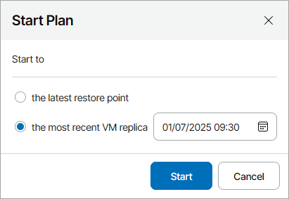

# Starting Failover Plans

You can start a failover plan without accessing the Veeam Backup & Replication console on a managed backup server.

Required Privileges

To perform this task, a user must have one of the following roles assigned: Portal Administrator, Site Administrator, Portal Operator.

Starting Failover Plans

1. Log in to Veeam Service Provider Console.

For details, see [Accessing Veeam Service Provider Console](access_vac.md).

1. In the menu on the left, click Failover Plans.
2. Select one or more plans in the list.
3. At the top of the list, click Start.

Alternatively, you can right-click the necessary failover plan and choose Start.

1. In the Start Plan window, select the restore point to which you want to fail over:

* Select the Start to the latest restore point option to fail over to the latest VM replica restore point.

Veeam Service Provider Console will search for the latest restore point for each VM replica across all replication jobs that are configured on the backup server.

* Select the Start to the most recent VM replica option and set the date and time to fail over to a specific VM replica restore point.

Veeam Service Provider Console will search for the closest restore point prior to the specified date and time for each VM replica across all replication jobs that are configured on the backup server.

1. Click Start.

