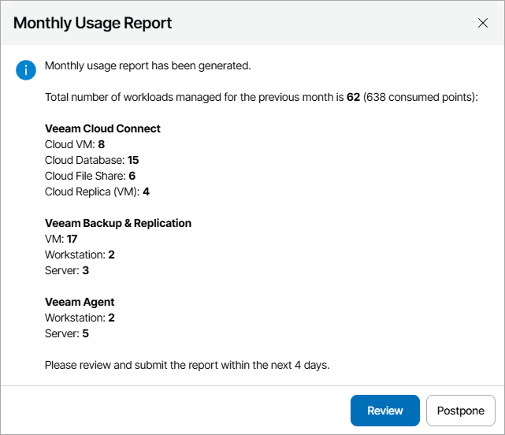
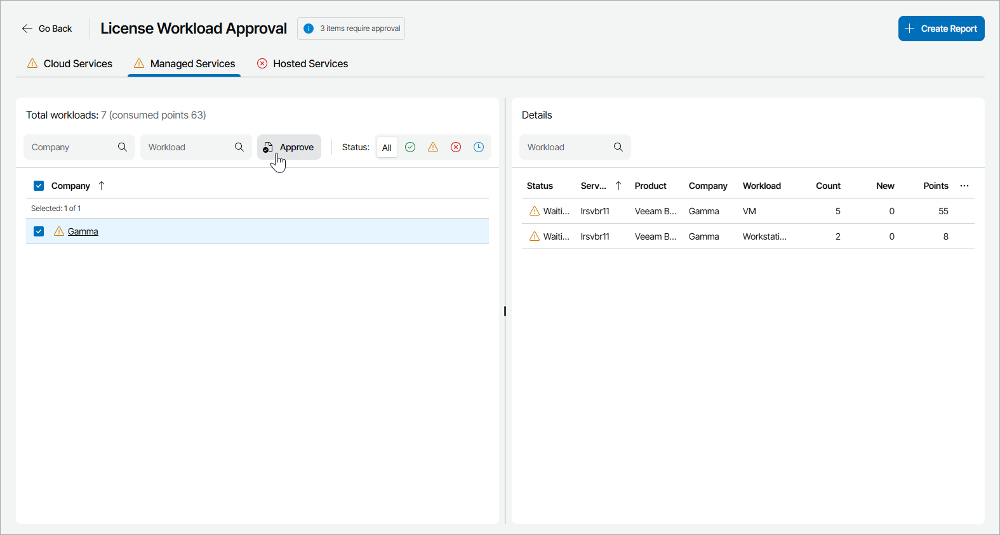
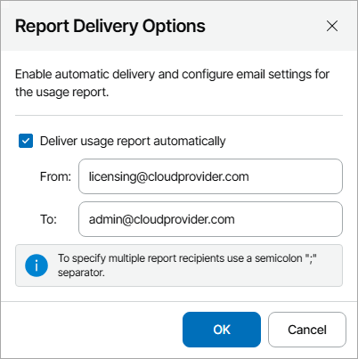

# Submitting License Usage Report

If you use a Rental license for Veeam Service Provider Console, you must submit a license usage report to Veeam every month. The license usage report shows the maximum number of workloads that were managed in Veeam Service Provider Console within the previous calendar month.

The license usage report is required for a license update. By comparing the number of managed workloads in the monthly report, Veeam can decide whether to allow a license update. If the monthly usage report does not deviate significantly from the highest watermark value, the license will be updated.

How License Usage Reporting Works

On the first day of the new month, Veeam Service Provider Console generates a single license usage report based on the maximum number of managed Veeam backup agents for the previous month. For Veeam Backup & Replication, Veeam ONE and Veeam Backup for Microsoft 365, Veeam Service Provider Console also collects the number of workloads stored in the cloud and managed workloads for separate companies.

Veeam Service Provider Console informs you about the generated report with a notification displayed when you access Veeam Service Provider Console as a Portal Administrator. You can review the report in Veeam Service Provider Console, approve it, and send it to Veeam. For details, see [How to Submit License Usage Report](submit_license_usage_report.md#submit).

If you do not want to approve license usage data manually, you can instruct Veeam Service Provider Console to approve and send reports automatically as soon as license usage data is collected. For details, see [Enabling Automatic Report Approval](submit_license_usage_report.md#auto).

Enabling Automatic Report Approval

To enable automatic report approval:

1. Log in to Veeam Service Provider Console.

For details, see [Accessing Veeam Service Provider Console](access_vac.md).

1. At the top right corner of the Veeam Service Provider Console window, click Configuration.
2. In the menu on the left, click License Information.
3. Navigate to the Usage Reports tab.
4. At the top of the page, set the Automatic Report Approval toggle to On.

|  |
| --- |
| Note: |
| If you turn on Automatic Report Approval in the Administrator Portal, Veeam Service Provider Console will propagate this setting to all managed resellers. |

How to Submit License Usage Report

Starting from the first day of the month (and up to, and including the fifth day of the month), when you access Veeam Service Provider Console as a Portal Administrator, the product will notify you that a license usage report was generated.

|  |
| --- |
| Tip: |
| To postpone submission of a license usage report, in the notification window click Postpone. The notification will not be displayed until the next day. |

To open the license usage report tab, in the notification window, click Review.

Alternatively, you can access the license usage report tab in the following way:

1. At the top right corner of the Veeam Service Provider Console window, click Configuration.
2. In the menu on the left, click License Information.
3. Open the Usage Reports tab.

To narrow down the list of reports in the list, you can use the following filters:

* Status — limit the list of reports by approval status (Approved, Waiting for Approval).
* Period — limit the list of reports by time period when the reports were generated.

1. Choose the report with the Waiting for Approval status in the list and click a link in the Status column.

Veeam Service Provider Console will open a license usage report in a new tab.

1. On the Cloud Services, Managed Services and Hosted Services tabs, review the workloads count and click Approve.

1. To submit the report to Veeam, click the Create Report button.

Veeam Service Provider Console will finalize the license usage report and send it to Veeam Licensing Server. The report is also saved as a PDF file. For details on accessing finalized reports, see [Viewing License Usage Reports](view_license_usage_report.md).

If you do not finalize the report, on the third day of the month, Veeam Service Provider Console will approve and generate the finalized report automatically.

To submit license usage to your aggregator, use VCSP Pulse Portal. For details, see section [Submitting License Usage](https://helpcenter.veeam.com/docs/vcsp/refguide/using_vcsp_pulse.html#submitting-license-usage) of the Veeam Rental Licensing and Usage Reporting Reference Guide.

If you want to automatically report on consumed licenses to VCSP Pulse, you can enable automatic reporting. For details, see section [Automatic License Reporting](https://helpcenter.veeam.com/docs/vcsp/refguide/automatic_license_reporting.html) of the Veeam Rental Licensing and Usage Reporting Reference Guide.

Configuring Report Delivery Options

You can additionally configure the delivery of license usage report to any email address as soon as the report is finalized.

|  |
| --- |
| Note: |
| To send out notifications by email, Veeam Service Provider Console requires an SMTP server. For details, see [Configuring SMTP Server Settings](configure_email_settings.md#smtpServer). |

To enable automatic report delivery:

1. Log in to Veeam Service Provider Console.

For details, see [Accessing Veeam Service Provider Console](access_vac.md).

1. At the top right corner of the Veeam Service Provider Console window, click Configuration.
2. In the menu on the left, click License Information.
3. Navigate to the Usage Reports tab.
4. At the top of the page, click the Configure Settings link.
5. In the Report Delivery Options window, select the Deliver usage report automatically check box and specify the following details:

* In the From field, specify an email address from which notifications must be sent.
* In the To field, specify an email address at which notifications must be sent.

You can specify multiple addresses separated with semicolons.

* If you want to include in the email a CSV file with the usage report data, select the Include CSV report in the email check box.

1. Click OK.

