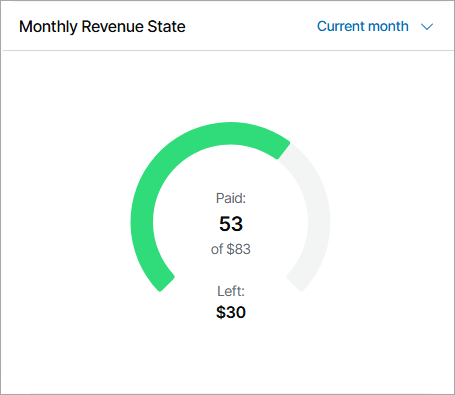
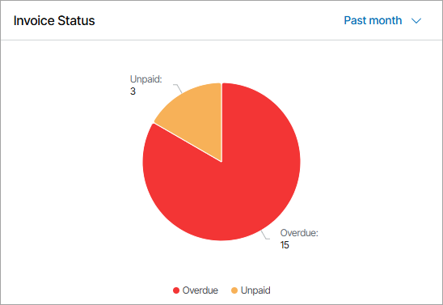
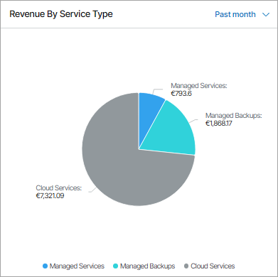
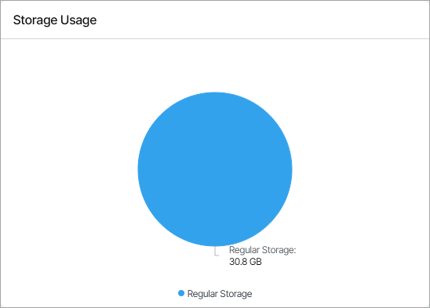
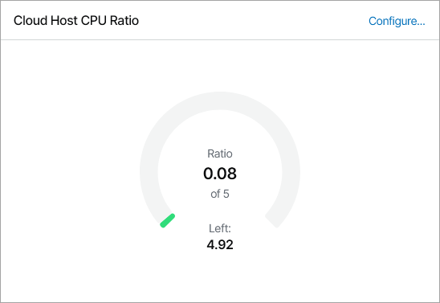

# Resources & Billing

You can view summary information about revenue, invoice statuses, payments and utilized cloud resources in the Resources & Billing dashboard.

Required Privileges

To perform this task, a user must have one of the following roles assigned: Portal Administrator, Site Administrator, Portal Operator, Read-only User.

Accessing Resources & Billing Dashboard

To access the dashboard:

1. Log in to Veeam Service Provider Console.

For details, see [Accessing Veeam Service Provider Console](access_vac.md).

1. In the menu on the left, click Resources & Billing.
2. To show data for a specific Veeam Cloud Connect site, reseller and company, use the sites and reseller/company filters at the top left corner of the Veeam Service Provider Console window.

The dashboard includes two views — Invoices and Cloud Connect Resources. The Cloud Connect Resources view includes Backup and Replication tabs.

To access the Invoices view of the dashboard, you must have at least one managed client company with a subscription plan assigned.

Invoices

This dashboard view shows summary information about the revenue state, payments and invoice statuses.

The dashboard view includes the following widgets:

* Monthly Revenue State widget shows the total amount of received and pending payments, and the total amount of payments in invoices generated for the selected period of time.

By default, the widget shows revenue for the past month. To display the amount of payments for the current month, past quarter or past year, use the list next to the widget name.

* Invoice Status widget shows the number of paid, unpaid and overdue invoices.

By default, the widget shows invoice status for the past month. To display the invoice status for the current month, past quarter or past year, use the list next to the widget name.

* Revenue by Service Type widget shows a breakdown of revenue by service.

By default, the widget shows data for the previous calendar month. To display data for the current month, past quarter or past year, use the list next to the widget name.

Cloud Connect Backup Resources

This dashboard view shows summary information about Veeam Cloud Connect backup resources consumed by companies.

The dashboard view includes the following widgets:

* Used Storage Quota widget for Portal Administrator shows the total amount of space available on backup repositories, the amount of space allocated to companies, and the amount of unallocated space. For Site Administrator and Portal Operator, the widget shows the total amount of space allocated for the client companies on all cloud repositories, the amount of used and remaining space.

* Storage Usage widget shows the amount of cloud storage space used for performance, capacity and archive tier, block storage and object storage backups. The widget counts the amount of space used by scale-out backup repository policies and reduced by storage deduplication.

* Stored Workloads widget shows the number of workload restore points stored on cloud repositories.

* Data Transfer Out widget shows the data transfer out quota set on backup repositories, the amount of data already downloaded from cloud repositories during the current billing period (length of time between two successive invoices), and the remaining data transfer out quota.

The widgets of this view allow you to reveal potential problems with overprovisioning of cloud resources: if the amount of allocated resources is greater than 100%, the chart will display an error.

Cloud Connect Replication Resources

This dashboard view shows summary information about Veeam Cloud Connect replication resources consumed by companies.

The dashboard view includes the following widgets:

* Cloud Host CPU Ratio widget for Portal Administrator shows the current vCPU per core ratio. The widget counts the current ratio by dividing the number of the used vCPUs by the total number of available physical cores. For all roles except for Portal Administrator the widget shows the number of cloud VM replicas on the selected hardware plan and the number of vCPUs used by these replicas.

By default, the widget assumes that the expected vCPU per core ratio is 5. Click the Configure link next to the widget name to specify a different vCPU per core ratio.

By default, the widget shows information for all hardware plans by which the company is subscribed. To choose a specific hardware plan, use the list at the top of the widget.

* Cloud Host Memory widget shows the amount of memory resources on cloud hosts, the amount of memory resources allocated to companies, and the amount of unallocated memory.

* Cloud Host Storage widget shows the amount of space on cloud storage that can be used by cloud VM replicas, the amount of space allocated to companies, and the amount of unallocated space.

The widgets of this view allow you to reveal potential problems with overprovisioning of cloud resources: if the amount of allocated resources is greater than 100%, the chart will display an error.

