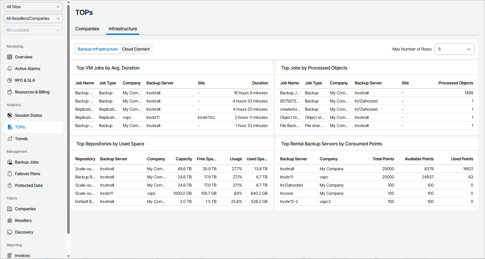
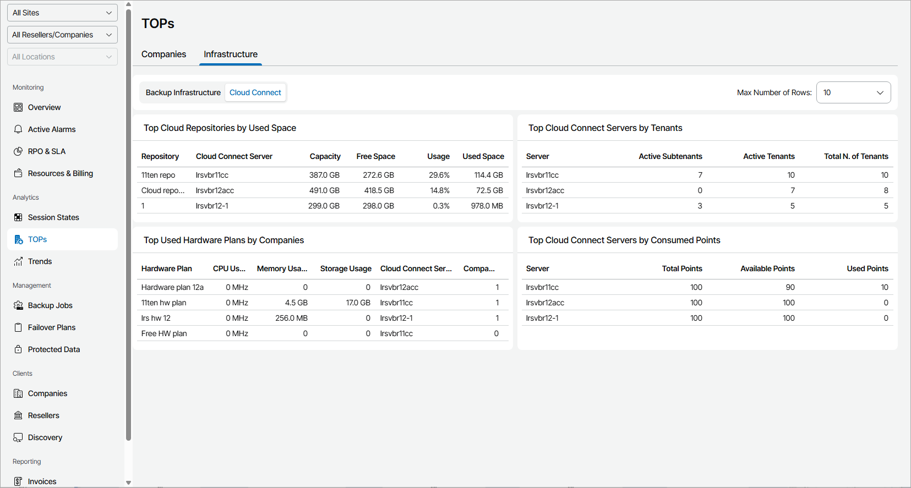

# Infrastructure

The Infrastructure view provides information on managed backup and cloud infrastructures, including jobs, backup servers, backup and cloud repositories, and so on.

To change the maximum number of rows that widgets can display, use the Max number of rows drop-down at the top left corner of the Veeam Service Provider Console window.

Use navigation bar at the top of the page to view information on the following infrastructure types:

* [Backup Infrastructure](#backup)

* [Cloud Connect](#cloud)

|  |
| --- |
| Note: |
| The Cloud Connect view is not available for Portal Operators or Read-only Users. |

Viewing Backup Infrastructure TOPs

The Backup Infrastructure view includes the following widgets:

* Top VM Jobs by Avg. Duration widget shows jobs with the greatest average amount of time taken to complete job session during the last 7 days. For each job, the widget details the job name, job type, a client company and backup server where the job is configured, Veeam Cloud Connect site on which the company is registered, and average weekly job duration.

Note that the widget does not include SureBackup jobs.

* Top Jobs by Processed Objects widget shows Veeam Backup & Replication and Veeam backup agents jobs with the greatest number of objects processed during the latest job session.
* Top Repositories by Used Space widget shows repositories with the greatest amount of used space, as a percentage of available space. For each repository, the widget details total repository capacity in GB, amount of used space in GB, amount of free space in GB, and a percentage of used space.
* Top Rental Backup Servers by Consumed Points widget shows Veeam Backup & Replication servers with the greatest number of consumed points. For each server, the widget details total number of points, number of used points and number of available points.

Viewing Cloud Connect TOPs

The Cloud Connect view includes the following widgets:

* Top Cloud Repositories by Used Space widget shows cloud repositories with the greatest amount of used space, as a percentage of available space. For each cloud repository, the widget details amount of used space in GB, amount of free space in GB, and a percentage of used space.
* Top Cloud Connect Servers by Tenants widget shows cloud servers with the greatest number of tenants. For each cloud server, the widget details number of active tenants and subtenants and the total number of tenants.
* Top Used Hardware Plans by Companies widget shows hardware plans with the greatest number of subscribed companies.
* Top Cloud Connect Servers by Consumed Points widget shows cloud servers with the greatest number of consumed points. For each cloud server, the widget details total number of points, number of used points and number of available points.

