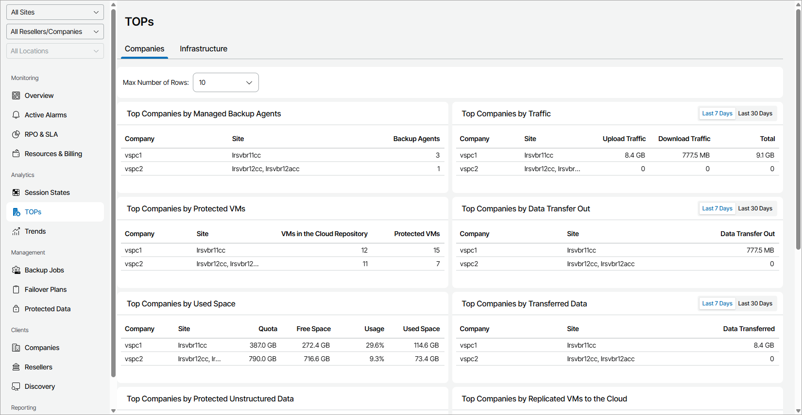

# Companies

The Companies view provides information about top consumers among client companies in terms of used cloud resources, managed Veeam backup agents and VMs, transferred data, and so on.

To change the maximum number of rows that widgets can display, use the Max Number of Rows drop-down list at the top of the dashboard.

The dashboard includes the following widgets:

* Top Companies by Managed Backup Agents widget shows companies with the greatest number of managed Veeam backup agents.
* Top Companies by Traffic widget shows companies that generated the greatest amount of backup traffic. For each company, the widget details the amount of traffic uploaded to cloud repositories and cloud hosts, and the amount of traffic downloaded from the cloud.

By default, the widget shows traffic for the last 7 days. To display the amount of traffic generated for the last 30 days, use the list next to the widget name.

* Top Companies by Protected VMs widget shows companies with the greatest number of protected VMs. For each company, the widget details the number of protected VMs, and the number of VMs stored in backups in cloud repositories.
* Top Companies by Data Transfer Out widget shows companies that downloaded the greatest amount of data from cloud repositories and cloud storage.

By default, the widget shows data transfer out traffic for the last 7 days. To display the amount of traffic generated for the last 30 days, use the list next to the widget name.

* Top Companies by Used Space widget shows companies that consume the greatest amount of cloud repository space, as a percentage of allocated space. For each company, the widget details the cloud repository quota (total allocated space on cloud repositories), total used space in GB, total free space in GB, and percentage of used space. For the used space value, the widget counts only the total size of backup files and does not count the space used by scale-out backup repository policies or reduced by storage deduplication.
* Top Companies by Transferred Data widget shows companies that uploaded the greatest amount of data to cloud repositories and cloud hosts.

By default, the widget shows the amount of data transmitted for the last 7 days. To display the amount of data transmitted for the last 30 days, use the list next to the widget name.

* Top Companies by Protected Unstructured Data widget shows companies with the greatest size of protected files at the source file shares and object storage. For each company, the widget details the number of managed storage, the size of files stored in backup and archive repositories, and the size of protected data at the source storage.
* Top Companies by Replicated VMs to the Cloud widget shows companies with the greatest number of managed cloud replica VMs.
* Top Companies by Microsoft 365 Users widget shows companies with the greatest number of protected Veeam Backup for Microsoft 365 users.
* Top Companies by Microsoft 365 Groups widget shows companies with the greatest number of protected Veeam Backup for Microsoft 365 groups.
* Top Companies by Protected Cloud Workloads widget shows companies with the greatest number of protected cloud workloads, including VMs, file shares and databases.
* Top Companies by Monitored Workloads widget shows companies with the greatest number of workloads monitored by connected Veeam ONE servers.

