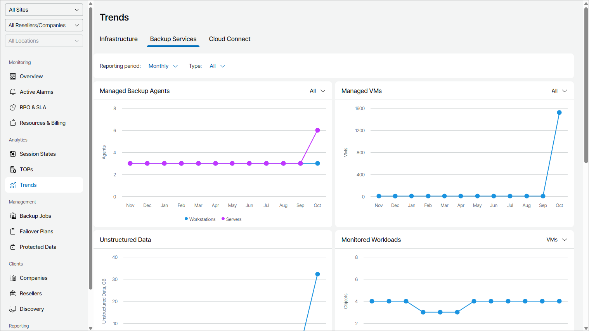

# Backup Services

The Backup Services view provides summary information on managed Veeam backup agents and VMs, monitored and protected workloads for client and hosted backup infrastructures.

By default, the dashboard represents monthly trends for client and hosted infrastructures. You can change reporting period to Weekly option by selecting it from the Reporting period drop-down list and represented infrastructure by selecting Client or Hosted option from the Type drop-down list.

The dashboard includes the following widgets:

* Managed Backup Agents widget shows how the number of managed Veeam backup agents has been changing during the reporting period. Use the filter at the top right corner of the widget to view information on selected Veeam backup agent management type (All, Managed by Console, Managed by Backup Server).

* Managed VMs widget shows how the number of managed VMs has been changing during the reporting period. Use the filter at the top right corner of the widget to view information on selected VM platform (All, vSphere, Hyper-V, Other).
* Unstructured Data widget shows how the amount of protected data on managed file shares and object storage has been changing during the reporting period. The widget shows the total size of protected files and the size of protected backup and archive files.
* Monitored Workloads widget shows how the number of workloads monitored by connected Veeam ONE servers has been changing during the reporting period. Use the filter at the top right corner of the widget to view information on a selected object (VMs, Agents, Application, File Shares, Cloud VMs, Cloud Databases, Cloud File Shares, Microsoft 365 (10 Users Pack)).

* Protected Microsoft 365 Objects widget shows how the number of objects protected with managed Veeam Backup for Microsoft 365 has been changing during the reporting period. Use the filter at the top right corner of the widget to view information on a selected object (Users, Groups, Sites, Teams).

* Protected AWS Workloads widget shows how the number of protected Amazon Web Services workloads has been changing during the reporting period. Use the filter at the top right corner of the widget to view information on a selected object (EC2, EFS, FSx, RDS, DynamoDB, Redshift Clusters, Redshift Serverless, VPC).

* Protected Azure Workloads widget shows how the number of protected Microsoft Azure workloads has been changing during the reporting period. Use the filter at the top right corner of the widget to view information on a selected object (VMs, Azure SQL Databases, Azure Cosmos Databases, Azure Files, Virtual Networks).
* Protected Google Cloud Workloads widget shows how the number of protected Google Cloud workloads has been changing during the reporting period. Use the filter at the top right corner of the widget to view information on a selected object (VMs, Cloud SQL Databases, Cloud Spanner).

