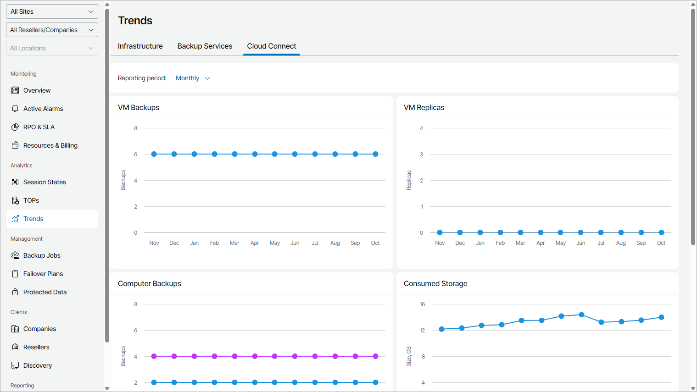

# Cloud Connect

The Cloud Connect dashboard provides information about the Veeam Cloud Connect infrastructure health state, consumed and available repository resources, as well as hardware plan configuration details.

By default, the dashboard represents trends for each month. You can change that to Weekly option by selecting it from the Reporting period drop-down list.

The dashboard includes the following widgets:

* VM Backups widget shows how the number of VMs backed up to cloud repositories has been changing during the reporting period.

* VM Replicas widget shows how the number of VMs replicated to cloud repositories has been changing during the reporting period.
* Computer Backups widget shows how the number of Veeam backup agents backed up to cloud repositories has been changing during the reporting period.

* Consumed Storage widget shows how the amount of consumed cloud storage has been changing during the reporting period.

* Storage Usage widget shows how the amount of space used on scale-out backup repositories has been changing during the reporting period. The widget includes total usage data and usage data for performance, capacity and archive tiers, object storage and regular storage.

