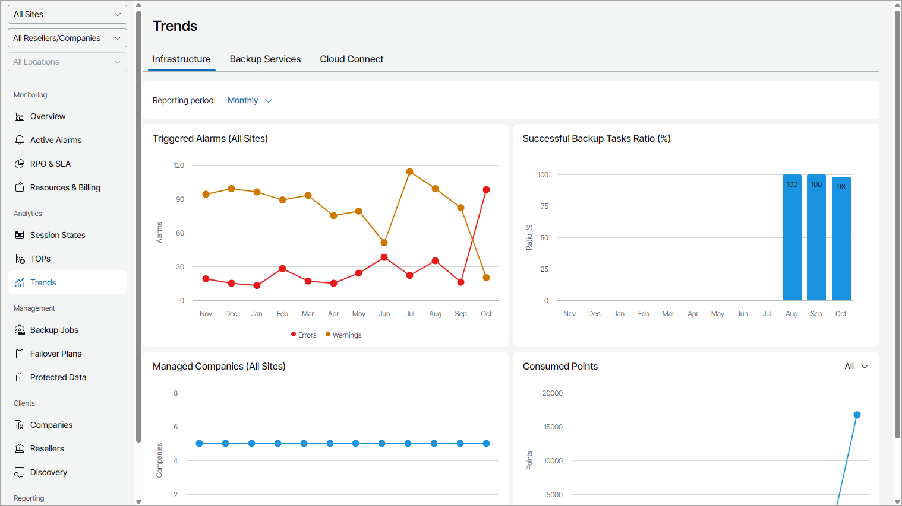

# Infrastructure

The Infrastructure view provides summary information on the number of triggered alarms, successful backup tasks ratio, the number of managed companies and the number of consumed points during the reporting period.

By default, the dashboard represents trends for each month. You can change that to Weekly option by selecting it from the Reporting period drop-down list.

The dashboard includes the following widgets:

* Triggered Alarms (All Sites) widget shows how the numbers of unresolved warning and error alarms has been changing during the reporting period.

* Successful Backup Tasks Ratio (%) widget shows how the percentage of successful backup tasks has been changing during the reporting period.
* Managed Companies (All Sites) widget shows how the number of managed companies has been changing during the reporting period.
* Consumed Points widget shows how the number of points consumed by managed Veeam products has been changing during the reporting period. Use the filter at the top right corner of the widget to view information on a selected Veeam product (Veeam Backup & Replication, Veeam Cloud Connect, Veeam ONE, Veeam Service Provider Console, Veeam Backup for Microsoft 365).

