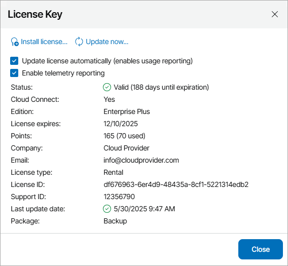

# Updating License Automatically

You can instruct Veeam Service Provider Console to update the license automatically. Automatic license update removes the need to perform license update manually each time it is about to expire. If automatic license update is enabled, Veeam Service Provider Console proactively communicates with the Veeam License Update Server to obtain and install a new license before the current license expires.

How Automated License Update Works

The process of automatic license update is performed in the following way:

1. After you enable automatic license update, Veeam Service Provider Console starts sending weekly requests to the Veeam License Update Server on the Internet, and checks if a new license is available.

Seven days before expiration of the current license, Veeam Service Provider Console starts sending requests once a day.

1. When a new license becomes available, Veeam Service Provider Console automatically downloads and installs it to replace the old license.

If Veeam Service Provider Console fails to update the license, it triggers the Veeam Service Provider Console license update failure alarm, and retries to update the license. The retry period ends one month after the license expiration date or the support expiration date (whichever is earlier). The retry period is equal to the number of days in the month of license expiration. For example, if the license expires in January, the retry period will be 31 day; if the license expires in April, the retry period will be 30 days.

How to Enable Automatic License Update

By default, automatic license update is disabled. To facilitate the license update process, you must enable it.

|  |
| --- |
| Note: |
| Enabling license auto update activates [License Usage Statistics](usage_logging.md). You cannot use license auto update without automatic usage reporting.  For Evaluation and NFR licenses, automatic license update and automatic usage reporting is enabled by default and cannot be disabled. |

To enable automatic license update:

1. Log in to Veeam Service Provider Console.

For details, see [Accessing Veeam Service Provider Console](access_vac.md).

1. At the top right corner of the Veeam Service Provider Console window, click Configuration.
2. In the menu on the left, click License Information.
3. On the Overview tab, click the license status link.
4. In the License Key window, select the Update license automatically (enables usage reporting) check box.

If you want to allow Veeam Service Provider Console to send telemetry logs to Veeam, select the Enable telemetry reporting check box.

1. Click Close.

