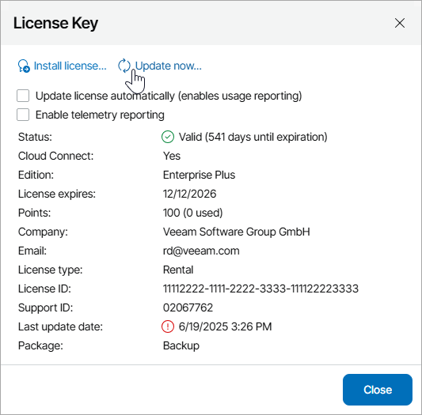

# Updating License Manually

You can update the Veeam Service Provider Console license from the Veeam License Update Server manually, on demand. When you update the license manually, Veeam Service Provider Console connects to the Veeam License Update Server on the Internet, downloads a new Veeam Service Provider Console license from it (if the license is available), and installs it to replace the old license.

To update the license manually:

1. Log in to Veeam Service Provider Console.

For details, see [Accessing Veeam Service Provider Console](access_vac.md).

1. At the top right corner of the Veeam Service Provider Console window, click Configuration.
2. In the menu on the left, click License Information.
3. On the Overview tab, click the License Status link.
4. In the License Key window, click Update now.

Veeam Service Provider Console will connect to the Veeam License Update Server on the Internet, download a new product license from it (if available), install it, and display a dialog box with the license update status.

1. Click OK in the displayed dialog box to acknowledge the license update result.

