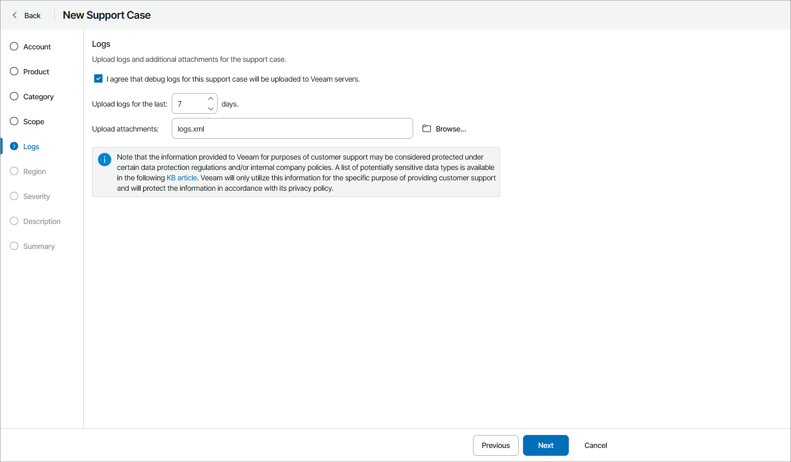

# Step 9. Upload Logs and Attachments

At the Logs step of the wizard, specify which log files you want to attach to the support case:

* If you want Veeam Service Provider Console to automatically attach log files to the support case, select the I agree that debug logs for this support case will be uploaded to Veeam servers check box and specify a number of days for which you want to gather logs from Veeam Service Provider Console Server and UI components and managed Veeam products.

Attached logs will depend on the Veeam product and managed objects in the case scope.

* If you want to upload logs manually or attach additional files to the support case, in the Upload attachments field click Browse and select files that must be attached to the support case.

