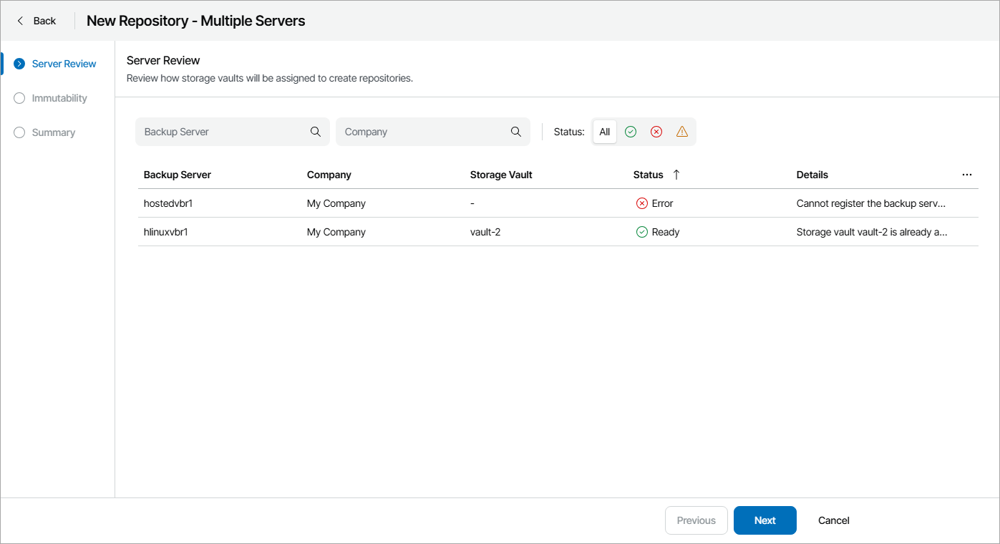
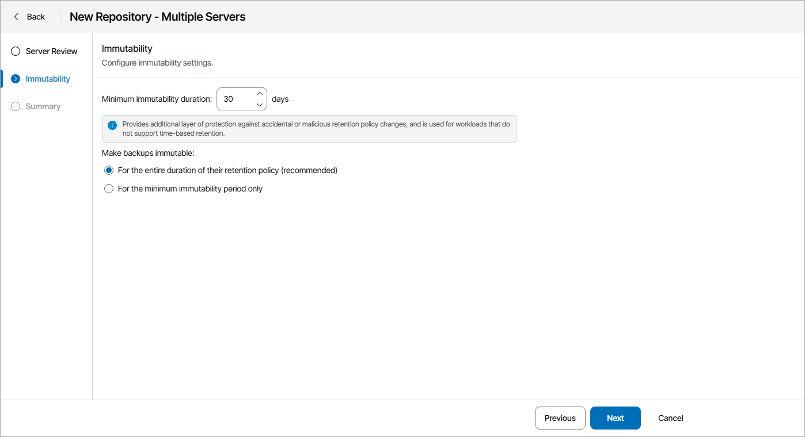
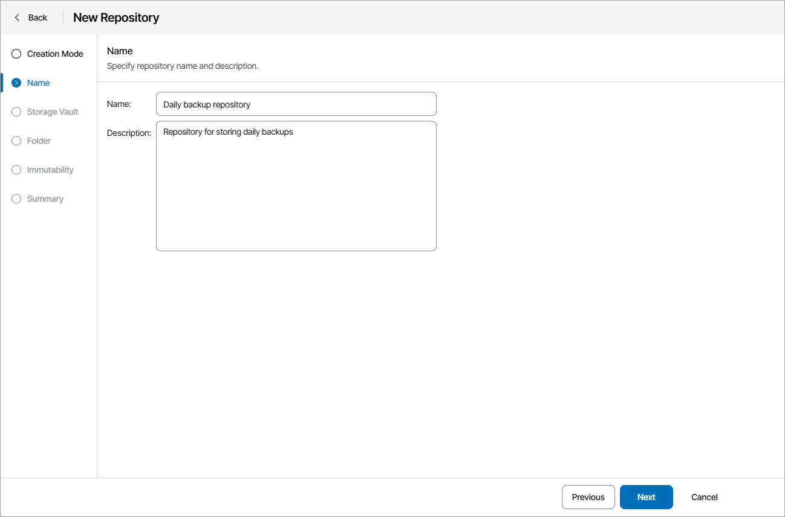
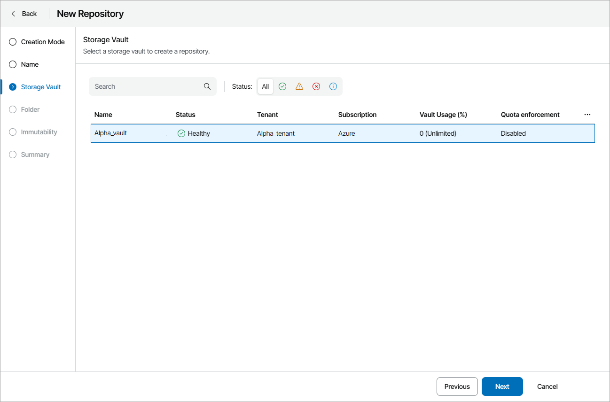
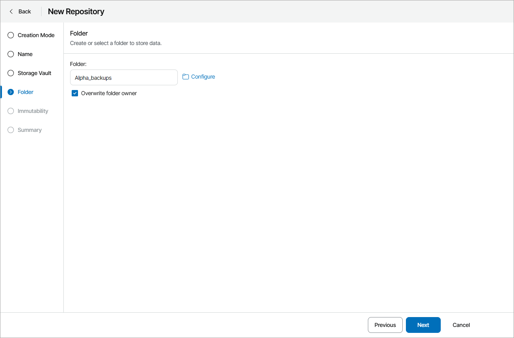
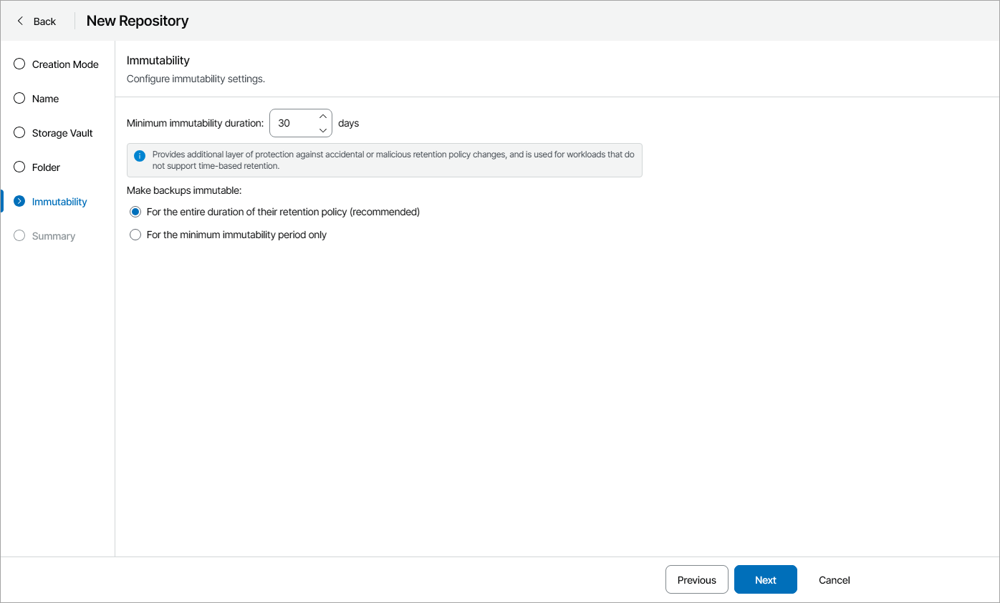

# Creating Backup Repositories

To target backup jobs to Veeam Data Cloud Vault, you must add the storage vault as a repository to your backup infrastructure.

In Veeam Service Provider Console plugin, you can create new repositories using the following ways:

* [Simple Mode](#simple) — use this mode to create repositories for multiple companies at the same time, if each company has only one vault tenant and one storage vault assigned.

In this mode, Veeam Service Provider Console will register Veeam Backup & Replication servers in Veeam Data Cloud as part of the repository creation process. Folder and repository names will be assigned automatically based on the backup server names.

* [Advanced Mode](#advanced) — use this mode to manually select a storage vault and a folder for a backup repository.

In this mode, you can create only one repository at a time.

Creating Backup Repositories in Simple Mode

To create repositories:

1. Log in to Veeam Service Provider Console.

For details, see [Accessing Veeam Service Provider Console](access_vac.md).

1. At the top right corner of the Veeam Service Provider Console window, click Configuration.
2. In the configuration menu on the left, click Catalog.
3. Click the Veeam Vault plugin tile.
4. In the menu on the left, click Backup Servers.
5. Select one or more servers in the list.
6. At the top of the list, click New Repository.

Veeam Service Provider Console will open the New Repository wizard.

1. If at step 6 you selected one backup server, at the Creation Mode step of the wizard, select Simple.
2. At the Server Review step of the wizard, review vault assignments for Veeam Backup & Replication servers.

Note that repositories will be created only for backup servers that have a Ready status.

1. At the Immutability step of the wizard, specify immutability settings:

* Select For the entire duration of their retention policy if you want the immutability period to depend on the retention policy of a backup job.

|  |
| --- |
| Important! |
| Consider the following:   * If the job retention exceeds the immutability period, the actual retention is calculated as job retention policy + Block Generation period. * If the immutability period exceeds the job retention period, the actual retention is counted as immutability period + Block Generation period.   For more information, see section [How Immutability Works](https://helpcenter.veeam.com/docs/vbr/userguide/hiw_immutability_os.html) in the Veeam Backup & Replication User Guide. |

* Select For the minimum immutability period only if you want to specify the immutability period explicitly. The backup job retention will be skipped.
* In the Minimum immutability duration field, specify immutability period in days.

1. At the Summary step of the wizard, review repository settings and click Finish.

Creating Backup Repositories in Advanced Mode

To create a new backup repository:

1. Log in to Veeam Service Provider Console.

For details, see [Accessing Veeam Service Provider Console](access_vac.md).

1. At the top right corner of the Veeam Service Provider Console window, click Configuration.
2. In the configuration menu on the left, click Catalog.
3. Click the Veeam Vault plugin tile.
4. In the menu on the left, click Backup Servers.
5. Select the necessary server in the list.
6. At the top of the list, click New Repository.
7. Veeam Service Provider Console will open the New Repository wizard.
8. At the Creation Mode step of the wizard, select Advanced.
9. At the Name step of the wizard, specify backup repository name and description.

1. At the Storage Vault step of the wizard, select a storage vault for which you want to create a repository.

1. At the Folder step of the wizard, click Configure and specify the folder that will be used to store data.

To create a new folder:

1. Click New folder.
2. In the New Folder window, specify folder name and click OK.
3. In the folder list, select the created folder and click Select.

If the selected folder belongs to another backup server, select the Overwrite folder owner check box to assign the folder to the selected server.

|  |
| --- |
| Note: |
| If you want to create multiple repositories for one Veeam Backup & Replication server, make sure to create a separate folder for each repository. |

1. At the Immutability step of the wizard, specify immutability settings:

* Select For the entire duration of their retention policy if you want the immutability period to depend on the retention policy of a backup job.

|  |
| --- |
| Important! |
| Consider the following:   * If the job retention exceeds the immutability period, the actual retention is calculated as job retention policy + Block Generation period. * If the immutability period exceeds the job retention period, the actual retention is counted as immutability period + Block Generation period.   For more information, see section [How Immutability Works](https://helpcenter.veeam.com/docs/vbr/userguide/hiw_immutability_os.html) in the Veeam Backup & Replication User Guide. |

* Select For the minimum immutability period only if you want to specify the immutability period explicitly. The backup job retention will be skipped.
* In the Minimum immutability duration field, specify immutability period in days.

1. At the Summary step of the wizard, review repository settings and click Finish.

