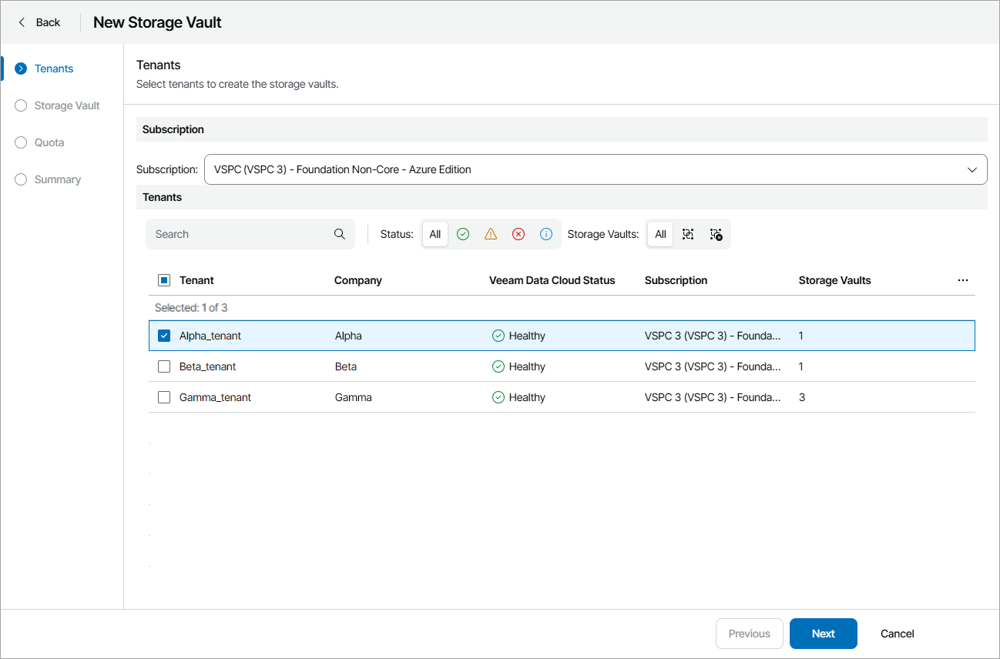
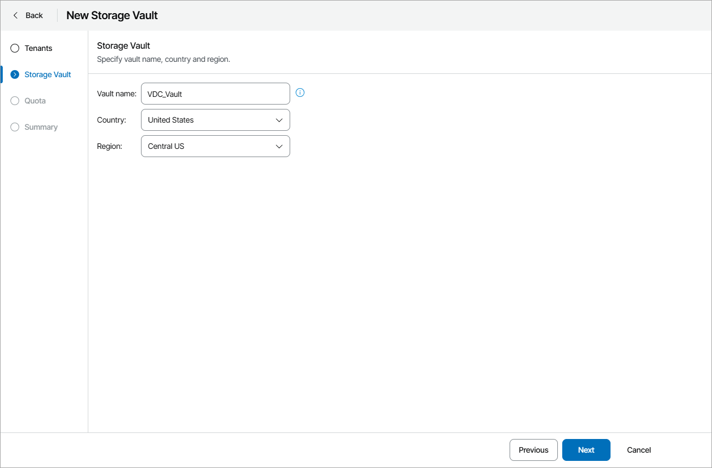
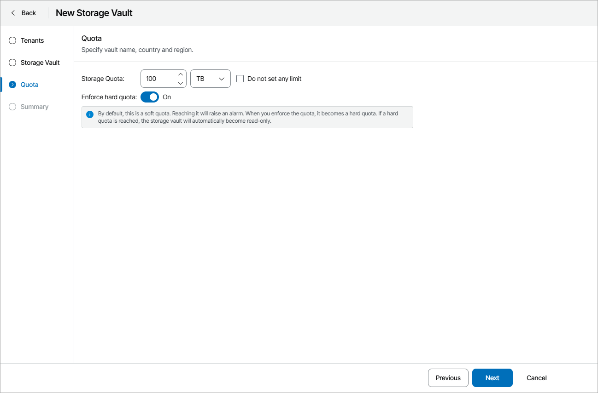

# Creating Storage Vaults

To create a new storage vault:

1. Log in to Veeam Service Provider Console.

For details, see [Accessing Veeam Service Provider Console](access_vac.md).

1. At the top right corner of the Veeam Service Provider Console window, click Configuration.
2. In the configuration menu on the left, click Catalog.
3. Click the Veeam Vault plugin tile.
4. In the menu on the left, click Veeam Data Cloud.
5. Navigate to the Storage Vaults tab.
6. At the top of the list, click New.

Veeam Service Provider Console will open the New Storage Vault wizard.

1. At the Tenants step of the wizard, select Veeam Data Cloud subscription and tenant for which you want to create a vault.

1. At the Storage Vault step of the wizard, specify vault name and select country and region where you want to create a vault.

If at the Tenants step you have selected multiple tenants, vault names will be assigned automatically based on the tenant names. The selected country and region will apply to all created vaults.

1. At the Quota step of the wizard, specify the amount of storage space allocated to the tenant or select the Do not set any limit check box to allocate an unlimited quota.

The Storage quota is a soft quota and puts no physical restriction on the repository. When the tenant reaches the specified quota, Veeam Service Provider Console triggers the Veeam Vault storage quota alarm. You can customize this alarm in accordance with your requirements. For details, see [Modifying Alarm Settings](modify_alarm_settings.md).

To set storage quota as a hard quota, set the Enforce hard quota toggle to On. If you enable this option, the vault will become read-only after the set quota is reached.

1. At the Summary step of the wizard, review the storage vault settings and click Finish.

