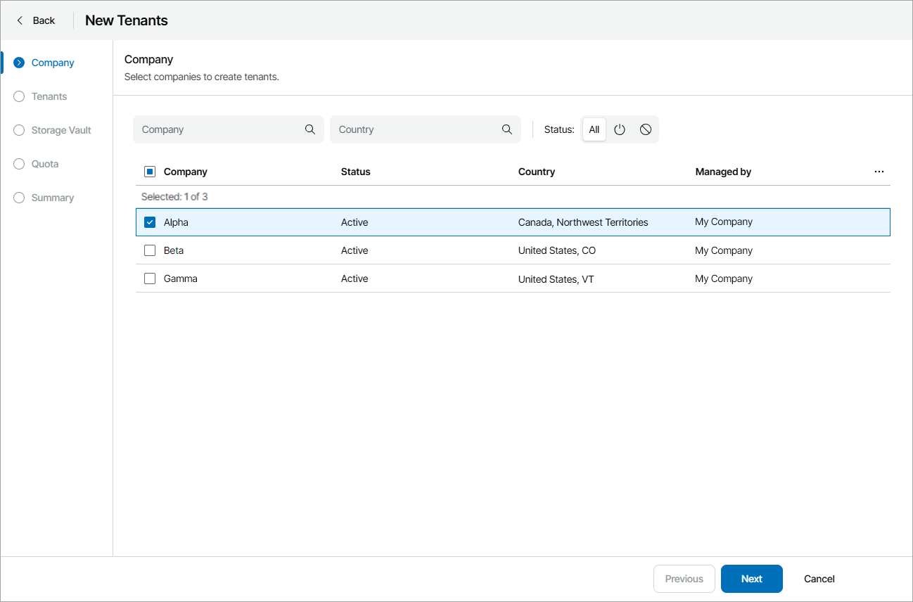
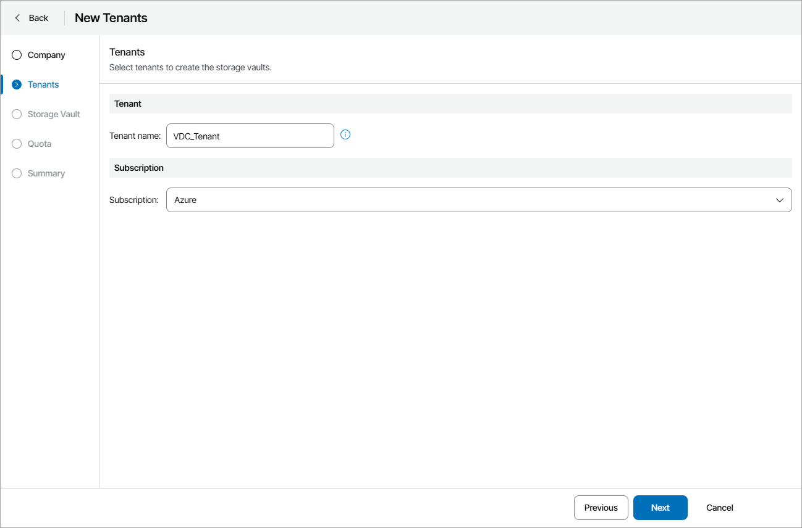
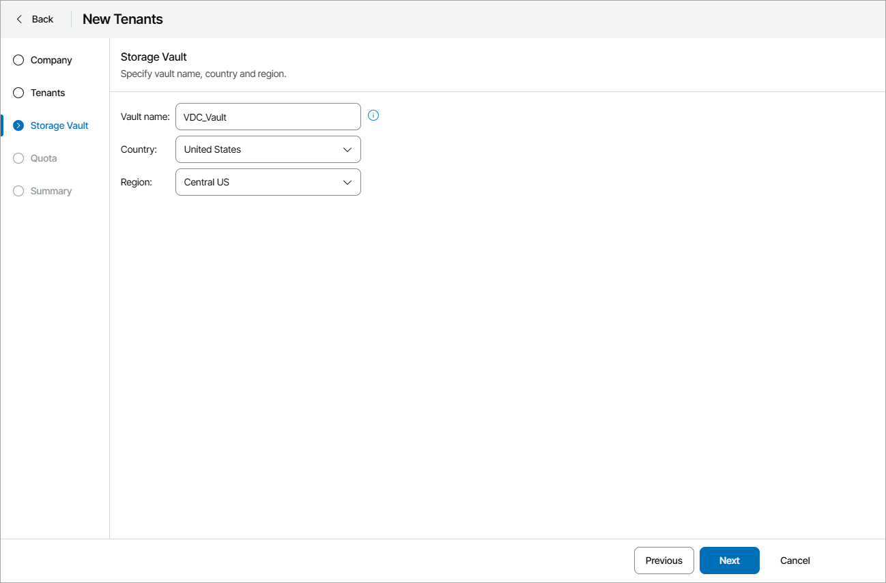
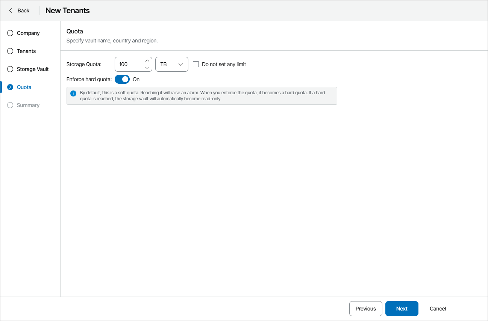

# Creating Vault Tenants

In Veeam Service Provider Console, you can initiate bulk tenant creation for Veeam Service Provider Console companies. For each tenant, a new storage vault will be created automatically.

To create new Veeam Data Cloud Vault tenants with assigned storage vaults:

1. Log in to Veeam Service Provider Console.

For details, see [Accessing Veeam Service Provider Console](access_vac.md).

1. At the top right corner of the Veeam Service Provider Console window, click Configuration.
2. In the configuration menu on the left, click Catalog.
3. Click the Veeam Vault plugin tile.
4. In the menu on the left, click Veeam Data Cloud.
5. Navigate to the Tenants tab.
6. At the top of the list, click New.

Veeam Service Provider Console will open the New Tenants wizard.

1. At the Company step of the wizard, select one or more companies for which you want to create Veeam Data Cloud Vault tenants.

1. At the Tenants step of the wizard, specify tenant name and select the Veeam Data Cloud Vault subscription.

If at the Company step you have selected multiple companies, tenant names will be assigned automatically based on the company names. The selected subscription will apply to all created tenants.

1. At the Storage Vault step of the wizard, specify vault name and select country and region where you want to create a vault.

If at the Company step you have selected multiple companies, vault names will be assigned automatically based on the company names. The selected country and region will apply to all created vaults.

1. At the Quota step of the wizard, specify the amount of storage space allocated to the tenant or select the Do not set any limit check box to allocate an unlimited quota.

The Storage quota is a soft quota and puts no physical restriction on the repository. When the tenant reaches the specified quota, Veeam Service Provider Console triggers the Veeam Vault storage quota alarm. You can customize this alarm in accordance with your requirements. For details, see [Modifying Alarm Settings](modify_alarm_settings.md).

To set storage quota as a hard quota, set the Enforce hard quota toggle to On. If you enable this option, the vault will become read-only after the set quota is reached.

1. At the Summary step of the wizard, review the tenant account settings and click Finish.

