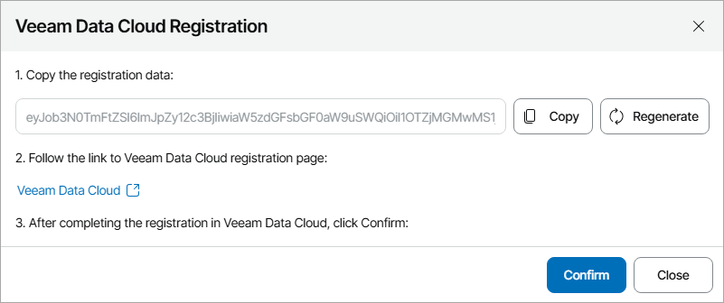

# Enabling Veeam Data Cloud Vault Integration

To allow Veeam Service Provider Console to communicate with Veeam Data Cloud:

1. Log in to Veeam Service Provider Console.

For details, see [Accessing Veeam Service Provider Console](access_vac.md).

1. At the top right corner of the Veeam Service Provider Console window, click Configuration.
2. In the configuration menu on the left, click Catalog.
3. Click the Veeam Vault plugin tile.
4. In the Veeam Data Cloud Registration window, copy the registration token.

To generate new registration token, click Regenerate.

1. Click the Veeam Data Cloud link.

Veeam Service Provider Console will open the Veeam Data Cloud portal.

1. Sign in to Veeam Data Cloud.
2. In the Register New Product window, do the following:

1. In the Registration Token field, insert the copied registration token.
2. From the Register For drop-down list, select your Veeam Data Cloud organization.

In the organizations list, your service provider organization is marked as Self.

1. Click Register.

You will be automatically redirected to Veeam Service Provider Console.

1. In Veeam Service Provider Console plugin, click Confirm.
2. In the Veeam Data Cloud Registration window, check integration status.

A successfully established connection will show the Configured integration status.

Disconnecting Veeam Data Cloud Vault Plugin

If you no longer want to manage Veeam Data Cloud Vault tenants and storage vaults in Veeam Service Provider Console, you can remove the plugin connection.

To disconnect plugin:

1. Log in to Veeam Service Provider Console.

For details, see [Accessing Veeam Service Provider Console](access_vac.md).

1. At the top right corner of the Veeam Service Provider Console window, click Configuration.
2. In the configuration menu on the left, click Catalog.
3. Click the Veeam Vault plugin tile.
4. Click Disconnect.
5. In the confirmation window, click Yes.

