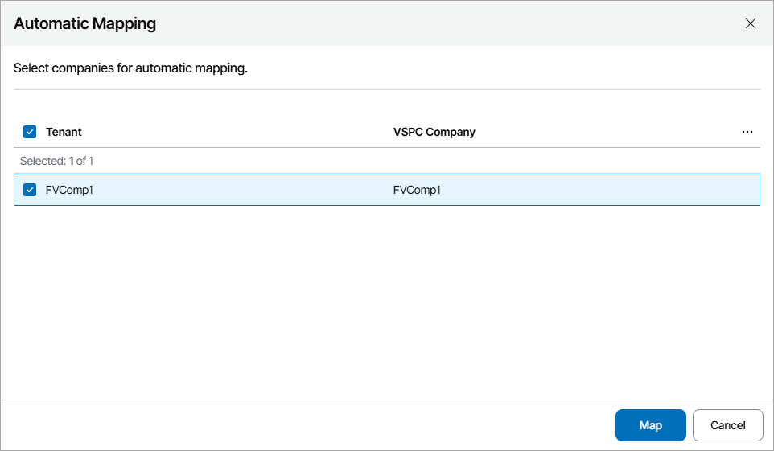
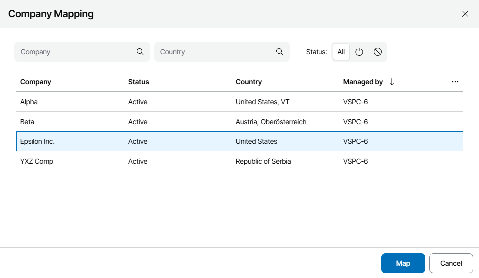

# Mapping Vault Tenants

To map Veeam Data Cloud Vault tenants to companies in Veeam Service Provider Console, you can use one of the following methods:

* [Map tenants automatically](#auto)

Select this method if names of companies you manage in Veeam Service Provider Console are same or similar to tenant names in Veeam Data Cloud.

* [Map tenants manually](#manual)

Select this method if names of companies you manage in Veeam Service Provider Console and tenant names in Veeam Data Cloud do not match.

Mapping Tenants Automatically

To map tenants automatically:

1. Log in to Veeam Service Provider Console.

For details, see [Accessing Veeam Service Provider Console](access_vac.md).

1. At the top right corner of the Veeam Service Provider Console window, click Configuration.
2. In the configuration menu on the left, click Catalog.
3. Click the Veeam Vault plugin tile.
4. In the menu on the left, click Veeam Data Cloud.
5. Navigate to the Tenants tab.
6. At the top of the list, click Automap.

This will automatically detect Veeam Data Cloud Vault tenants with the names same or similar to the names of companies configured in Veeam Service Provider Console.

1. In the displayed list of matched tenants, select the necessary tenants and click Map.

Mapping Tenants Manually

To map tenants manually:

1. Log in to Veeam Service Provider Console.

For details, see [Accessing Veeam Service Provider Console](access_vac.md).

1. At the top right corner of the Veeam Service Provider Console window, click Configuration.
2. In the configuration menu on the left, click Catalog.
3. Click the Veeam Vault plugin tile.
4. In the menu on the left, click Veeam Data Cloud.
5. Navigate to the Tenants tab.
6. From the list of tenants, select an unmapped tenant.

To narrow down the list of tenants, you can search tenants by name, Veeam Service Provider Console company and subscription or apply the following filters:

* Status — limit the list of tenants by tenant status (Healthy, Warning, Error, Information, All).
* Subscription type — limit the list of tenants by subscription type.
* Mapping status — limit the list of tenants by mapping status (Mapped, Not mapped).

1. At the top of the list, click Map to.
2. In the Company Mapping window, select the necessary company and click Map.

1. Repeat steps 7–9 for all tenants you want to map.

