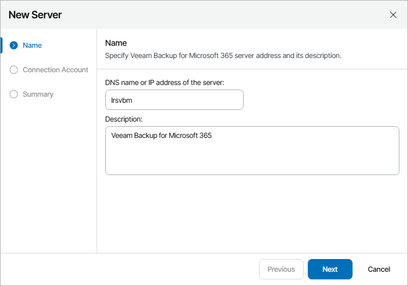
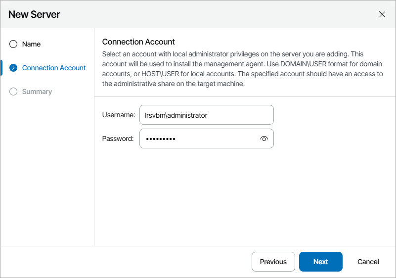
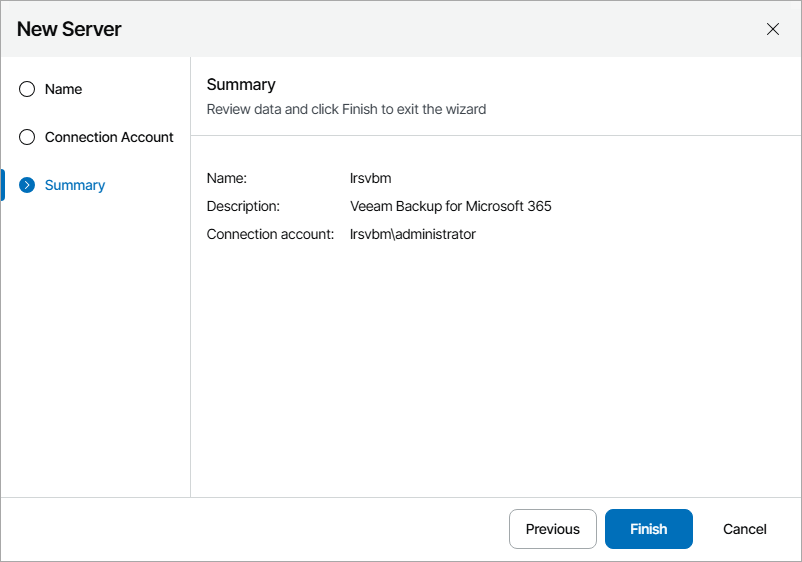

# Connecting Veeam Backup for Microsoft 365 Servers

To allow Veeam Service Provider Console to communicate with a hosted Veeam Backup for Microsoft 365 server, you must configure a connection to this server.

When you connect a Veeam Backup for Microsoft 365 server, Veeam Service Provider Console deploys its management agent on the server.The management agent is responsible for transmitting commands from Veeam Service Provider Console to Veeam Backup for Microsoft 365 server, performing management operations, collecting data from Veeam Backup for Microsoft 365 and communicating it back to Veeam Service Provider Console.

Prerequisites

On Veeam Backup for Microsoft 365 servers that you want to connect, the Windows Management Instrumentation (WMI-In) firewall rule must be configured to allow inbound traffic.

Connecting Veeam Backup for Microsoft 365 Servers

To configure a connection to the Veeam Backup for Microsoft 365 server:

1. Log in to Veeam Service Provider Console.

For details, see [Accessing Veeam Service Provider Console](access_vac.md).

1. At the top right corner of the Veeam Service Provider Console window, click Configuration.
2. In the configuration menu on the left, click Catalog.
3. Click the Veeam Backup for Microsoft 365 plugin tile.
4. In the menu on the left, click Servers.
5. At the top of the server list, click New.

Veeam Service Provider Console will launch the New Server wizard.

1. At the Name step of the wizard, specify the following settings:

1. In the DNS name or IP address of the server field, type FQDN or IP address of the Veeam Backup for Microsoft 365 server.
2. In the Description field, type server description or comments.

1. At the Connection Account step of the wizard, specify credentials of a user account with local Administrator privileges on the Veeam Backup for Microsoft 365 server.

This account will be used to install a Veeam Service Provider Console management agent on the Veeam Backup for Microsoft 365 server.

The user name must be specified in the DOMAIN\USERNAME format for domain accounts, or HOST\USERNAME format for local accounts.

1. At the Summary step of the wizard, review connection settings and click Finish.

1. Repeat steps 6–9 for all Veeam Backup for Microsoft 365 servers that you want to add.

If the connected Veeam Backup for Microsoft 365 server does not have Veeam Backup for Microsoft 365 REST API installed and activated, after connecting the server, you must activate it to allow Veeam Service Provider Console to communicate with the server. For details, see [Activating Veeam Backup for Microsoft 365 Servers](vbo_activate_servers.md).

Checking Installation Results

To make sure that installation of management agents has completed successfully, complete the following steps:

1. Log in to Veeam Service Provider Console.

For details, see [Accessing Veeam Service Provider Console](access_vac.md).

1. At the top right corner of the Veeam Service Provider Console window, click Configuration.
2. In the configuration menu on the left, click Catalog.
3. Click the Veeam Backup for Microsoft 365 plugin tile.
4. In the menu on the left, click Servers and find the necessary Veeam Backup for Microsoft 365 server in the list.
5. Check the value in the Deployment Status column.

If installation was successful, the Deployment Status status must be Success.

1. Click a link in the Deployment Status column to display session details of the installation procedure.

If the server was connected successfully but the Deployment Status status is Error, click Clear Logs to update the status.

In some cases, after installation you may need to perform additional operations. For example, if the setup detects a pending computer reboot, the list of installation session details will display a warning notifying that reboot is required. To complete the installation, you can initiate computer reboot in Veeam Service Provider Console. For details, see [Rebooting Remote Computers](reboot_remote_computers.md).

