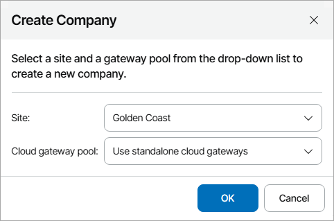

# Creating New Companies

You can create companies in Veeam Service Provider Console based on data from accounts of organizations managed in Veeam Backup for Microsoft 365.

When you create a new company, Veeam Service Provider Console:

1. Retrieves organization name from Veeam Backup for Microsoft 365.
2. Creates an account based on retrieved information and maps it automatically to a source organization in Veeam Backup for Microsoft 365.
3. [If you have selected to create a cloud tenant] Creates a cloud tenant account based on the retrieved information and assigns it automatically to the created Veeam Service Provider Console company.
4. Sends an email message to Veeam Service Provider Console Portal Administrator at the address specified on the Company Info tab.

For details, see [Filling Company Profile](fill_company_profile.md).

|  |
| --- |
| Note: |
| Veeam Service Provider Console will not be able to send an email message until you configure SMTP server settings and global notification policy settings. For details, see [Configuring Notification Settings](configure_email_settings.md). |

Creating Companies

To create new companies in Veeam Service Provider Console:

1. Log in to Veeam Service Provider Console.

For details, see [Accessing Veeam Service Provider Console](access_vac.md).

1. At the top right corner of the Veeam Service Provider Console window, click Configuration.
2. In the configuration menu on the left, click Catalog.
3. Click the Veeam Backup for Microsoft 365 plugin tile.
4. In the menu on the left, click Companies.

Veeam Service Provider Console will display a list of all organizations managed in Veeam Backup for Microsoft 365 and all companies managed in Veeam Service Provider Console.

1. From the list of companies and organizations, select unmapped Veeam Backup for Microsoft 365 organizations for which you want to create companies in Veeam Service Provider Console.

To narrow down the list of companies and organizations, you can apply the following filters:

* Microsoft 365 Organization Name — search organizations by name configured in Veeam Backup for Microsoft 365.
* VSPC Company Name — search companies by name configured in Veeam Service Provider Console.
* Site — limit the list of companies by Veeam Cloud Connect server on which the company is registered.
* Backup server — limit the list of organizations by name of the server on which Veeam Backup for Microsoft 365 is deployed.
* Status — limit the list of companies and organizations by mapping status (Mapped, Not mapped, Creating, Error).
* Company source type — limit the list of companies and organizations by source type (Veeam Backup for Microsoft 365, Veeam Service Provider Console).

1. At the top of the list, click Create Company in Console.
2. In the Create Company window, select the Veeam Cloud Connect server, on which you want to create the cloud tenant for the company, and the gateway pool that will be available to the cloud tenant.

If you do not want to create a cloud tenant for the company, from the Site drop-down list, select the No site (without tenant creation) option. In this case, you will have to map cloud tenant to the created company manually. For details, see [Configuring Cloud Tenant Mapping](assign_cloud_tenants.md).

|  |
| --- |
| Note: |
| If you want to provide backup or replication services to created companies, you must allocate resources to them. For details, see [Modifying Company Settings](modify_tenants.md). |

