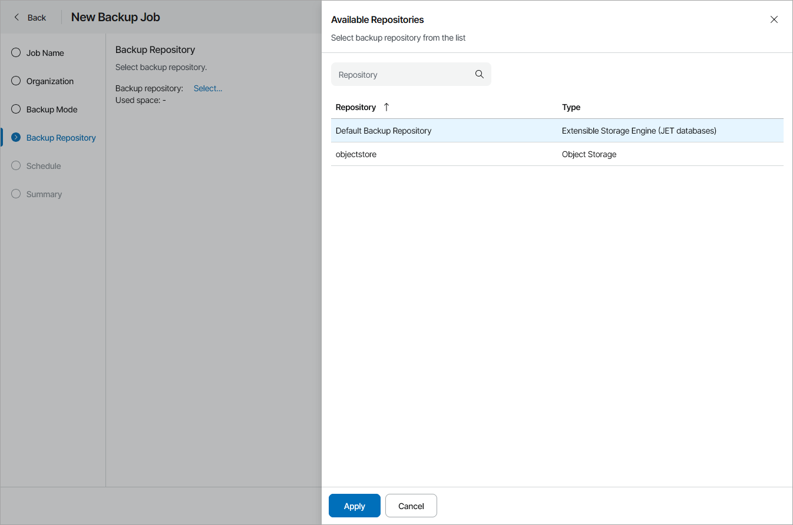

# Step 5. Choose Backup Repository

The Backup Repository step of the wizard is available if you have more than one repositories in your Veeam Backup for Microsoft 365 infrastructure.

To choose the target backup repository:

1. Click Select.
2. In the Available Repositories window, select the necessary backup repository.
3. Click Apply.

