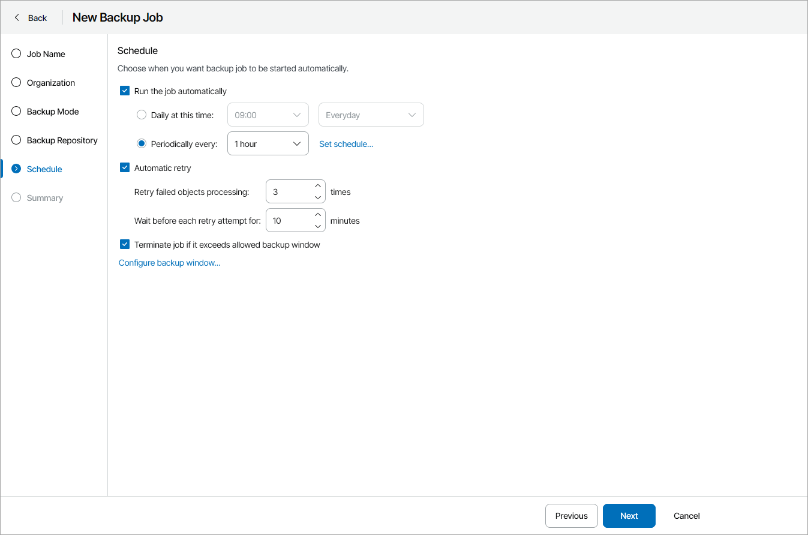

# Step 6. Configure Backup Schedule

At the Schedule step of the wizard, specify backup schedule:

1. Select the Run the job automatically check box.

If this check box is not selected, you will have to start the backup job manually to create backup. For details, see [Starting and Stopping Jobs](start_stop_vbo_jobs.md).

1. Define scheduling settings for the job:

* To run the job at specific time daily, on defined week days or with specific periodicity, select Daily at this time. Use the fields on the right to configure the necessary schedule.
* To run the job repeatedly throughout a day with a specific time interval, select Periodically every. In the field on the right, select the necessary time period. Click Set schedule and use the time table to define the permitted time window for the job.

A repeatedly run job is started by the following rules:

* Veeam Backup for Microsoft 365 always starts counting defined intervals from 12:00 AM. For example, if you configure to run a job with a 4-hour interval, the job will start at 12:00 AM, 4:00 AM, 8:00 AM, 12:00 PM, 4:00 PM and so on.
* If you define permitted hours for the job, after the denied interval is over, Veeam Backup for Microsoft 365 will immediately start the job and then run the job by the defined schedule.

For example, you have configured a job to run with a 2-hour interval and defined permitted hours from 9:00 AM to 5:00 PM. According to the rules above, the job will first run at 9:00 AM, when the denied period is over. After that, the job will run at 10:00 AM, 12:00 PM, 2:00 PM and 4:00 PM.

1. In the Automatic retry section, define whether Veeam Backup for Microsoft 365 must attempt to run the backup job again if the job fails for some reason. Type the number of attempts to run the job and define time intervals between them.
2. In the Terminate the job if it exceeds allowed backup window section, define the time interval within which the backup job must complete. The backup window prevents the job from overlapping with production hours and ensures that the job does not impact performance of your server.

To set up a backup window for the job:

1. Select the Terminate job if it exceeds allowed backup window check box and click Configure backup window.
2. In the Schedule window, define the allowed hours and prohibited hours for backup.

If the job exceeds the allowed window, it will be automatically terminated.

