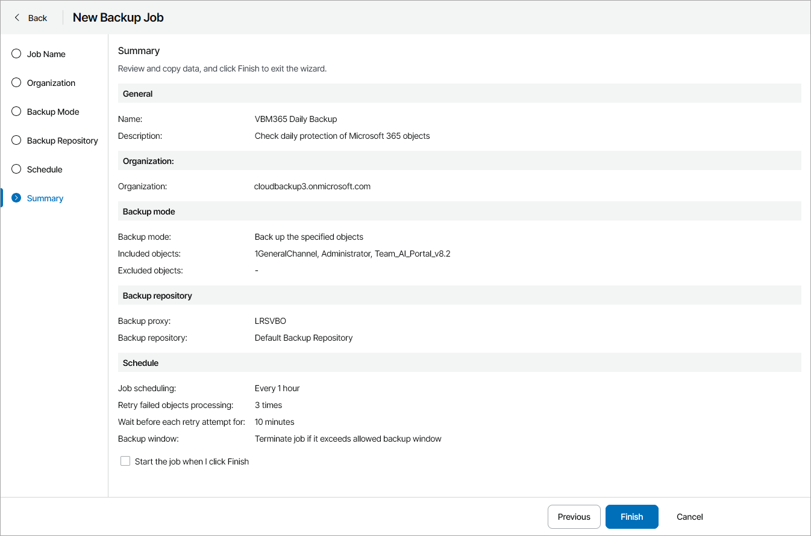

# Step 7. Review Backup Job Settings

At the Summary step of the wizard, review backup job settings.

1. To start the job after you save the job configuration, select the Start the job when I click Finish check box.

If you do not select this check box, the job will start according to the configured schedule. If you did not configure a schedule, you will need to start the job manually. For details, see [Starting and Stopping Jobs](start_stop_vbo_jobs.md).

1. Click Finish.

