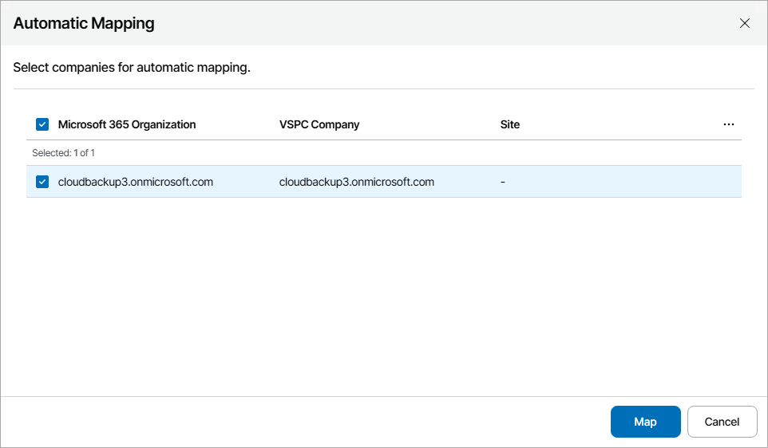
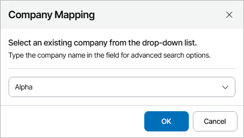

# Mapping Companies

To map Veeam Backup for Microsoft 365 organizations to companies in Veeam Service Provider Console, you can use one of the following methods:

* [Map companies automatically](#auto)

Select this method if names of companies you manage in Veeam Service Provider Console are same or similar to their organization names in Veeam Backup for Microsoft 365.

* [Map companies manually](#manual)

Select this method if names of companies you manage in Veeam Service Provider Console and their organization names in Veeam Backup for Microsoft 365 do not match.

Mapping Companies Automatically

To map companies automatically:

1. Log in to Veeam Service Provider Console.

For details, see [Accessing Veeam Service Provider Console](access_vac.md).

1. At the top right corner of the Veeam Service Provider Console window, click Configuration.
2. In the configuration menu on the left, click Catalog.
3. Click the Veeam Backup for Microsoft 365 plugin tile.
4. In the menu on the left, click Companies.

Veeam Service Provider Console will display a list of all organizations managed in Veeam Backup for Microsoft 365.

1. At the top of the list, click Automap.

This will automatically detect organizations in Veeam Backup for Microsoft 365 with the names same or similar to the names of companies configured in Veeam Service Provider Console.

1. In the displayed list of matched companies, select the necessary companies and click Map.

Mapping Companies Manually

To map companies manually:

1. Log in to Veeam Service Provider Console.

For details, see [Accessing Veeam Service Provider Console](access_vac.md).

1. At the top right corner of the Veeam Service Provider Console window, click Configuration.
2. In the configuration menu on the left, click Catalog.
3. Click the Veeam Backup for Microsoft 365 plugin tile.
4. In the menu on the left, click Companies.

Veeam Service Provider Console will display the list of all organizations managed in Veeam Backup for Microsoft 365 and all companies managed in Veeam Service Provider Console.

1. From the list of companies and organizations, select one or more unmapped Veeam Backup for Microsoft 365 organizations.

To narrow down the list of companies and organizations, you can apply the following filters:

* Microsoft 365 Organization Name — search organizations by name configured in Veeam Backup for Microsoft 365.
* VSPC Company Name — search companies by name configured in Veeam Service Provider Console.
* Site — limit the list of companies by Veeam Cloud Connect server on which the company is registered.
* Backup server — limit the list of organizations by name of the server on which Veeam Backup for Microsoft 365 is deployed.
* Status — limit the list of companies and organizations by mapping status (Mapped, Not mapped, Creating, Error).
* Company source type — limit the list of companies and organizations by source type (Veeam Backup for Microsoft 365, Veeam Service Provider Console).

1. At the top of the list, click Map to.
2. In the Company Mapping window, type the name of Veeam Service Provider Console company which you want to map.

If you have selected multiple Veeam Backup for Microsoft 365 organizations, all selected organizations will be mapped to one Veeam Service Provider Console company.

1. Click OK.

1. Repeat steps 6–9 for all companies and organizatons you want to map.

