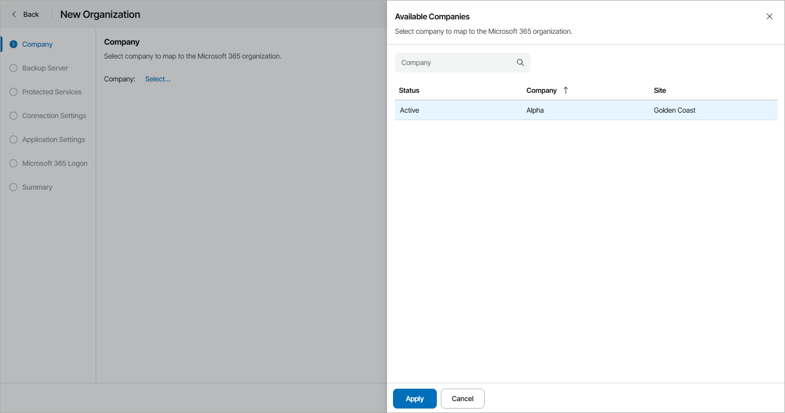
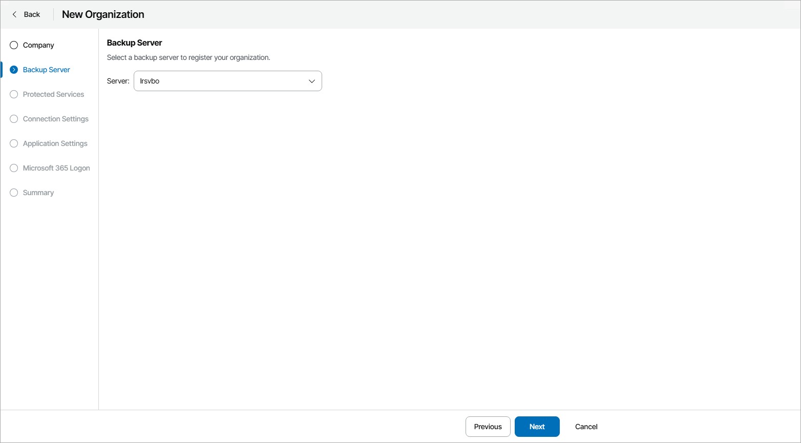
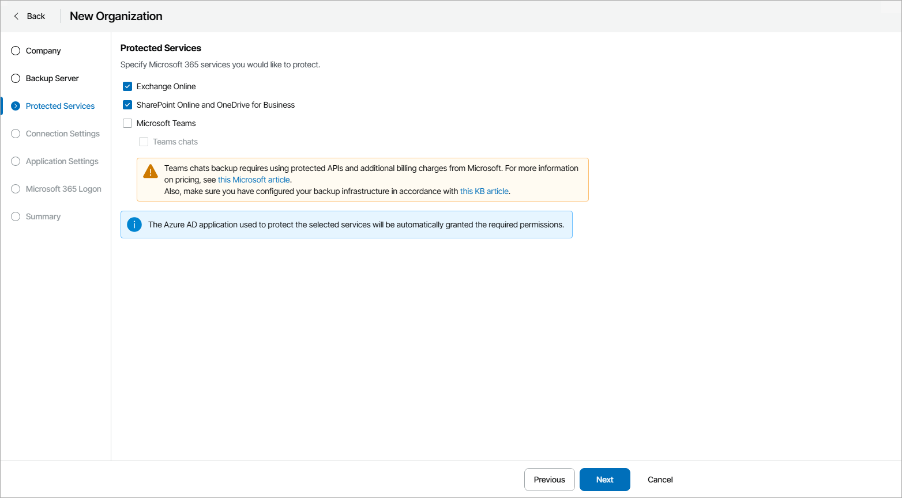
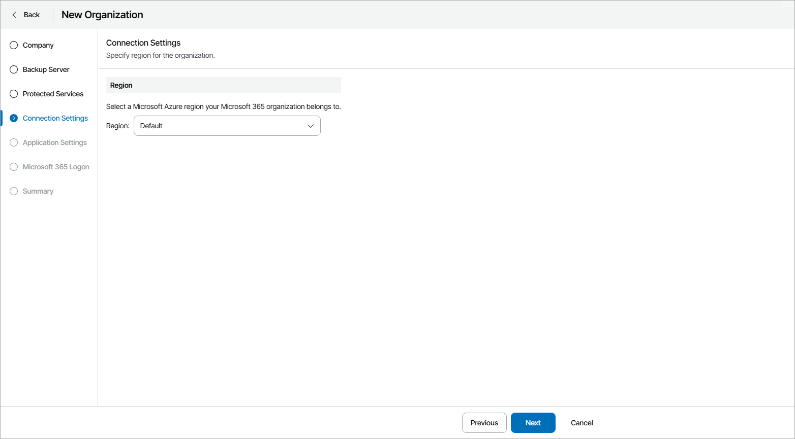
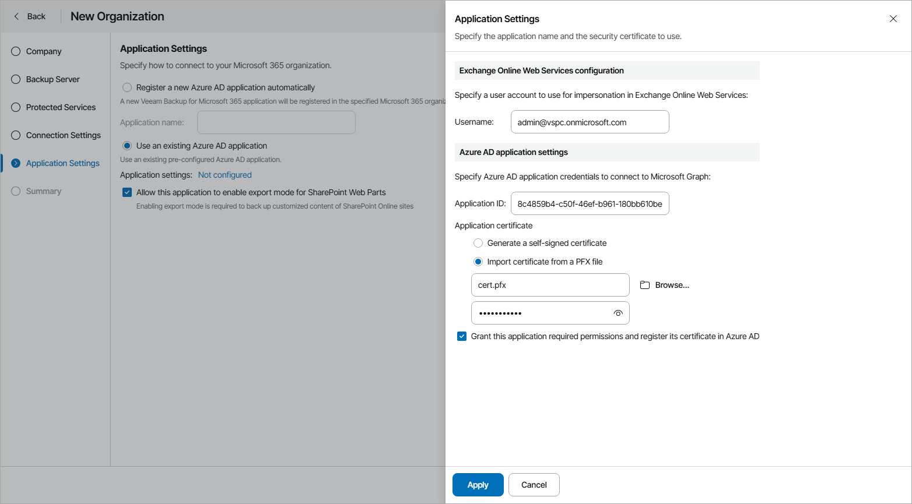
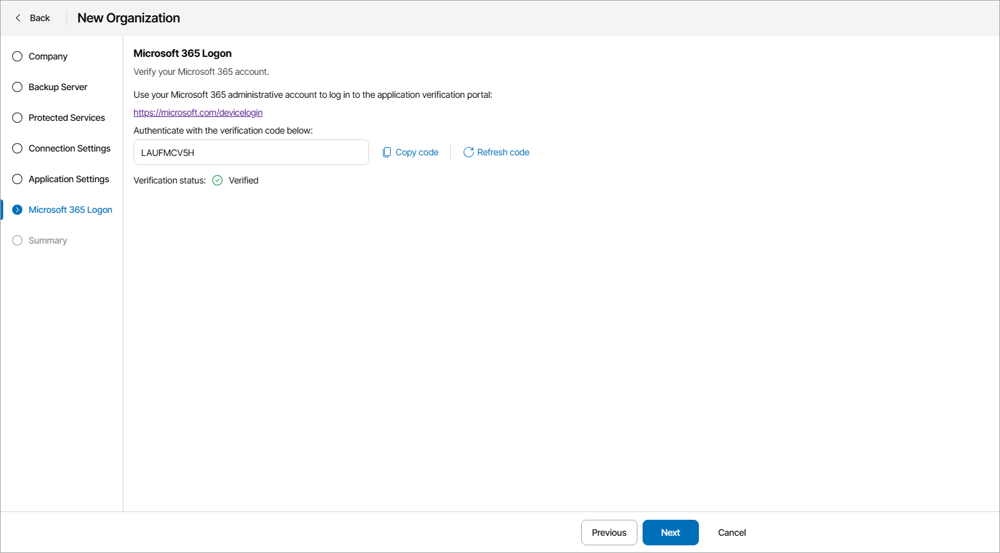

# Registering New Microsoft 365 Organizations

To register a new Microsoft 365 organization:

1. Log in to Veeam Service Provider Console.

For details, see [Accessing Veeam Service Provider Console](access_vac.md).

1. At the top right corner of the Veeam Service Provider Console window, click Configuration.
2. In the configuration menu on the left, click Catalog.
3. Click the Veeam Backup for Microsoft 365 plugin tile.
4. In the menu on the left, click Companies.
5. At the top of the list, click Register Organization.

Veeam Service Provider Console will launch the New Organization wizard.

1. At the Company step of the wizard, click Select and choose company to which you want to map the organization.

1. If you have more than one connected Veeam Backup for Microsoft 365 server , at the Backup Server step of the wizard, select a Veeam Backup for Microsoft 365 server on which you want to register the organization.

1. At the Protected Services step of the wizard, select Microsoft services that you want to protect (Exchange Online, SharePoint Online and OneDrive for Business, Microsoft Teams, Teams chats).

You can select Microsoft Teams and Teams chats check boxes only if both Exchange Online and SharePoint Online and OneDrive for Business check boxes are selected.

Note that backing up Teams chats requires using protected APIs and additional billing charges from Microsoft. For details, see [Microsoft Docs](https://docs.microsoft.com/en-us/graph/teams-licenses). For details on configuring your backup infrastructure to back up Teams chats, see [this Veeam KB article](https://www.veeam.com/kb4340).

1. At the Connections Settings step of the wizard, select Microsoft Azure region that your Microsoft 365 organization belongs to.

1. At the Application Settings step of the wizard, select whether you want to register a Azure AD application or use an existing application:

* If you want to register a new Azure AD application, select the Register a new Azure AD application automatically option and specify the name of the new Azure AD application.

* If you want to use an existing Azure AD application, select the Use an existing Azure AD application option and configure Azure AD application settings:

1. Click a link in the Application settings field.

Veeam Service Provider Console will open the Application Settings window.

1. In the Username field, specify a user account that you want to use for impersonation. For more information about impersonation, see [Microsoft Docs](https://docs.microsoft.com/en-us/exchange/client-developer/exchange-web-services/impersonation-and-ews-in-exchange).

You can enter any account that belongs to your Microsoft 365 organization using one of the following formats: name@<domain\_name>.com or name@<domain\_name>.onmicrosoft.com.

Consider that if you select only SharePoint Online and OneDrive for Business services to protect at the Protected Services step, wizard displays the Organization field instead. In this field, specify a domain name of your Microsoft 365 organization without the user name.

1. In the Application ID field, specify an identification number of Azure AD application that you want to use to access your Microsoft 365 organization.

You can find this number in the application settings of your Azure Active Directory. For more information, see [Microsoft Docs](https://docs.microsoft.com/en-us/azure/active-directory/develop/howto-create-service-principal-portal).

1. In the Application certificate subsection, select whether you want to generate a new self-signed certificate or to import certificate from a .PFX file.

Before using an existing certificate, make sure to register this certificate in Azure Active Directory. For details, see [Microsoft Docs](https://docs.microsoft.com/en-us/azure/active-directory/develop/howto-create-service-principal-portal#certificates-and-secrets).

When generating a new self-signed certificate, Veeam Backup for Microsoft 365 will register it automatically.

1. Select the Grant this application required permissions and register its certificate in Azure AD check box to automatically grant required permissions to Azure AD application and register the specified certificate in your Azure Active Directory.

For details on required permissions, see section [Permissions for Azure Archiver Appliance](https://helpcenter.veeam.com/docs/vbo365/guide/azure_archiver_appliance_permissions.html) of the Veeam Backup for Microsoft 365 User Guide.

1. Click Apply.

* [If you have selected to protect SharePoint Online and OneDrive for Business] Select the Allow this application to enable export mode for SharePoint Web Parts check box to allow Veeam Backup for Microsoft 365 to back up web parts of your Microsoft SharePoint sites. For details on web parts, see [Microsoft Docs](https://docs.microsoft.com/en-us/visualstudio/sharepoint/creating-web-parts-for-sharepoint?view=vs-2019).

1. At the Microsoft 365 Logon step of the wizard, log in to your Microsoft 365 organization:

1. Click Copy code to copy an authentication code.

Consider that the code is valid for 15 minutes. You can click Refresh code to request a new code from Microsoft.

1. Click the Microsoft verification portal link.

A web browser window will open.

1. On the Sign in to your account webpage, paste the code that you have copied and sign in to Microsoft Azure.

Make sure to sign in with the user account that has the Global Administrator role. For details on this role, see [Microsoft Docs](https://docs.microsoft.com/en-us/azure/active-directory/users-groups-roles/directory-assign-admin-roles).

1. Return to the wizard and click Next.

1. At the Summary step of the wizard, review organization settings and click Finish.

