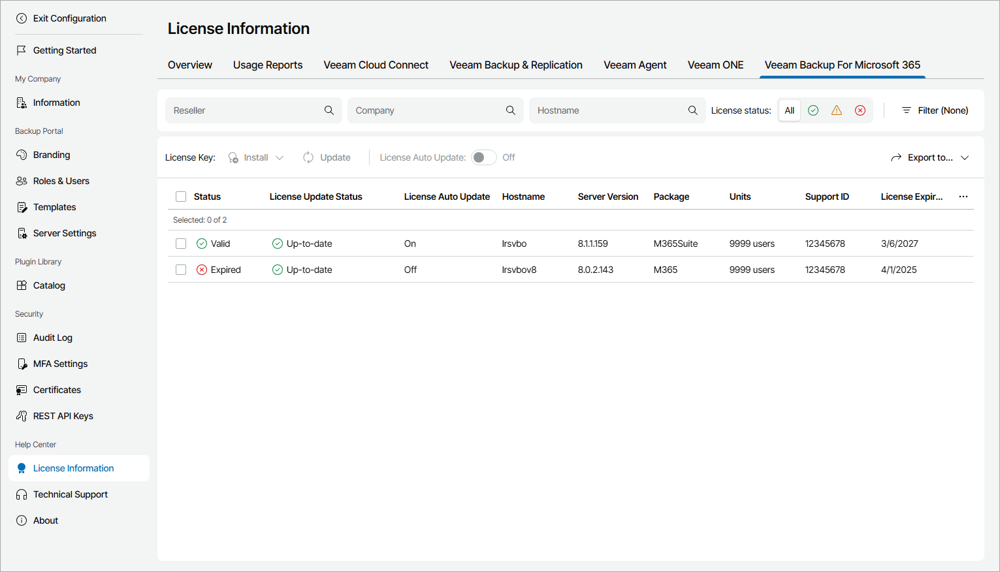

# Veeam Backup for Microsoft 365

The Veeam Backup for Microsoft 365 view provides a list of Veeam Backup for Microsoft 365 servers managed in Veeam Service Provider Console, and information about their license status.

To narrow down the list of Veeam Backup for Microsoft 365 servers, you can use the following filters:

* Reseller — search Veeam Backup for Microsoft 365 servers by name of a reseller who manages the server.
* Company — search Veeam Backup for Microsoft 365 servers by company name.
* Hostname — search Veeam Backup for Microsoft 365 servers by host name.
* License status — limit the list of Veeam Backup for Microsoft 365 servers by license status (Valid, Warning, Error).

* Type — limit the list of Veeam Backup for Microsoft 365 servers by type of license installed on the server (Community, Rental, Subscription).

Each Veeam Backup for Microsoft 365 server in the list is described with a set of properties. By default, some properties in the list are hidden. To display additional properties, click the ellipsis on the right of the list header and choose properties that must be displayed.

* Status — status of license installed on the Veeam Backup for Microsoft 365 server (Valid, Warning, Error).

* License Update Status — status of the latest license update.

* Reseller — name of a reseller who manages the company to which Veeam Backup for Microsoft 365 server belongs.

* Company — client company to which a Veeam Backup for Microsoft 365 server belongs.

* Site — name of the Veeam Cloud Connect site on which the company is registered.

* Location — location to which a Veeam Backup for Microsoft 365 server belongs.
* Hostname — name of a Veeam Backup for Microsoft 365 server for which license details are provided.
* Server Version — version of Veeam Backup for Microsoft 365 installed on a server.
* License Expiration — date when a license will expire.

* Licensee Company — name of the user or company to which the license was issued.
* Units — number of users included in a license file.
* Used Units — number of licensed users.

* Email — email address of the contact person in a company.

* License Type — license type (Community, Rental, Subscription).

* Support ID — support ID required for contacting Veeam Customer Technical Support.

* License ID — ID of the license file.

* License Auto Update — indicates if license auto update is enabled.

Exporting Veeam Backup for Microsoft 365 License Details

You can export Veeam Backup for Microsoft 365 license details to a CSV or XML file:

1. Apply the necessary filters to display in the list Veeam Backup for Microsoft 365 servers you want to export.
2. Click Export to and choose a format of the exported data:

* CSV — choose this option to structure exported data as a CSV file.
* XML — choose this option to structure exported data as an XML file.

The file with exported data will be saved to the default download location on your computer.

