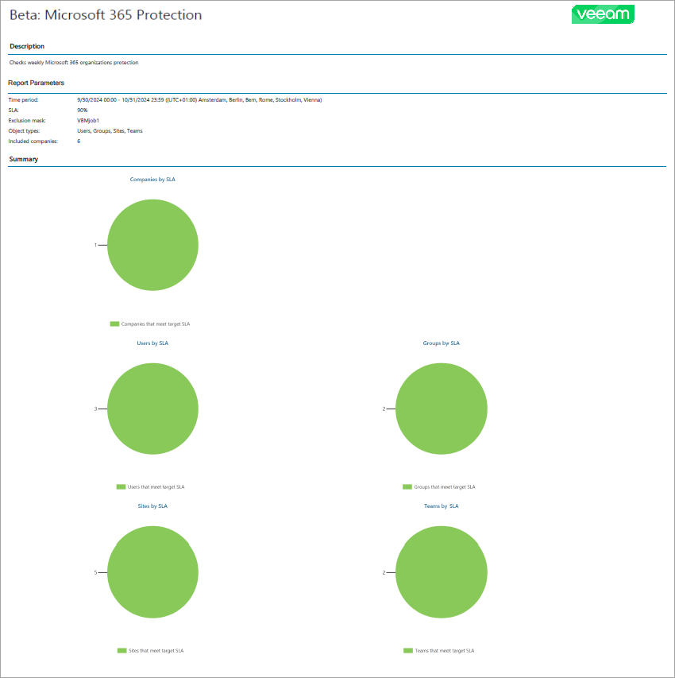

# Protected Microsoft 365 Objects Backup Report

The Protected Microsoft 365 Objects report analyzes the efficiency of Microsoft 365 workload protection with Veeam Backup for Microsoft 365.

* The Report Parameters section provides information about SLA, time period, types of objects in the report scope and mask for the objects excluded from the report scope. For summary report, this section provides information about the number of companies in the report scope.

* The report charts display information about the number of companies (for summary report), users, groups, sites and teams that meet and breach the target SLA.
* [For summary report] The Overview section provides information about the number and percentage of SLA compliant users, groups, sites and teams for each company in the report scope.
* The Details section provides information about all objects that meet and breach the target SLA including object name, number of available restore points, backup job name and destination, number of successful job sessions, Veeam Backup for Microsoft 365 server name, SLA percentage and configured job schedule in Coordinated Universal Time (UTC).

For summary report, the Details section is included only if you have selected the Include detailed information to the report check box during report configuration.

* The Objects that breach target SLA subsection displays a list of objects with SLA lower than the SLA value specified in the report configuration. Information on objects for each company is grouped by Microsoft 365 organization.
* The Objects that meet target SLA subsection displays a list of objects with SLA equal to or greater than the SLA value specified in the report configuration. Information on objects for each company is grouped by Microsoft 365 organization.

