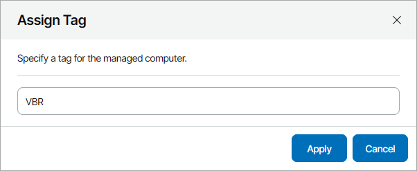

# Assigning Custom Tags to Hosted Veeam Backup & Replication Servers

In Veeam Service Provider Console plugin, you can assign custom tags for hosted Veeam Backup & Replication and Veeam Backup Enterprise Manager servers. Assigning custom tags can help you differentiate managed servers that have same or similar names.

To assign custom tags to hosted Veeam Backup & Replication and Veeam Backup Enterprise Manager servers:

1. Log in to Veeam Service Provider Console.

For details, see [Accessing Veeam Service Provider Console](access_vac.md).

1. At the top right corner of the Veeam Service Provider Console window, click Configuration.
2. In the configuration menu on the left, click Catalog.
3. Click the Veeam Backup & Replication plugin tile.
4. In the menu on the left, click Infrasctructure.
5. Select a Veeam Backup & Replication server in the list.
6. Click a link in the Tag column.

If the column is hidden, click the ellipsis on the right of the list header and select Tag in the list of properties that must be displayed.

1. In the Assign Tag window, specify a tag that must be assigned to a backup server and click Apply.

