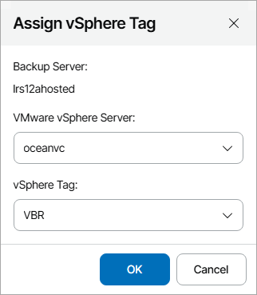

# Assigning Tags to Companies

To assign a VMware vSphere tag to a client company:

1. Log in to Veeam Service Provider Console.

For details, see [Accessing Veeam Service Provider Console](access_vac.md).

1. At the top right corner of the Veeam Service Provider Console window, click Configuration.
2. In the configuration menu on the left, click Catalog.
3. Click the Veeam Backup & Replication plugin tile.
4. In the menu on the left, click Resources.
5. Select the necessary company in the list.
6. At the top of the list, click Assign vSphere Tag.
7. In the Assign vSphere Tag window, select a VMware vSphere server connected to the Veeam Backup & Replication server and a tag that you want to assign to the company.

|  |
| --- |
| Note: |
| Veeam Service Provider Console collects data from the connected Veeam Backup & Replication servers every hour. If you have added a new tag, it may take up to an hour for this tag to get included in the list. To assign the new tag, make sure to collect data from Veeam Backup & Replication servers manually before configuring or running the backup job. For details, see [Collecting Data](collect_agent_data.md#backup). |

1. Click OK.

