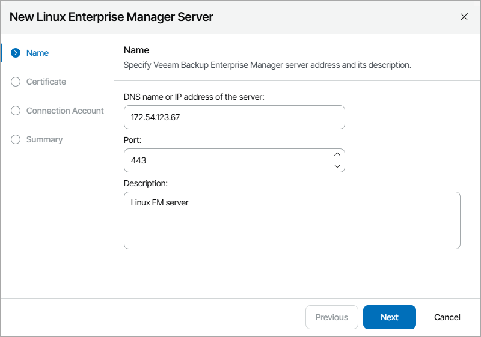
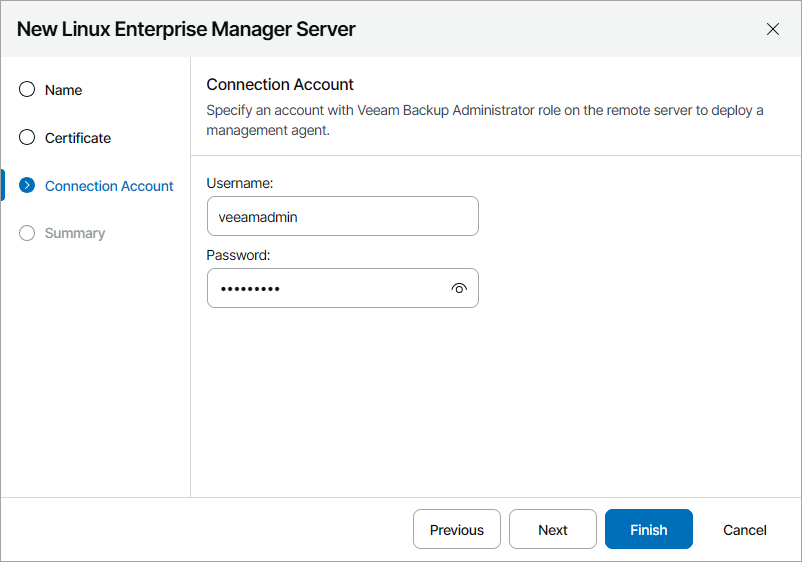

# Connecting Linux Veeam Backup Enterprise Manager Servers

To deploy a management agent on the Linux Veeam Backup Enterprise Manager server, you must enable remote data collection in the Veeam Host Management Console. For details, see [Configuring Backup Infrastructure Settings](https://helpcenter.veeam.com/docs/vbr/userguide/hmc_configure_infrastructure.html?ver=13) in the Veeam Backup & Replication User Guide.

To configure a connection to the Linux Veeam Backup Enterprise Manager server:

1. Log in to Veeam Service Provider Console.

For details, see [Accessing Veeam Service Provider Console](access_vac.md).

1. At the top right corner of the Veeam Service Provider Console window, click Configuration.
2. In the configuration menu on the left, click Catalog.
3. Click the Veeam Backup & Replication plugin tile.
4. In the menu on the left, click Infrastructure.
5. At the top of the server list, click Add and select Linux Enterprise Manager Server.

Veeam Service Provider Console will launch the New Linux Enterprise Manager Server wizard.

1. At the Name step of the wizard, specify the following settings:

1. In the DNS name or IP address of the server field, type FQDN or IP address of the computer where Veeam Backup Enterprise Manager server is deployed.
2. In the Port field, specify a number of the port that you plan to use to connect to the Veeam Backup Enterprise Manager server. By default, port 443 is used.
3. In the Description field, type server description or comments.

1. At the Certificate step of the wizard, review the Veeam Backup Enterprise Manager server security certificate.
2. At the Connection Account step of the wizard, specify credentials of a user account with the Veeam Backup Administrator role on the remote machine.

This account will be used to install a Veeam Service Provider Console management agent on the Veeam Backup Enterprise Manager server. After installation, Veeam Service Provider Console management agent will operate under the new veeam-usr-vspc-agent user.

If you specify a user account other than the default veeamadmin, it is recommended to assign the Service Account role to the selected account in Veeam Host Management. For details on roles and permissions, see sections [Configuring Users](https://helpcenter.veeam.com/docs/vbr/userguide/hmc_configure_users.html) and [Configuring Roles](https://helpcenter.veeam.com/docs/vbr/userguide/configure_roles.html) in the Veeam Backup & Replication User Guide.

1. At the Summary step of the wizard, review connection settings and click Finish.
2. Repeat steps 6–10 for all Veeam Backup Enterprise Manager servers that you want to add.

Checking Installation Results

To make sure that installation of management agents has completed successfully, complete the following steps:

1. Log in to Veeam Service Provider Console.

For details, see [Accessing Veeam Service Provider Console](access_vac.md).

1. At the top right corner of the Veeam Service Provider Console window, click Configuration.
2. In the configuration menu on the left, click Catalog.
3. Click the Veeam Backup & Replication plugin tile.
4. In the menu on the left, click Infrastructure and find the necessary Veeam Backup Enterprise Manager server in the list.
5. Check the value in the Agent Deployment column.

If installation was successful, the Agent Deployment status must be Success.

1. Click a link in the Agent Deployment column to display session details of the installation procedure.

If the server was connected successfully but the Agent Deployment status is Error, click Clear Logs to update the status.

