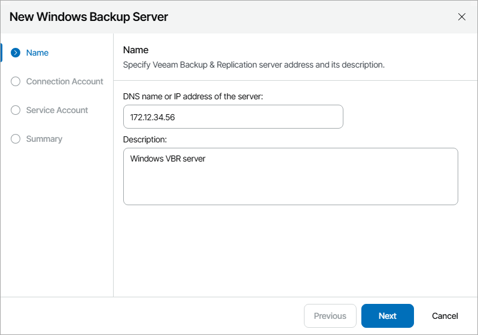
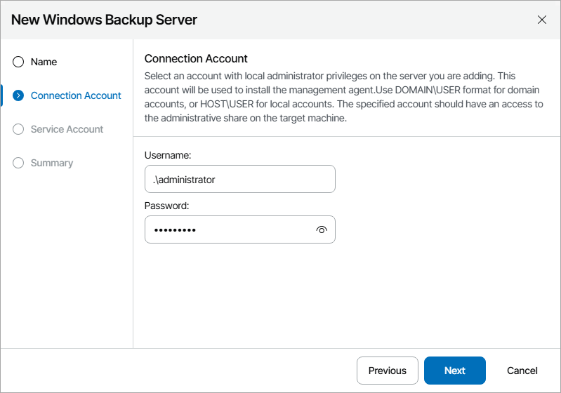
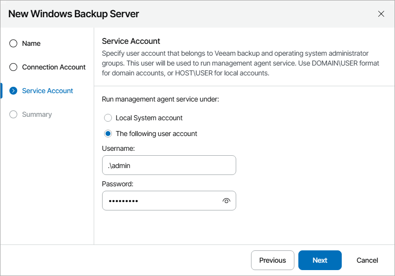

# Connecting Windows Veeam Backup & Replication Servers

To configure a connection to the Windows Veeam Backup & Replication server:

1. Log in to Veeam Service Provider Console.

For details, see [Accessing Veeam Service Provider Console](access_vac.md).

1. At the top right corner of the Veeam Service Provider Console window, click Configuration.
2. In the configuration menu on the left, click Catalog.
3. Click the Veeam Backup & Replication plugin tile.
4. In the menu on the left, click Infrastructure.
5. At the top of the server list, click Add and select Windows Backup Server.

Veeam Service Provider Console will launch the New Windows Backup Server wizard.

1. At the Name step of the wizard, specify the following settings:

1. In the DNS name or IP address of the server field, type FQDN or IP address of the computer where Veeam Backup & Replication server is deployed.
2. In the Description field, type server description or comments.

1. At the Connection Account step of the wizard, specify credentials of a user account with local Administrator privileges on the Veeam Backup & Replication server.

This account will be used to install a Veeam Service Provider Console management agent on the Veeam Backup & Replication server.

The user name must be specified in the DOMAIN\USERNAME format for domain accounts, or HOST\USERNAME format for local accounts.

1. At the Service Account step of the wizard, specify the account that will be used to run a management agent on the Veeam Backup & Replication server:

* Select Local System account, if you want to run management agent under the Local System account of the machine on which Veeam Backup & Replication server is installed.
* To use a different account, select The following user account and specify the credentials of a user account with Veeam Backup Administrator privileges on Veeam Backup & Replication server and Local Administrator privileges on the machine on which Veeam Backup & Replication server is installed.

The user name must be specified in the DOMAIN\USERNAME format for domain accounts, or HOST\USERNAME format for local accounts.

For details on Veeam Backup & Replication users, roles and privileges, see section [Managing Users and Roles](https://helpcenter.veeam.com/docs/vbr/userguide/users_roles.html?ver=13) of the Veeam Backup & Replication User Guide.

1. At the Summary step of the wizard, review connection settings and click Finish.
2. Repeat steps 6–10 for all Veeam Backup & Replication servers that you want to add.

Checking Installation Results

To make sure that installation of management agents has completed successfully, complete the following steps:

1. Log in to Veeam Service Provider Console.

For details, see [Accessing Veeam Service Provider Console](access_vac.md).

1. At the top right corner of the Veeam Service Provider Console window, click Configuration.
2. In the configuration menu on the left, click Catalog.
3. Click the Veeam Backup & Replication plugin tile.
4. In the menu on the left, click Infrastructure and find the necessary Veeam Backup & Replication server in the list.
5. Check the value in the Agent Deployment column.

If installation was successful, the Agent Deployment status must be Success.

1. Click a link in the Agent Deployment column to display session details of the installation procedure.

If the server was connected successfully but the Agent Deployment status is Error, click Clear Logs to update the status.

In some cases, after installation you may need to perform additional operations. For example, if the setup detects a pending computer reboot, the list of installation session details, will display a warning notifying that reboot is required. To complete the installation, you can initiate computer reboot in Veeam Service Provider Console. For details, see [Rebooting Remote Computers](reboot_remote_computers.md).

