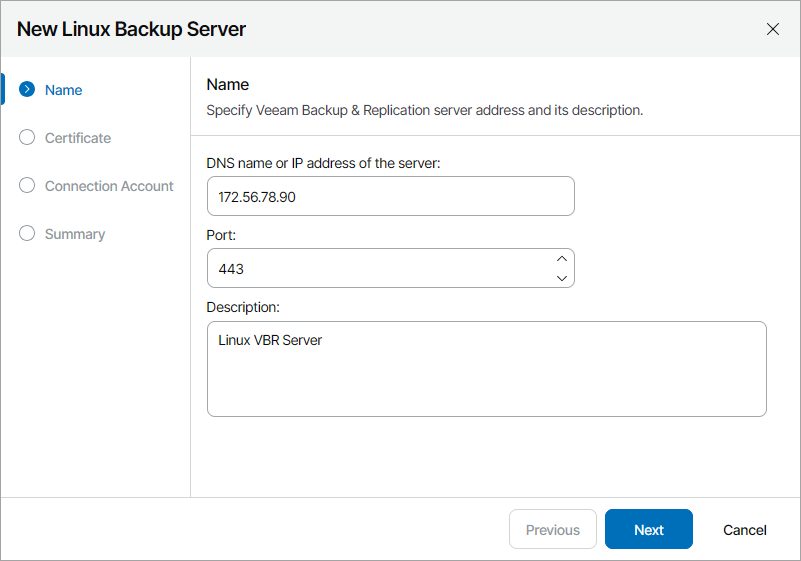
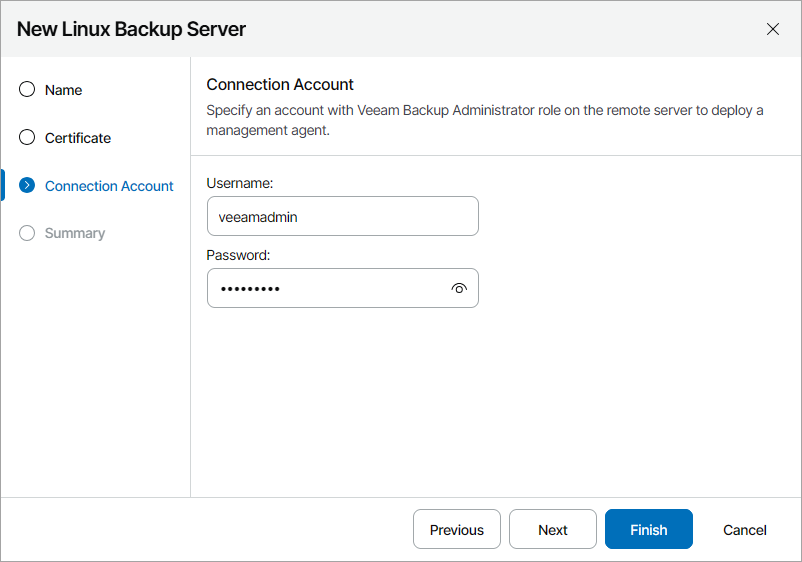

# Managing Backup High Availability Clusters

Veeam Service Provider Console allows you to manage backup High Availability clusters and monitor cluster nodes without accessing Veeam Backup & Replication. For details on High Availability clusters, see section [High Availability (HA) Cluster](https://helpcenter.veeam.com/docs/vbr/userguide/high_availability_cluster.html?ver=13) in the Veeam Backup & Replication User Guide.

Required Privileges

To perform this task, a user must have one of the following roles assigned: Portal Administrator, Site Administrator, Portal Operator.

Limitations

When working with High Availability clusters, note the following:

* You can create and manage backup jobs only on the server that acts as the primary node of a cluster.
* You cannot remove the primary node separately. To remove the primary node, you must delete the cluster.
* For the secondary node, only edit and remove actions are available.
* The secondary node of a cluster is displayed only on the Backup Servers tab and in Veeam Backup & Replication plugin.

Connecting High Availability Clusters

To manage a High Availability cluster in Veeam Service Provider Console, you must connect primary and secondary nodes of the cluster.

|  |
| --- |
| Note: |
| To deploy a management agent on the Linux Veeam Backup & Replication server, you must enable remote data collection in the Veeam Host Management Console. For details, see section [Configuring Backup Infrastructure Settings](https://helpcenter.veeam.com/docs/vbr/userguide/hmc_configure_infrastructure.html?ver=13) in the Veeam Backup & Replication User Guide. |

To connect a High Availability cluster:

1. Connect the primary node of a cluster to Veeam Service Provider Console.

For details on connecting the primary node of a client High Availability cluster, see [Connecting Veeam Backup & Replication Servers](connect_backup_servers.md#client).

For details on connecting the primary node of a hosted High Availability cluster, see [Connecting Linux Veeam Backup & Replication Servers](vbr_connect_linux.md).

Alternatively, you can add the primary and secondary nodes of a hosted High Availability cluster through the Veeam Backup & Replication plugin. For details, see section [Connecting Linux Veeam Backup & Replication Servers](vbr_connect_linux.md).

1. Log in to Veeam Service Provider Console.

For details, see [Accessing Veeam Service Provider Console](access_vac.md).

1. In the menu on the left, click Discovery.
2. Open the Backup Servers tab.
3. Select the primary node of the necessary High Availability cluster in the list.

To display all clusters with missing secondary nodes, click Filter, in the Cluster Status section select Missing secondary node and click Apply.

1. At the top of the server list, click High Availability Cluster and select Add Secondary Node.

Veeam Service Provider Console will launch the New Linux Backup Server wizard.

1. At the Name step of the wizard, specify the following settings:

1. In the DNS name or IP address of the server field, type FQDN or IP address of the computer where Veeam Backup & Replication server is deployed.
2. In the Port field, specify a number of the port that you plan to use to connect to the Veeam Backup & Replication server. By default, port 443 is used.
3. In the Description field, type server description or comments.

1. At the Certificate step of the wizard, review the Veeam Backup & Replication server security certificate.
2. At the Connection Account step of the wizard, specify credentials of a user account with the Veeam Backup Administrator role on the remote machine.

This account will be used to install a Veeam Service Provider Console management agent on the Veeam Backup & Replication server. After installation, Veeam Service Provider Console management agent will operate under the new veeam-usr-vspc-agent user.

If you specify a user account other than the default veeamadmin, it is recommended to assign the Service Account role to the selected account in Veeam Host Management. For details on roles and permissions, see sections [Configuring Users](https://helpcenter.veeam.com/docs/vbr/userguide/hmc_configure_users.html) and [Configuring Roles](https://helpcenter.veeam.com/docs/vbr/userguide/configure_roles.html) in the Veeam Backup & Replication User Guide.

1. At the Summary step of the wizard, review connection settings and click Finish.

Modifying High Availability Cluster Nodes

You can modify settings of the connected High Availability cluster nodes:

1. Log in to Veeam Service Provider Console.

For details, see [Accessing Veeam Service Provider Console](access_vac.md).

1. In the menu on the left, click Discovery.
2. Open the Backup Servers tab.
3. Expand the necessary High Availability cluster and select the required node in the list.
4. At the top of the server list, click High Availability Cluster and select Edit.
5. Modify Veeam Backup & Replication server settings specified in [Connecting High Availability Clusters](#connect).
6. Save changes.

Removing High Availability Clusters

To remove a High Availability cluster:

1. Log in to Veeam Service Provider Console.

For details, see [Accessing Veeam Service Provider Console](access_vac.md).

1. In the menu on the left, click Discovery.
2. Open the Backup Servers tab.
3. Select the necessary High Availability cluster in the list.
4. At the top of the server list, click High Availability Cluster and select Remove.
5. In the confirmation window, click Remove.

If you need to replace the secondary node of a cluster, you can remove only the existing secondary node:

1. Log in to Veeam Service Provider Console.

For details, see [Accessing Veeam Service Provider Console](access_vac.md).

1. In the menu on the left, click Discovery.
2. Open the Backup Servers tab.

Expand the necessary High Availability cluster and select the secondary node in the list.

1. At the top of the server list, click High Availability Cluster and select Remove.
2. In the confirmation window, click Remove.

