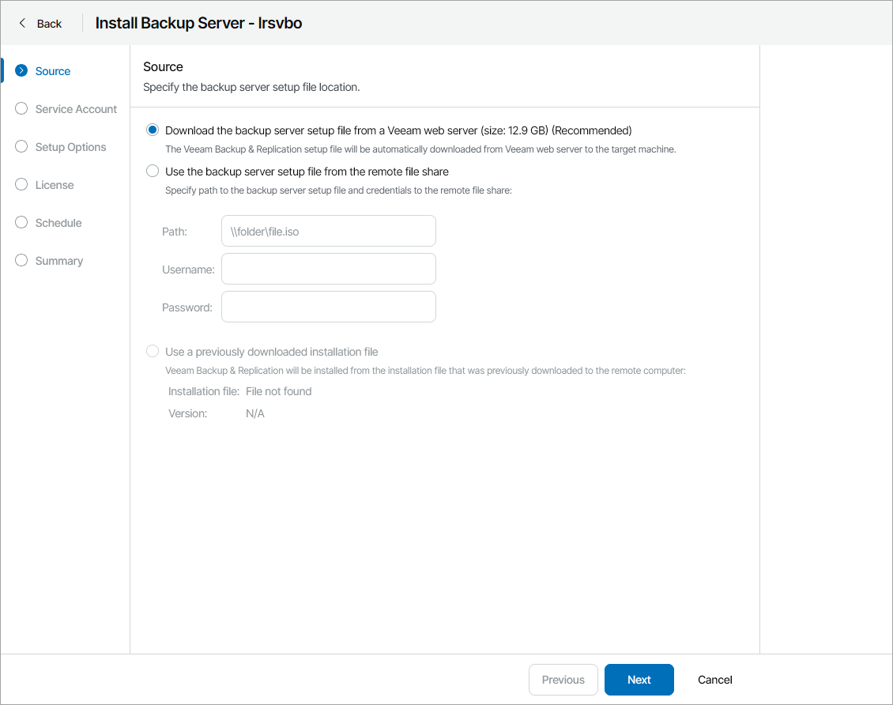
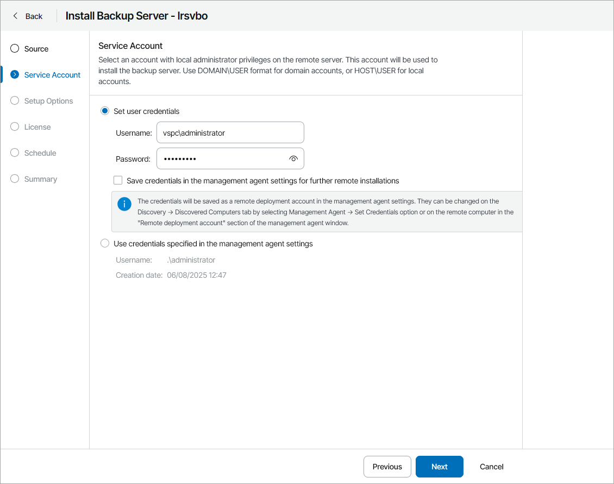
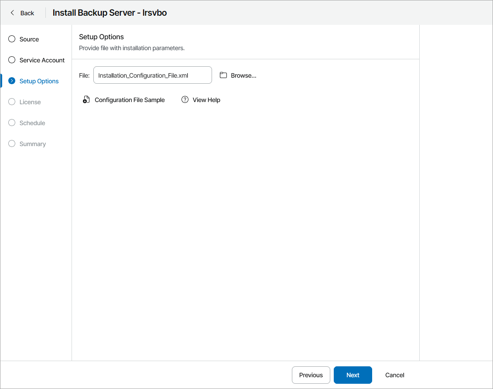
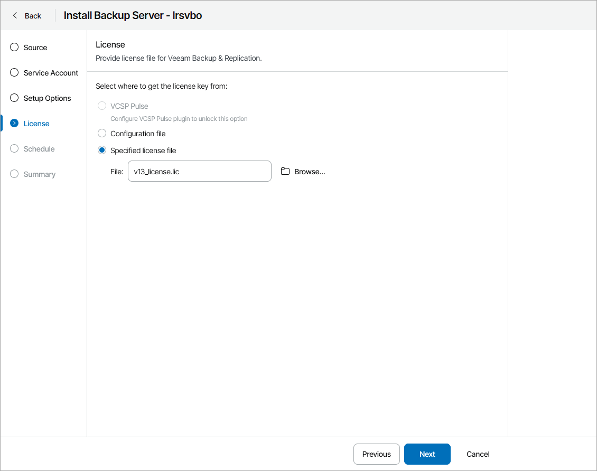
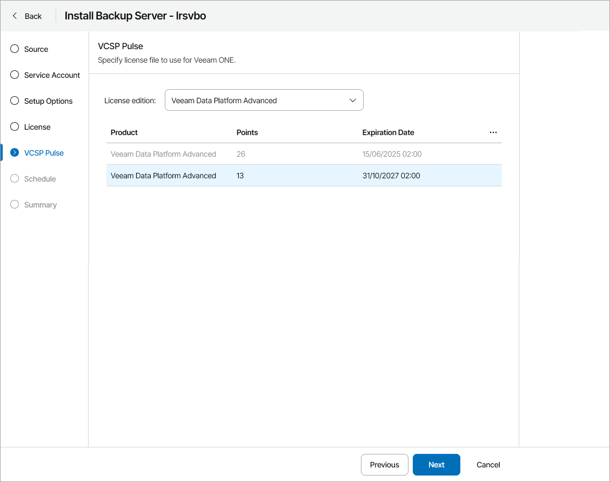
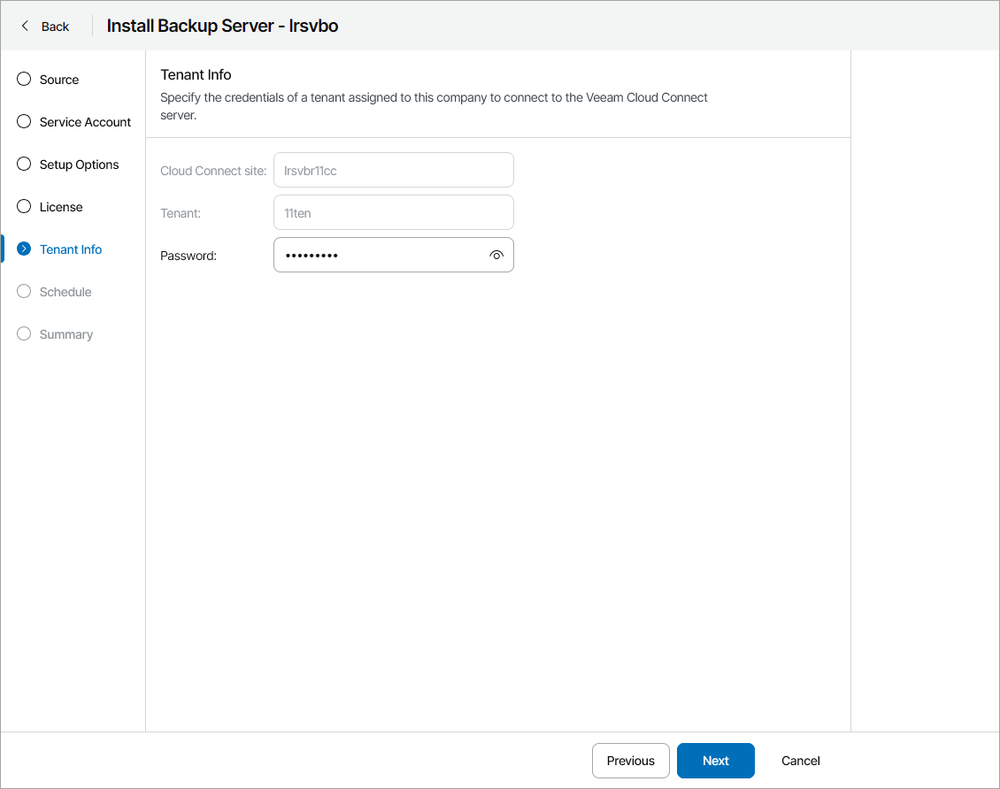
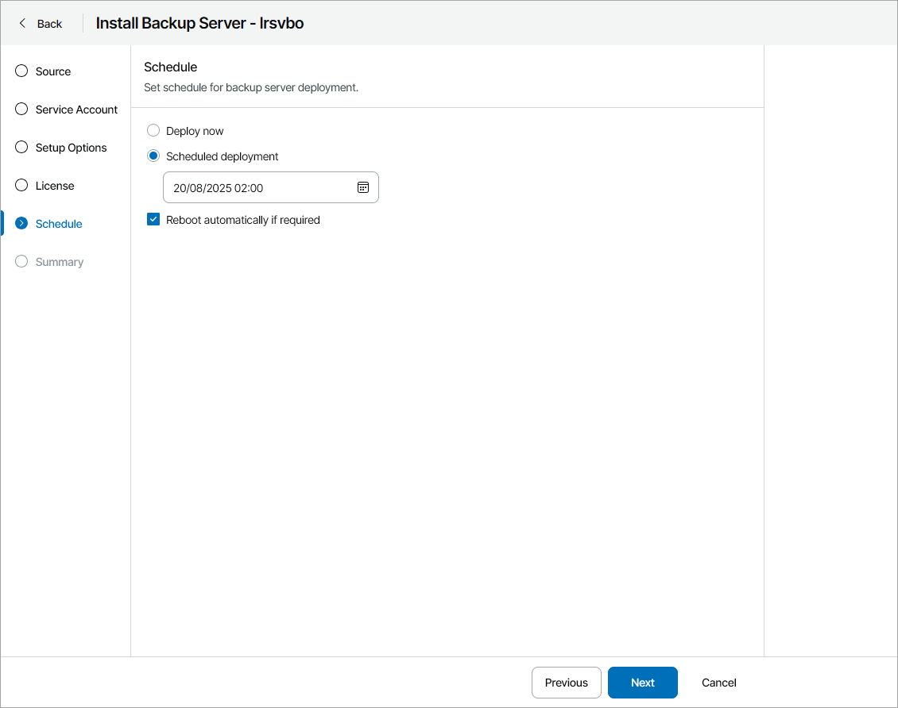
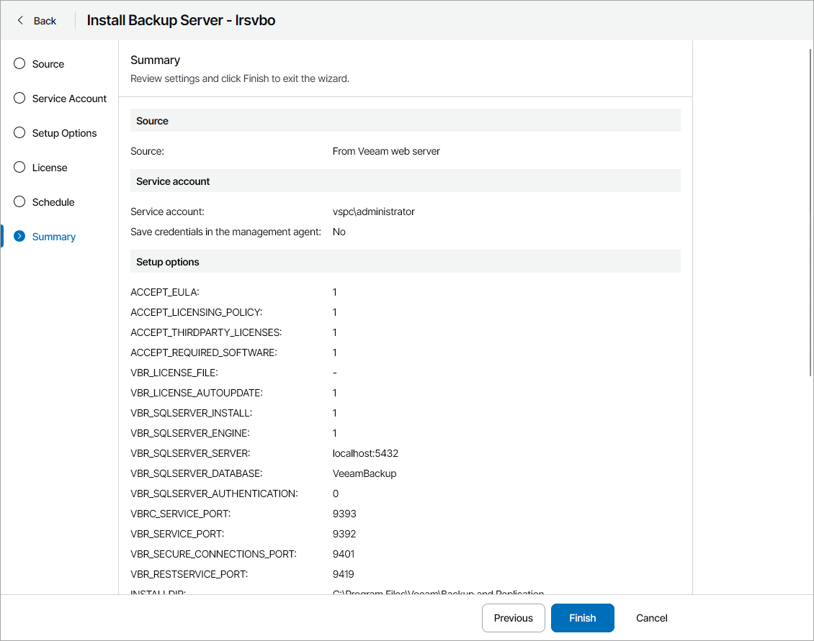

# Installing Veeam Backup & Replication

You can install Veeam Backup & Replication on discovered computers in client or hosted infrastructure. Veeam Service Provider Console will deploy its management agent on a discovered computer and install Veeam Backup & Replication in silent mode.

For details on installation in silent mode, see section [Installing Veeam Backup & Replication Console in Silent Mode](https://helpcenter.veeam.com/docs/vbr/userguide/install_console_answer_file.html) of the Veeam Backup & Replication User Guide.

How Installation of Veeam Backup & Replication is Performed

Installation of Veeam Backup & Replication runs as follows:

1. A backup administrator instructs Veeam Service Provider Console to install Veeam Backup & Replication on a discovered computer and configures installation settings.
2. If Veeam Service Provider Console management agent is not installed on the remote computer, the master agent downloads the Veeam Service Provider Console management agent, downloads Veeam Backup & Replication setup files from the Veeam Installation Server (over the Internet) or the remote file share, uploads these files to discovered computer, triggers management agent installation, and configures management agents to communicate with Veeam Service Provider Console.

Alternatively, you can download the setup file in Veeam Service Provider Console to the remote computer in advance to decrease Veeam Backup & Replication server downtime.

1. Veeam Service Provider Console management agent on the discovered computer provides Veeam Backup & Replication license from the selected source and triggers installation of Veeam Backup & Replication in silent mode. After the installation is complete, Veeam Service Provider Console management agent connects Veeam Backup & Replication to Veeam Service Provider Console.

Required Privileges

To perform this task, a user must have one of the following roles assigned: Portal Administrator, Site Administrator, Portal Operator.

Prerequisites

For details on system requirements for Veeam Backup & Replication servers, see the [System Requirements](https://helpcenter.veeam.com/docs/vbr/userguide/system_requirements.html?ver=13#backup-server) section of the Veeam Backup & Replication User Guide.

In addition to requirements listed in the Veeam Backup & Replication User Guide, consider the following:

* To install Veeam Backup & Replication on a client computer, you must upgrade Veeam Cloud Connect server on which the client company is registered to version 12.
* Make sure you have additional free space on the system disk on the machine on which you plan to install Veeam Backup & Replication. Veeam Service Provider Console will need extra space to download and unpack Veeam Backup & Replication setup file. You can check the setup file size on the first step of the wizard.

* Make sure you have local administrator credentials for the machine on which you plan to install Veeam Backup & Replication.
* To install Veeam Backup & Replication on a client computer, you must enable backup servers management for the client company. For details, see [Step 4. Configure Hosted Services](allocate_hosted_quota.md).

|  |
| --- |
| Note: |
| In Veeam Service Provider Console, you can install Veeam Backup & Replication for Microsoft Windows version 12 or later. Veeam Service Provider Console does not support installation of Veeam Backup & Replication Community Edition or Veeam Backup & Replication for Linux.  When you initiate Veeam Backup & Replication installation, Veeam Service Provider Console will send to Veeam Installation Server data about Veeam Service Provider Console version. This data will be sent even if you have disabled automatic checks for Veeam products updates. |

Installing Veeam Backup & Replication

To initiate Veeam Backup & Replication installation:

1. Log in to Veeam Service Provider Console.

For details, see [Accessing Veeam Service Provider Console](access_vac.md).

1. In the menu on the left, click Discovery.
2. Open the Discovered Computers tab and navigate to Computers.
3. Select the necessary computer in the list.
4. At the top of the list, click Install Product > Install Backup Server > Install.

Alternatively, you can right-click the necessary computer, click Install Product > Install Backup Server > Install.

Veeam Service Provider Console will open the Install Backup Server wizard.

1. At the Source step of the wizard, specify location of the Veeam Backup & Replication distribution:

* To use a latest distribution from Veeam Installation Server (over the Internet), select the Download the backup server setup file from a Veeam web server option.
* To use a distribution stored on a remote file share, select the Use the backup server setup file from the remote file share option and specify remote file share location and credentials of an account that Veeam Service Provider Console will use to connect to the file share.
* If you have previously downloaded an installation file to the remote computer in Veeam Service Provider Console, select the Use a previously downloaded installation file option. Veeam Service Provider Console will locate the downloaded installation file automatically.

For details on how to download the installation file in Veeam Service Provider Console, see [Downloading Setup File](#download_iso).

1. At the Service Account step of the wizard, specify service account credentials:

* Select the Set user credentials option to set the user name and password.

The account must have local administrator permissions on the remote computer.

To store the user name and password as remote deployment account credentials in the management agent, select the Save credentials in the management agent settings for further remote installations check box. This will allow you to use these credentials to upgrade the Veeam Backup & Replication server in Veeam Service Provider Console.

If you have previously saved credentials in the management agent, you must confirm overwriting the saved credentials.

You can also set or update service account credentials in Veeam Service Provider Console. For details, see [Modifying Management Agent Credentials](modify_agent_credentials.md).

* Select the Use credentials specified in the management agent settings option to use the credentials saved in the management agent settings.

1. At the Setup Options step of the wizard, specify path to an XML file with installation parameters.

To create a configuration file, click Configuration File Sample to download the file template and fill in the necessary configuration parameters. For details on configuration parameters, see [Configuration Parameters](#config).

1. At the License step of the wizard, do one of the following:

* To install license key configured in VCSP Pulse, select VCSP Pulse.

This option is available only if you have configured integration with VCSP Pulse. For details, see [Integration with VCSP Pulse](integration_pulse.md).

If this option is selected, the VCSP Pulse step will become available in the wizard.

* To install license provided in configuration file, select Configuration file.

* To upload license file from your computer, select Specified license file, click Browse and specify a path to the license file.

1. [If you have selected VCSP Pulse at step 9] At the VCSP Pulse step of the wizard, select the necessary license key in the list.

It is not recommended to install one VCSP Pulse license in multiple products. If you have selected a license key that is already installed in another product, Veeam Service Provider Console will ask you to copy the license key. If you do not want to copy the license key, you can download the license file from VCSP Pulse and install it manually. Note that in license usage report Veeam Service Provider Console will add up points usage for all servers with the same license ID.

1. [If you deploy Veeam Backup & Replication on a client computer] At the Tenant Info step of the wizard, specify password for the Veeam Cloud Connect tenant account (for Native Veeam Cloud Connect tenant accounts) or credentials for the VMware Cloud Director organization administrator account (for VMware Cloud Director tenant accounts).

1. At the Schedule step of the wizard, specify when you want to install Veeam Backup & Replication:

* To install Veeam Backup & Replication immediately, select Deploy now.
* To postpone installation, select Scheduled deployment and specify date and time when Veeam Backup & Replication will be installed.

You will be able to reschedule or cancel the installation using the link in the Scheduled Deployment column on the Discovered Computers tab.

If you want to reboot remote computers automatically during Veeam Backup & Replication installation, select the Reboot automatically if required check box. If you do not select the check box, you may need to reboot the backup server manually to complete installation. For details, see [Rebooting Remote Computers](reboot_remote_computers.md).

1. At the Summary step of the wizard, review installation settings and click Finish.

Downloading Setup File

To download the Veeam Backup & Replication installation file to a remote computer:

1. Log in to Veeam Service Provider Console.

For details, see [Accessing Veeam Service Provider Console](access_vac.md).

1. In the menu on the left, click Discovery.
2. Open the Discovered Computers tab and navigate to Computers.
3. Select the necessary computers in the list.
4. At the top of the list, click Install Backup Server and select Download Installation File.

Alternatively, you can right-click the necessary computer, click Install Backup Server and select Download Installation File.

Veeam Service Provider Console will open the Download Installation File window.

1. In the Directory field, check, and if necessary, change the directory where Veeam Service Provider Console will download the installation file.
2. Click Download.
3. To ensure that the Veeam Backup & Replication installation file was downloaded successfully:

* Check the value in the Installation File Download Status column.

If the installation was successful, the Installation File Download Status must be Success.

* Click the link in the Installation File Download Status column to display session details of the installation file download.

If you want to cancel the download of the Veeam Backup & Replication installation file, click Cancel Download. If the download was canceled and the Installation File Download Status is Failed, click Clear Logs to reset the status.

Checking Installation Results

To make sure that installation of Veeam Backup & Replication has completed successfully, complete the following steps:

1. Log in to Veeam Service Provider Console.

For details, see [Accessing Veeam Service Provider Console](access_vac.md).

1. In the menu on the left, click Discovery.
2. Open the Discovered Computers tab and navigate to Computers.
3. Find the necessary computers in the list.
4. Check the value in the Deployment Status and Deployment Progress columns.

If installation was successful, the Deployment Status must be Success, and the Deployment Progress must be 100%.

1. Click a link in the Deployment Status column to display session details of the installation procedure.

If you want to cancel Veeam Backup & Replication installation, click Cancel Deployment. If the installation was canceled and the Deployment Status is Failed, click Clear Logs to reset the status.

In some cases, after installation you may need to perform additional operations. For example, if the setup detects a pending computer reboot, the list of installation session details will display a warning notifying that reboot is required. To complete the installation, you can initiate computer reboot in Veeam Service Provider Console. For details, see [Rebooting Remote Computers](reboot_remote_computers.md).

Configuration Parameters

The configuration file contains the following parameters:

* ACCEPT\_EULA — specify "1" to accept Veeam license agreement.
* ACCEPT\_LICENSING\_POLICY — specify "1" to accept Veeam licensing policy.
* ACCEPT\_THIRDPARTY\_LICENSES — specify "1" to accept the license agreement for 3rd party components that Veeam incorporates.
* ACCEPT\_REQUIRED\_SOFTWARE — specify "1" to accept all required software license agreements.
* VBR\_LICENSE\_FILE — path to the license file on the machine where you want to install Veeam Backup & Replication. If you want to install VCSP Pulse license or provide the license file manually, leave this parameter empty.
* VBR\_LICENSE\_AUTOUPDATE — specify "1" to enable automatic license update and usage reporting. Specify "0" if you want to update the license manually. For NFR licenses, specify "1". For licenses without ID information, specify "0".
* VBR\_SERVICE\_USER — user account under which the Veeam Backup Service will run. If you do not specify this parameter, the service will run under the LocalSystem account.
* VBR\_SERVICE\_PASSWORD — password for the account under which the Veeam Backup Service will run.
* VBR\_SQLSERVER\_INSTALL — specify "0" to use an existing SQL server instance or specify "1" to create a new SQL server instance.
* VBR\_ENTRAID\_DATABASE\_INSTALL — specify "1" if you want to install a PostgreSQL database for Microsoft Entra ID. Specify "0" if you do not want to install the database.
* VBR\_SQLSERVER\_ENGINE — specify "0" to use PostgreSQL engine or specify "1" to use Microsoft SQL engine. Note that if you want to create a new SQL server instance, you can only choose the PostgreSQL engine.
* VBR\_SQLSERVER\_SERVER — SQL server and instance (for Microsoft SQL) or SQL server an port (for PostgreSQL) where the configuration database will be deployed. Note that if you want to create a new SQL instance, you can only connect to a local host.
* VBR\_SQLSERVER\_DATABASE — configuration database name.
* VBR\_SQLSERVER\_AUTHENTICATION — specifies authentication mode to connect to the SQL Server where the Veeam Backup & Replication configuration database is deployed. Specify "1" to use the SQL Server authentication mode or specify "0" to use the Microsoft Windows authentication mode.
* VBR\_SQLSERVER\_USERNAME — LoginID to connect to the SQL Server in the SQL Server authentication mode.
* VBR\_SQLSERVER\_PASSWORD — password to connect to the SQL Server in the SQL Server authentication mode.
* VBRC\_SERVICE\_PORT — TCP port that will be used by the Veeam Guest Catalog Service.
* VBR\_SERVICE\_PORT — TCP port that will be used by the Veeam Backup Service.
* VBR\_SECURE\_CONNECTIONS\_PORT — port used for communication between the mount server and the backup server.
* VBR\_RESTSERVICE\_PORT — port used for communication with REST API service.
* INSTALLDIR — path to the directory where Veeam Backup & Replication will be installed.
* VM\_CATALOGPATH — path to the catalog folder where index files will be stored.
* VBR\_IRCACHE — path to the folder where the instant recovery cache will be stored.
* VBR\_CHECK\_UPDATES — specify "1" to automatically check for new product versions and updates. Specify "0" if you do not want Veeam Backup & Replication to check for updates automatically.
* AHV\_INSTALL — specify "1" if you want to install Nutanix AHV Plug-in for Veeam Backup & Replication. Specify "0" if you do not want to install the plugin.
* KVM\_INSTALL — specify "1" if you want to install oVirt KVM Plug-in for Veeam Backup & Replication. Specify "0" if you do not want to install the plugin.
* PVE\_INSTALL — specify "1" if you want to install Proxmox VE Plug-in for Veeam Backup & Replication. Specify "0" if you do not want to install the plugin.
* AWS\_INSTALL — specify "1" if you want to install AWS Plug-in for Veeam Backup & Replication. Specify "0" if you do not want to install the plugin.
* AZURE\_INSTALL — specify "1" if you want to install Microsoft Azure Plug-in for Veeam Backup & Replication. Specify "0" if you do not want to install the plugin.
* GCP\_INSTALL — specify "1" if you want to install Google Cloud Plug-in for Veeam Backup & Replication. Specify "0" if you do not want to install the plugin.
* KASTEN\_INSTALL — specify "1" if you want to install Kasten Plug-in for Veeam Backup & Replication. Specify "0" if you do not want to install the plugin.

Note that you must specify "1" in ACCEPT\_EULA, ACCEPT\_LICENSING\_POLICY, ACCEPT\_THIRDPARTY\_LICENSES and ACCEPT\_REQUIRED\_SOFTWARE parameters to proceed with the installation.

