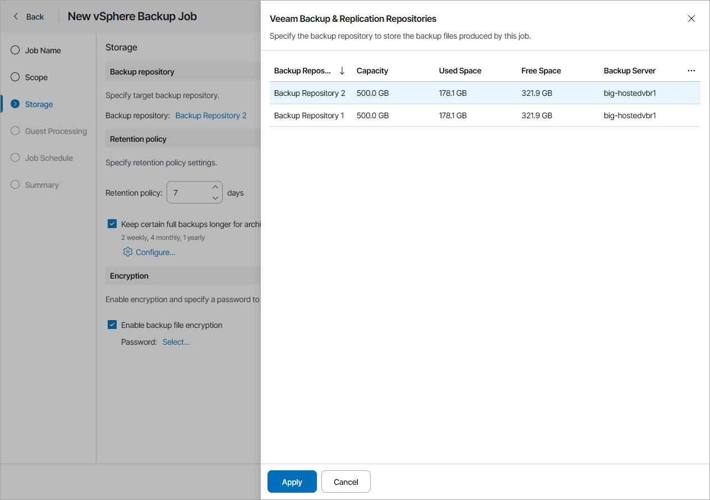

# Step 4. Specify Backup Repository Settings

At the Storage step of the wizard, select backup repository and configure job retention policy:

1. Click a link in the Backup repository section.
2. In the Veeam Backup & Replication Repositories window, select the necessary backup repository.
3. Click Apply.
4. In the Retention policy section, specify retention policy settings:

* In the Retention policy field, specify the number of days for which you want to keep the created restore points.

When the specified number is exceeded, the earliest restore point is removed from the backup chain or merged with the next closest restore point. For details, see section [Short-Term Retention Policy](https://helpcenter.veeam.com/docs/vbr/userguide/retention_policy.html?ver=13) of the Veeam Backup & Replication User Guide.

* To enable long-term retention policy, select the Keep certain full backups longer for archival purposes check box and click Configure.

In the GFS Retention Settings window, specify how long you want to keep weekly, monthly and yearly full backups.

For details on GFS retention mechanism, see section [Long-Term Retention Policy (GFS)](https://helpcenter.veeam.com/docs/vbr/userguide/gfs_retention_policy.html?ver=13) of the Veeam Backup & Replication User Guide.

1. In the Encryption section, configure backup file encryption:

1. To enable encryption, select the Enable backup file encryption check box and click Select.
2. In the Encryption Passwords window, select password to protect the encryption key.

To create a new password, click Add and specify password and password hint.

|  |
| --- |
| Important! |
| Make sure to remember your password. Note that Veeam Customer Technical Support cannot recover lost passwords or retrieve data from encrypted backup files. |

1. Click Apply.

|  |
| --- |
| Note: |
| If you have selected to back up to a Veeam Data Cloud Vault repository, you are required to configure backup files encryption. |

