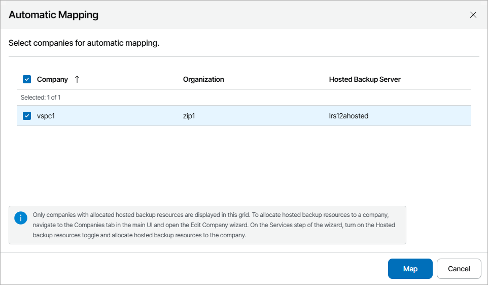
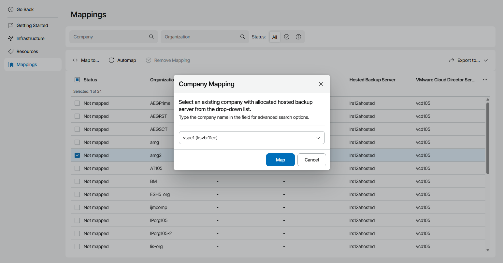

# Mapping VMware Cloud Director Organizations

To map organizations in VMware Cloud Director to companies in Veeam Service Provider Console, you can use one of the following methods:

* [Map companies automatically](#auto)

Select this method if names of companies you manage in Veeam Service Provider Console are same or similar to their names in VMware Cloud Director.

* [Map companies manually](#manual)

Select this method if names of companies you manage in Veeam Service Provider Console and organization names in VMware Cloud Director do not match.

|  |
| --- |
| Note: |
| Note that if a VMware Cloud Director organization is mapped to a Veeam Service Provider Console company and a job created outside of Veeam Service Provider Console processes only workloads that belong to this VMware Cloud Director organization, this job will be assigned to the mapped company automatically. |

Mapping Companies Automatically

To map companies automatically:

1. Log in to Veeam Service Provider Console.

For details, see [Accessing Veeam Service Provider Console](access_vac.md).

1. At the top right corner of the Veeam Service Provider Console window, click Configuration.
2. In the configuration menu on the left, click Catalog.
3. Click the Veeam Backup & Replication plugin tile.
4. In the menu on the left, click Mappings.

Veeam Service Provider Console will display a list of all managed VMware Cloud Director organizations.

1. At the top of the list, click Automap.

This will automatically detect VMware Cloud Director organizations with names same or similar to the names of companies configured in Veeam Service Provider Console.

1. In the displayed list of matched companies, select the necessary companies and click Map.

Mapping Companies Manually

To map companies manually:

1. Log in to Veeam Service Provider Console.

For details, see [Accessing Veeam Service Provider Console](access_vac.md).

1. At the top right corner of the Veeam Service Provider Console window, click Configuration.
2. In the configuration menu on the left, click Catalog.
3. Click the Veeam Backup & Replication plugin tile.
4. In the menu on the left, click Mappings.

Veeam Service Provider Console will display the list of all managed VMware Cloud Director organizations.

1. From the list of companies, select an unmapped VMware Cloud Director organization.

To narrow down the list of companies, you can apply the following filters:

* Company — search companies by name configured in Veeam Service Provider Console.
* Organization — search organizations by name configured in VMware Cloud Director.
* Status — limit the list of companies and organizations by mapping status (Mapped, Not mapped).

1. At the top of the list, click Map to.
2. In the Company Mapping window, type the name of Veeam Service Provider Console company which you want to map.
3. Click OK.

1. Repeat steps 6–9 for all companies you want to map.

