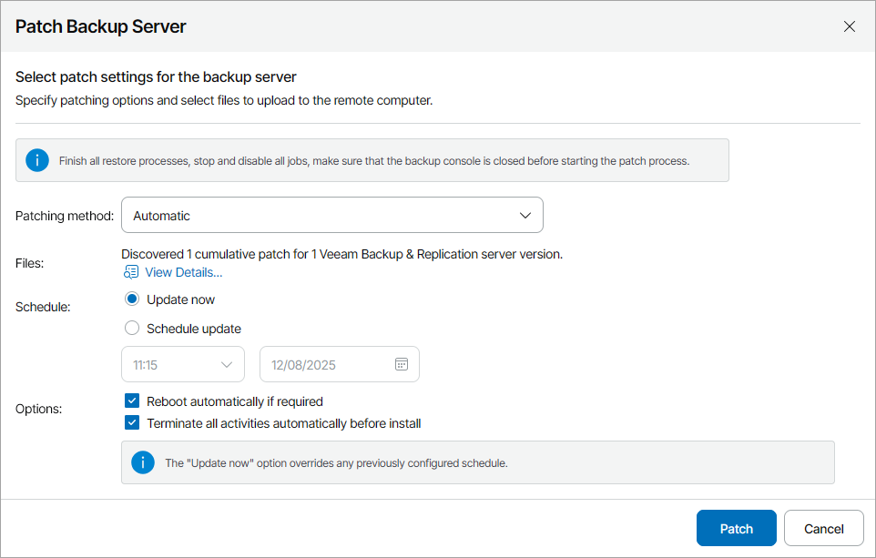
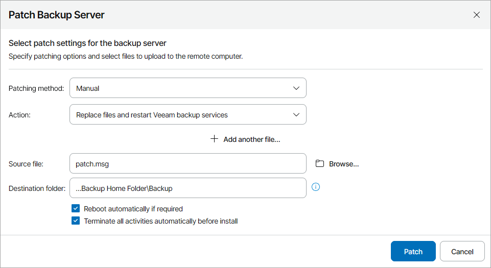
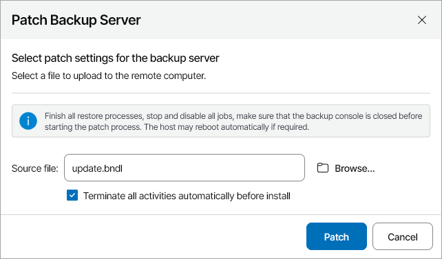

# Applying Patches to Veeam Backup & Replication Servers

From time to time, you may obtain from Veeam Software patches aimed to fix known issues in the Veeam Backup & Replication software. A patch is a hotfix or bugfix that does not change product major or minor version. Applying patches on individual backup servers in the client infrastructure may take a lot of time and effort. To streamline this process, you can apply patches to a group of Veeam Backup & Replication servers managed in Veeam Service Provider Console. Only servers on computers running the same OS can be patched at the same time.

The procedure of applying patches to Veeam Backup & Replication servers is performed with the help of a management agent. The management agent obtains patch files available for backup servers within the patching scope from Veeam Installation Server (over the Internet), uploads these files to hosted and client computers within the patching scope, and initiates the patching process on these computers.

Alternatively, you can patch Veeam Backup & Replication servers manually. In this case, the management agent obtains patch files provided by the Administrator Portal user, uploads these files to hosted and client computers within the patching scope, and initiates the patching process on these computers.

For Veeam Backup & Replication servers deployed on Veeam Software Appliance, you can only [upload private fixes](#vsa_fix).

You cannot patch Veeam Backup Enterprise Manager servers in Veeam Service Provider Console. For details on how to update a Veeam Backup Enterprise Manager server, see section [Installing Updates](https://helpcenter.veeam.com/docs/vbr/userguide/update_appliance_install_updates.html) in the Veeam Backup & Replication User Guide.

|  |
| --- |
| Note: |
| For security reasons, only files obtained from Veeam Customer Technical Support or downloaded from Veeam website can be used for patching. |

Required Privileges

To perform this task, a user must have one of the following roles assigned: Portal Administrator, Site Administrator, Portal Operator.

Before You Begin

Before you start the procedure of applying patches:

* Stop and disable all active jobs and finish all restore processes.
* Close the Veeam Backup & Replication console on the servers to which you want to apply patches.

Configuring Automated Patching for Veeam Backup & Replication Servers

If patches for managed backup servers are available on Veeam Installation Server, you can install these patches on the backup servers automatically.

|  |
| --- |
| Note: |
| Automated patching is only available for Windows Veeam Backup & Replication servers. Linux Veeam Backup & Replication servers will be updated automatically if this option is enabled on the Veeam Software Appliance. For details, see section [Configuring Updates](https://helpcenter.veeam.com/docs/vbr/userguide/update_appliance_configure_updates.html) of the Veeam Backup & Replication User Guide. |

To configure automated patching for a Windows Veeam Backup & Replication server:

1. Log in to Veeam Service Provider Console.

For details, see [Accessing Veeam Service Provider Console](access_vac.md).

1. In the menu on the left, click Discovery.
2. Open the Backup Servers tab.
3. Select one or more backup servers in the list.

Note that all selected Veeam Backup & Replication servers must have available automatic patches. If you select servers with no patches available, automatic patching will not start for these servers, and the value in the Update Status column will change to Failed.

1. At the top of the list, click Manage Updates and choose Patch Server.

Alternatively, you can right-click the necessary server, choose Manage Updates and select Patch Server.

1. In the Patch Backup Server window, in the Patching method list, select Automatic.

To view details on patches available for selected Veeam Backup & Replication servers, click the View Details link.

In some cases, Veeam Service Provider Console may not have information on the latest available patches. To update the patches list, click Rescan.

1. In the Schedule section, specify patching schedule:

* To install patch immediately, select Update now.

If you select this option, any previously scheduled update will be canceled automatically.

* To postpone patch installation, select Schedule update and specify date and time when the patch will be installed.

1. If you want to reboot remote computers automatically during patch installation, select the Reboot automatically if required check box.

If you do not select the check box, you may need to reboot the backup server manually to complete patch installation. For details, see [Rebooting Veeam Backup & Replication Servers](reboot_vbr.md).

1. If you want Veeam Backup & Replication to automatically stop all active jobs and restore processes, temporarily disable scheduled jobs and close Veeam Backup & Replication console, select the Terminate all activities automatically before install check box.

After the patching process is finished, scheduled jobs will be enabled automatically. Note that some jobs cannot be stopped automatically.

1. Click Patch.

Veeam Service Provider Console will upload patch files to a Veeam Backup & Replication server and initiate patch installation. After patch installation, Veeam Backup & Replication remote components will be updated automatically. To check patching progress and download patching session logs, click a link in the Update Status column. To reschedule or cancel scheduled patch installation, click a link in the Scheduled Updates column.

Applying Patches to Windows Veeam Backup & Replication Servers Manually

To patch a Windows Veeam Backup & Replication server manually:

1. Log in to Veeam Service Provider Console.

For details, see [Accessing Veeam Service Provider Console](access_vac.md).

1. In the menu on the left, click Discovery.
2. Open the Backup Servers tab.
3. Select one or more backup servers in the list.

Note that you can patch only Veeam Backup & Replication servers with the same version. Otherwise, only the Veeam Backup & Replication servers that are compatible with the patch version will be patched.

1. At the top of the list, click Manage Updates and choose Patch Server.

Alternatively, you can right-click the necessary server, choose Manage Updates and select Patch Server.

1. In the Patch Backup Server window, in the Patching method list, select Manual.
2. Specify patching method:

* To execute files on the Veeam Backup & Replication server:

1. From the Action drop-down list, select Execute files.
2. Click Browse and select a patch file that must be executed on the backup servers.
3. To execute multiple patch files, click Add another file and repeat step ii for every file you want to upload.

Note that all patch files will be executed in the order of upload.

* To replace files in the Veeam Backup & Replication installation folder and restart backup services:

1. From the Action drop-down list, select Replace files and restart Veeam backup services.
2. Click Browse and select a patch file.
3. Specify a path to the installation folder of a Veeam Backup & Replication server.
4. To replace multiple files, click Add another file and repeat steps ii–iii for all files that you want to replace.

1. If you want to reboot remote computers automatically during patch installation, select the Reboot automatically if required check box.

If you do not select the check box, you may need to reboot the backup server manually to complete patch installation. For details, see [Rebooting Veeam Backup & Replication Servers](reboot_vbr.md).

1. If you want Veeam Backup & Replication to automatically terminate all active jobs and restore processes, temporarily disable scheduled jobs and close Veeam Backup & Replication console, select the Terminate all activities automatically before install check box.

After the patching process is finished, scheduled jobs will be enabled automatically. Note that some jobs cannot be stopped automatically.

1. Click Patch.

Veeam Service Provider Console will upload patch files to a Veeam Backup & Replication server and execute selected action. Do not close your browser tab until patching process is finished. After patch installation, Veeam Backup & Replication remote components will be updated automatically. To check patching progress and download patching session logs, click a link in the Update Status column.

To complete patch installation, you may need to reboot the backup server. For details, see [Rebooting Veeam Backup & Replication Servers](reboot_vbr.md).

Uploading Private Fixes to Linux Veeam Backup & Replication Servers

To upload a private fix to a Linux Veeam Backup & Replication server deployed with Veeam Software Appliance:

1. Log in to Veeam Service Provider Console.

For details, see [Accessing Veeam Service Provider Console](access_vac.md).

1. In the menu on the left, click Discovery.

1. Open the Backup Servers tab.

1. Select one or more backup servers in the list.

To update a High Availability cluster, you must upload the private fix file to each cluster node separately.

1. At the top of the list, click Manage Updates and choose Patch Server.

Alternatively, you can right-click the necessary server, choose Manage Updates and select Patch Server.

1. Click Browse and select a .BNDL file with private fix.
2. If you want Veeam Backup & Replication to automatically terminate all active jobs and restore processes, temporarily disable scheduled jobs and close Veeam Backup & Replication console, select the Terminate all activities automatically before install check box.

After the patching process is finished, scheduled jobs will be enabled automatically. Note that some jobs cannot be stopped automatically.

1. Click Patch.

Veeam Service Provider Console will upload the private fix file to a Veeam Backup & Replication server and execute the selected actions. Do not close your browser tab until the update process is finished. After the private fix is installed, Veeam Backup & Replication remote components will be updated automatically. To check update progress and download session logs, click a link in the Update Status column.

If necessary, the backup server will reboot automatically to complete the update.

