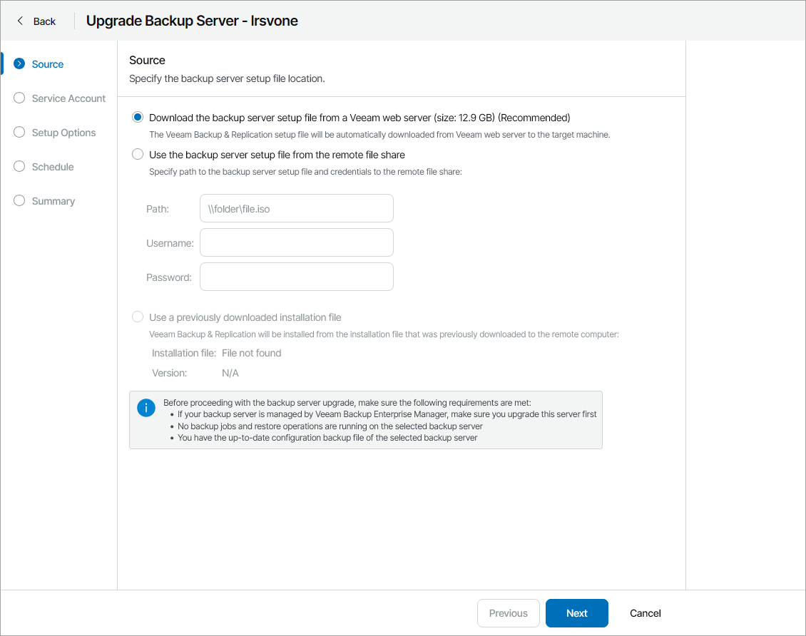
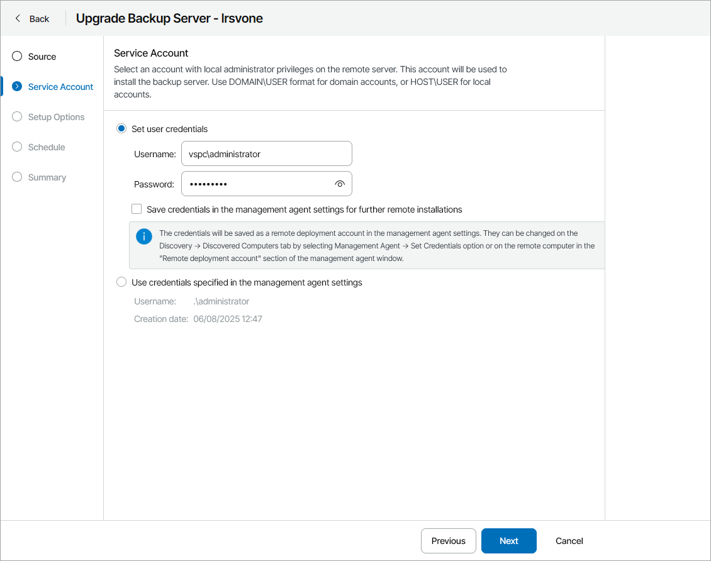
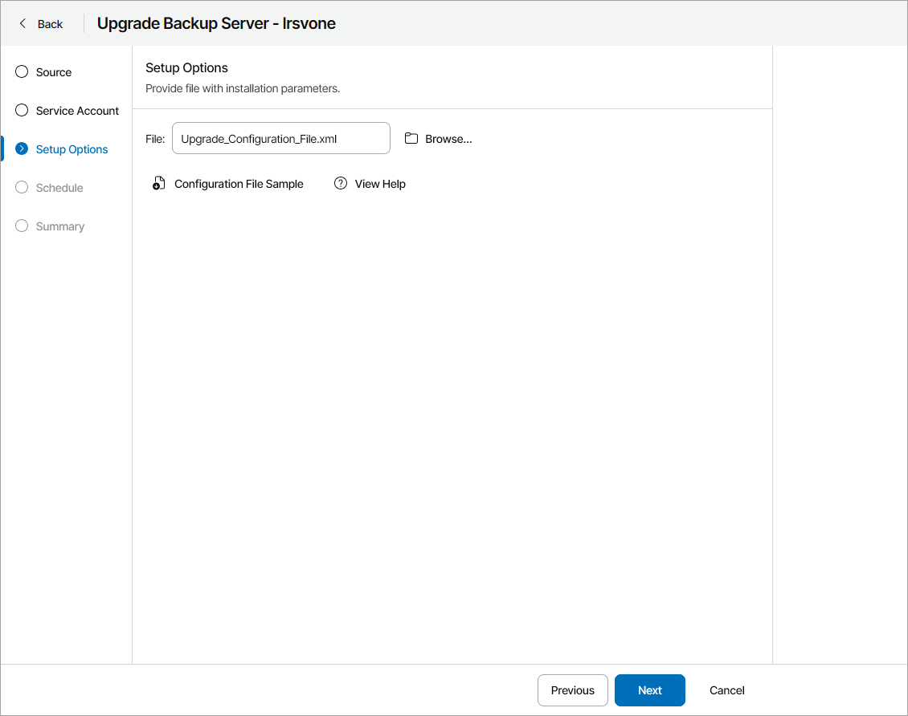
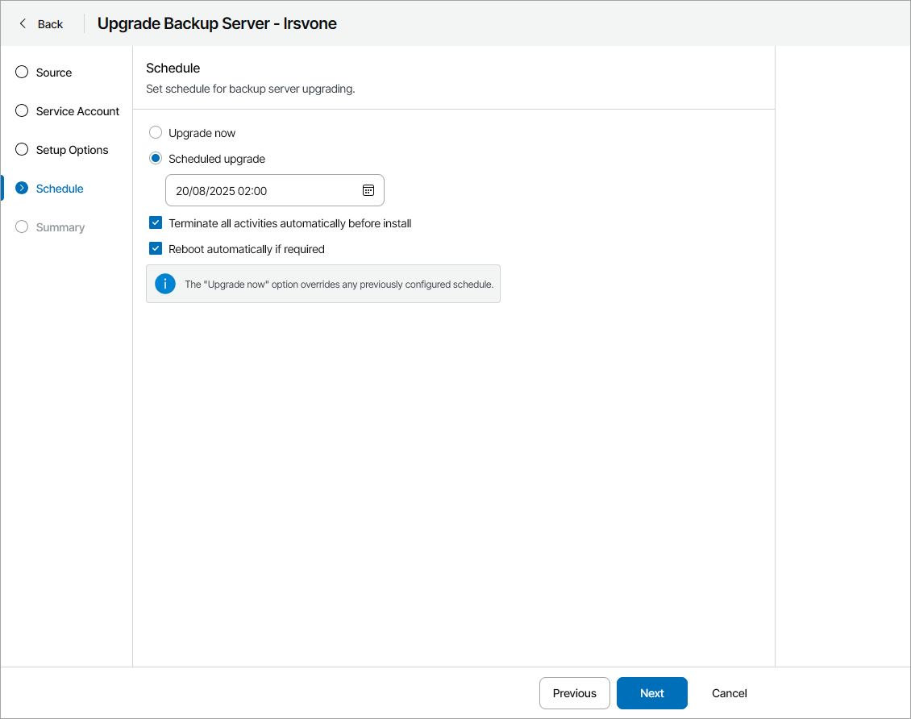
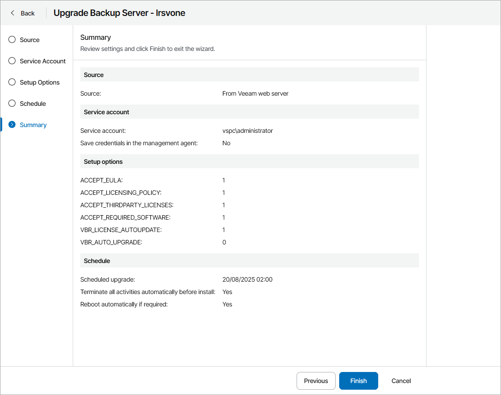

# Upgrading Veeam Backup & Replication Servers

In Veeam Service Provider Console, you can initiate upgrade of Veeam Backup & Replication on client or hosted computers without accessing the managed backup servers.

For details on upgrading servers in silent mode, see section [Upgrading Veeam Backup & Replication in Silent Mode](https://helpcenter.veeam.com/docs/backup/vsphere/upgrade_vbr_answer_file.html) of the Veeam Backup & Replication User Guide.

How Upgrade of Veeam Backup & Replication is Performed

The upgrade procedure works as follows:

1. Veeam Service Provider Console periodically connects to the Veeam Installation Server (over the Internet), and checks whether a new Veeam Backup & Replication version is available.
2. If a new software version is available for managed Veeam Backup & Replication servers, Veeam Service Provider Console displays message next to these servers saying that an upgrade is available.
3. A backup administrator instructs Veeam Service Provider Console to upgrade Veeam Backup & Replication on a remote computer and configures upgrade settings.
4. The Veeam Service Provider Console management agent obtains the Veeam Backup & Replication setup file from the Veeam Installation Server (over the Internet) or from the remote file share and uploads this file to the remote computer.

Alternatively, you can download the setup file in Veeam Service Provider Console to the remote computer in advance to decrease Veeam Backup & Replication server downtime.

1. The management agent on the remote computer triggers the upgrade with the configured settings.

Required Privileges

To perform this task, a user must have one of the following roles assigned: Portal Administrator, Site Administrator, Portal Operator.

Prerequisites

For details on system requirements for Veeam Backup & Replication servers, see the [Upgrade Checklist](https://helpcenter.veeam.com/docs/backup/vsphere/upgrade_vbr_byb.html#system-requirements) section of the Veeam Backup & Replication User Guide.

In addition to requirements listed in the Veeam Backup & Replication User Guide, consider the following:

* To upgrade Veeam Backup & Replication on a client computer, you must upgrade Veeam Cloud Connect server on which the client company is registered to version 13.
* Make sure you have additional free space on the system disk on the machine on which you plan to upgrade Veeam Backup & Replication. Veeam Service Provider Console will need extra space to download and unpack Veeam Backup & Replication setup file. You can check the setup file size on the first step of the wizard.

* Make sure you have local administrator credentials for the machine on which you plan to upgrade Veeam Backup & Replication.

* If the Veeam Backup & Replication server you want to upgrade is managed by Veeam Backup Enterprise Manager, make sure to upgrade Veeam Backup Enterprise Manager before upgrading Veeam Backup & Replication. For details, see section [Upgrading to Veeam Backup Enterprise Manager 12](https://helpcenter.veeam.com/docs/backup/em/em_upgrading.html) of the Veeam Backup Enterprise Manager Guide.

|  |
| --- |
| Note: |
| Upgrade is available from Veeam Backup & Replication version 11a or later to Veeam Backup & Replication version 12 or later. Veeam Service Provider Console does not support upgrade for Veeam Backup & Replication Community Edition. |

Before You Begin

Before you start the upgrade procedure:

* Stop and disable all active jobs and finish all restore processes.
* Close the Veeam Backup & Replication console on the servers which you want to upgrade.

Upgrading Veeam Backup & Replication

To upgrade a Veeam Backup & Replication server:

1. Log in to Veeam Service Provider Console.

For details, see [Accessing Veeam Service Provider Console](access_vac.md).

1. In the menu on the left, click Discovery.
2. Open the Backup Servers tab.
3. Select the necessary computers in the list.
4. At the top of the list, click Manage Updates and choose Upgrade Server.

Alternatively, you can right-click the necessary server, select Manage Updates and choose Upgrade Server.

Veeam Service Provider Console will open the Upgrade Backup Server wizard.

1. At the Source step of the wizard, specify location of the Veeam Backup & Replication distribution:

* To use a latest distribution from Veeam License Update server, select the Download the backup server setup file from a Veeam web server option.
* To use a distribution stored on a remote file share, select the Use the backup server setup file from the remote file share option and specify remote file share location and credentials of an account that Veeam Service Provider Console will use to connect to the file share.

* If you have previously downloaded an installation file to the remote computer, select the Use a previously downloaded installation file option. Veeam Service Provider Console will locate the downloaded installation file automatically.

For details on how to download the installation file in Veeam Service Provider Console, see [Downloading Setup File](#download_iso).

1. At the Service Account step of the wizard, specify service account credentials. The account must have local administrator permissions on the remote computer.

* Select the Set user credentials option to set the user name and password.

The account must have local administrator permissions on the remote computer.

To store the user name and password as remote deployment account credentials in the management agent, select the Save credentials in the management agent settings for further remote installations check box. This will allow you to use these credentials for future upgrades in Veeam Service Provider Console.

If you previously saved credentials in the management agent, you must confirm overwriting the saved credentials.

You can also set or update service account credentials in Veeam Service Provider Console. For details, see [Modifying Management Agent Credentials](modify_agent_credentials.md).

* Select the Use credentials specified in the management agent settings option to use the credentials configured in the management agent settings.

1. At the Setup Options step of the wizard, click Browse and specify path to an XML configuration file.

To create a configuration file, click Configuration File Sample to download the file template and fill in the necessary installation parameters. For details on configuration parameters, see [Configuration Parameters](#config).

1. At the Schedule step of the wizard, specify deployment schedule:

* To upgrade Veeam Backup & Replication immediately, select Upgrade now.

If you select this option, any previously scheduled update will be canceled automatically.

* To postpone upgrade, select Scheduled upgrade and specify date and time when Veeam Backup & Replication will be upgraded.

You will be able to reschedule or cancel the upgrade using the link in the Scheduled Updates column on the Backup Servers tab.

* If you want Veeam Backup & Replication to automatically stop active backup jobs, temporarily disable scheduled jobs and close Veeam Backup & Replication console, select the Terminate all activities automatically before install check box. After the upgrade is finished, scheduled jobs will be enabled automatically.

Restore activities will not be affected. Note that some jobs cannot be gracefully stopped automatically.

* If you want to reboot remote computers automatically during Veeam Backup & Replication upgrade, select the Reboot automatically if required check box. If you do not select the check box, you may need to reboot the backup server manually to complete installation. For details, see [Rebooting Veeam Backup & Replication Servers](reboot_vbr.md).

1. At the Summary step of the wizard, review upgrade settings and click Finish.

Downloading Setup File

To download the Veeam Backup & Replication upgrade file to a remote computer:

1. Log in to Veeam Service Provider Console.

For details, see [Accessing Veeam Service Provider Console](access_vac.md).

1. In the menu on the left, click Discovery.
2. Open the Backup Servers tab.
3. Select the necessary computers in the list.
4. At the top of the list, click Manage Updates and select Download Upgrade File.

Alternatively, you can right-click the necessary computer, click Manage Updates and select Download Upgrade File.

Veeam Service Provider Console will open the Download Installation File window.

1. In the Directory field, check, and if necessary, change the directory where Veeam Service Provider Console will download the upgrade file.
2. Click Download.
3. To ensure that the Veeam Backup & Replication installation file was downloaded successfully:

* Check the value in the Upgrade File Download Status column.

If the installation was successful, the Upgrade File Download Status must be Success.

* Click the link in the Upgrade File Download Status column to display session details of the upgrade file download.

If you want to cancel the download of the Veeam Backup & Replication upgrade file, click Cancel Download. If the download was canceled and the Upgrade File Download Status is Failed, click Clear Logs to reset the status.

Checking Upgrade Results

To make sure that Veeam Backup & Replication upgrade has completed successfully, complete the following steps:

1. Log in to Veeam Service Provider Console.

For details, see [Accessing Veeam Service Provider Console](access_vac.md).

1. In the menu on the left, click Discovery.
2. Open the Backup Servers tab.
3. Find the necessary computers in the list.
4. Check the value in the Update Status column.

If installation was successful, the Update Status must be Success.

1. Click a link in the Update Status column to display session details of the installation procedure.

If you want to cancel Veeam Backup & Replication upgrade, click Cancel Update. If the upgrade was canceled and the Update Status is Failed, click Clear Logs to reset the status.

Configuration Parameters

The configuration file contains the following parameters:

* ACCEPT\_EULA — specify "1" to accept Veeam license agreement.

* ACCEPT\_LICENSING\_POLICY — specify "1" to accept Veeam licensing policy.

* ACCEPT\_THIRDPARTY\_LICENSES — specify "1" to accept the license agreement for 3rd party components that Veeam incorporates.
* ACCEPT\_REQUIRED\_SOFTWARE — specify "1" to accept all required software license agreements.
* VBR\_LICENSE\_FILE — path to the license file. If you do not want to change license on the upgraded server, leave this parameter unchanged.

If you want to install VCSP Pulse license on the upgraded server, specify empty value or disable the parameter. After the upgrade is complete, navigate to the Configuration > Licensing > Veeam Backup & Replication tab to install a new license. For details, see [Installing Veeam Backup & Replication License](install_vbr_license.md).

* VBR\_LICENSE\_AUTOUPDATE — specify "1" to enable automatic license update and usage reporting. Specify "0" if you want to update the license manually. For NFR licenses, specify "1". For licenses without ID information, specify "0".
* VBR\_SERVICE\_PASSWORD — password for the account under which the Veeam Backup Service is running. This parameter is disabled by default. If you do not want to change the password, leave this parameter disabled.
* VBR\_SQLSERVER\_PASSWORD — password to connect to the SQL Server. This parameter is disabled by default. If you do not want to change the password, leave this parameter disabled.

* VBR\_ENTRAID\_DATABASE\_INSTALL — specify "1" if you want to install a PostgreSQL database for Microsoft Entra ID. Specify "0" if you do not want to install the database.

* VBR\_AUTO\_UPGRADE — specify "1" to enable automatic upgrade of existing components in the backup infrastructure. Specify "0" if you want to upgrade the existing components manually.

Note that you must specify "1" in ACCEPT\_EULA, ACCEPT\_LICENSING\_POLICY, ACCEPT\_THIRDPARTY\_LICENSES and ACCEPT\_REQUIRED\_SOFTWARE parameters to proceed with the upgrade.

