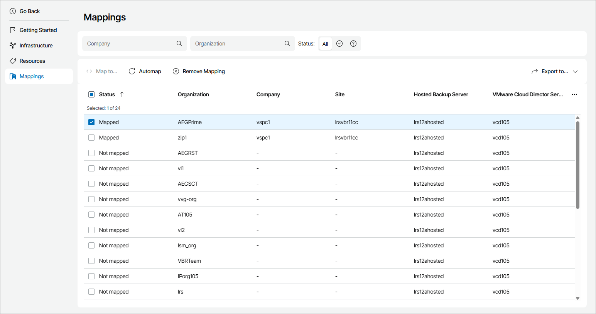

# Viewing and Exporting VMware Cloud Director Organization Details

You can view details on mapped VMware Cloud Director organizations and export them to a CSV or XML file:

1. Log in to Veeam Service Provider Console.

For details, see [Accessing Veeam Service Provider Console](access_vac.md).

1. At the top right corner of the Veeam Service Provider Console window, click Configuration.
2. In the configuration menu on the left, click Catalog.
3. Click the Veeam Backup & Replication plugin tile.
4. In the menu on the left, click Mappings.

Veeam Service Provider Console will display a list of all managed VMware Cloud Director organizations.

To narrow down the list of organizations, you can apply the following filters:

* Company — search companies by name configured in Veeam Service Provider Console.
* Organization — search organizations by name configured in VMware Cloud Director.
* Status — limit the list of companies and organizations by mapping status (Mapped, Not mapped).

1. To export organization details, click Export to and choose a format of the exported data:

* CSV — choose this option to structure exported data as a CSV file.
* XML — choose this option to structure exported data as an XML file.

The file with exported data will be saved to the default download location on your computer.

Each organization in the list is described with a set of properties.

* Status — organization status (Mapped, Not mapped).
* Organization — name of a VMware Cloud Director organization.
* Company — name of a Veeam Service Provider Console company.
* Site — name of a Veeam Cloud Connect site on which the Veeam Service Provider Console company is registered.
* Hosted Backup Server — name of a Veeam Backup & Replication server allocated to the organization.
* VMware Cloud Director Server — hostname of a VMware Cloud Director server assigned to the organization.

