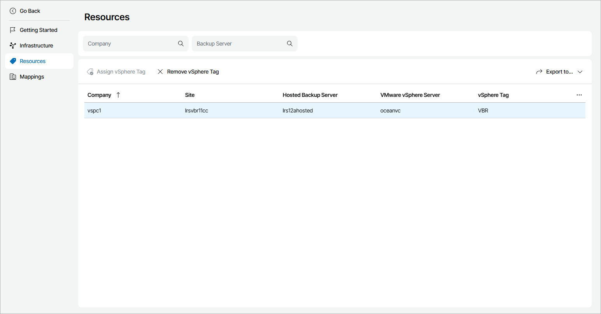

# Viewing and Exporting VMware vSphere Tag Details

You can view details on assigned VMware vSphere tags and export them to a CSV or XML file:

1. Log in to Veeam Service Provider Console.

For details, see [Accessing Veeam Service Provider Console](access_vac.md).

1. At the top right corner of the Veeam Service Provider Console window, click Configuration.
2. In the configuration menu on the left, click Catalog.
3. Click the Veeam Backup & Replication plugin tile.
4. In the menu on the left, click Resources.

Veeam Service Provider Console will display a list of all client companies with allocated hosted Veeam Backup & Replication resources.

To narrow down the list of companies, you can apply the following filters:

* Company — search the list of companies by name.
* Backup Server — search the list of companies by Veeam Backup & Replication server name.

1. To export company details, click Export to and choose a format of the exported data:

* CSV — choose this option to structure exported data as a CSV file.
* XML — choose this option to structure exported data as an XML file.

The file with exported data will be saved to the default download location on your computer.

Each company in the list is described with a set of properties.

* Company — name of a Veeam Service Provider Console company.
* Site — name of a Veeam Cloud Connect site on which the company is registered.
* Hosted Backup Server — name of a Veeam Backup & Replication server allocated to the company.
* VMware vSphere Server — hostname of a VMware vSphere server assigned to the company.

* vSphere Tag — VMware vSphere tag assigned to the company.

