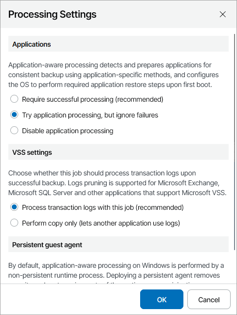
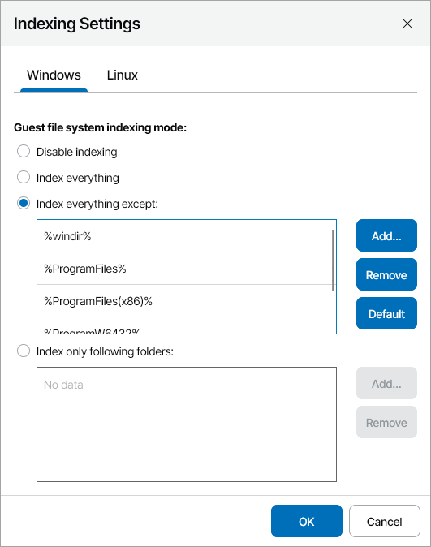
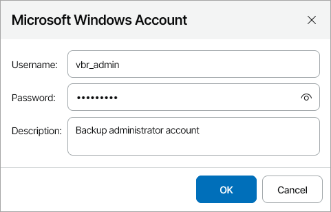
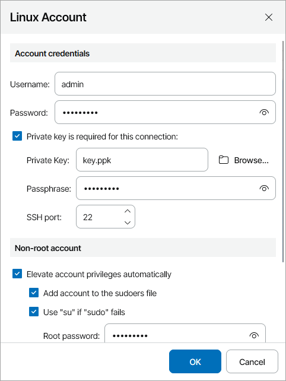

# Step 5. Specify Guest OS Processing Options

At the Guest Processing step of the wizard, you can enable the following settings for guest OS processing:

* [Application-aware processing](#application)
* [File indexing](#file)
* [Guest OS credentials](#credentials)

Application-Aware Processing

If the VM runs VSS-aware applications, you can enable application-aware processing to create a transactionally consistent backup. The transactionally consistent backup guarantees proper recovery of applications without data loss.

To enable application-aware processing:

1. In the Processing options section, select the Enable application-aware processing check box.
2. Click the Customize application link.
3. In the Application-Aware Processing Options window, select workloads for which you want to customize settings and click Edit.

If you customize processing options for an organization, datacenter or vApp, the customized settings will be applied to all VMs in the workload. To customize processing options for a single VM, click Add, select the necessary VM from the list and click Add.

1. In the Applications section, specify the behavior for application-aware processing:

* Select Require successful processing if you want Veeam Backup & Replication to stop the backup process when an error occurs during application-aware processing.
* Select Try application processing, but ignore failures if you want to continue the backup process when an error occurs during application-aware processing. This option guarantees completion of the backup job. In this case, Veeam Backup & Replication will create a crash consistent backup instead of transactionally consistent backup.
* Select Disable application processing if you do not want to enable application-aware processing.

1. In the VSS settings section, specify if Veeam Backup & Replication must process transaction logs or create copy-only backups:

* Select Process transaction logs with this job if Veeam Backup & Replication must process application logs.

[For Microsoft Exchange VMs] If you select this option, Veeam Backup & Replication will back up the Exchange database and its logs. The non-persistent runtime components or persistent components that run on the VM guest OS will wait for a backup job to complete successfully. After that, they will trigger truncation of transaction logs on a Microsoft Exchange server. If the backup job fails, the logs on this server will remain untouched.

* Select Perform copy only if you use another tool to maintain consistency of the database state. If you select this option, Veeam Backup & Replication will create a copy-only backup. The copy-only backup preserves the chain of full/differential backup files and transaction logs. For details, see [Microsoft Docs](http://msdn.microsoft.com/en-us/library/ms191495.aspx).

1. If you want Veeam Backup & Replication to use persistent guest agents on each protected VM for application-aware processing, select the Use persistent guest agent check box.

For more information, see section [Persistent Agent Components](https://helpcenter.veeam.com/docs/vbr/userguide/persistent_agent_components.html?ver=13) of the Veeam Backup & Replication User Guide.

File Indexing

To specify guest OS indexing options:

1. In the Processing options section, select the Enable guest file system indexing and malware detection check box.
2. Click the Customize indexing link.
3. In the Guest File System Indexing Options window, select workloads for which you want to customize settings and click Edit.

If you customize processing options for an organization, datacenter or vApp, the customized settings will be applied to all VMs in the workload. To customize processing options for a single VM, click Add, select the necessary VM from the list and click Add.

1. In the Indexing Settings window, select the necessary OS tab and specify the indexing scope:

* Select Disable indexing if you do not want to enable file indexing for this OS.
* Select Index everything to index all files within the backup scope. Veeam Backup & Replication will index all files that reside on the computer OS (for entire computer backup), on the volumes that you have selected for backup (for volume-level backup), in the directories that you have selected for backup (for file-level backup).
* Select Index everything except to index all files on your computer OS except those defined in the list.

By default, system folders are excluded from indexing. You can add or delete folders using the Add and Remove buttons on the right. You can use system environment variables to form the list, for example: %windir%, %ProgramFiles% and %Temp%.

* Select Index only following folders to define folders that you want to index. You can add or delete folders to index using the Add and Remove buttons on the right. You can use system environment variables to form the list, for example: %windir%, %ProgramFiles% and %Temp%.

For details on file system indexing, see section [VM Guest OS File Indexing](https://helpcenter.veeam.com/docs/vbr/userguide/indexing.html?ver=13) of the Veeam Backup & Replication User Guide.

Guest OS Credentials

To add credentials records that you plan to use to connect to components in the backup infrastructure:

1. In the Guest OS credentials section step of the wizard, click Select.
2. If you want to add new credentials, in the Guest OS Credentials window click Add and select guest OS for which you want to add credentials:

* For Microsoft Windows credentials, specify account credentials and description.

* For Linux credentials:

1. In the Username field, specify a user name for the created credentials record.
2. In the Password field, specify the password for the user account. The password is required in all cases except when you use root or a user with enabled NOPASSWD:ALL setting in /etc/sudoers.
3. To connect to Linux machines using the Identity/Pubkey authentication method, select the Private key is required for this connection check box.

In the Private key field, click Browse to select a private key.

In the Passphrase field, specify a passphrase for the private key on the backup server. To view the entered passphrase, click and hold the eye icon on the right of the field.

|  |
| --- |
| Note: |
| To use this method, you must first generate a pair of keys using a key generation utility, for example, ssh-keygen. Place the public key on a Linux server to which you plan to connect. To do this, add the public key to the authorized\_keys file in the .ssh/ directory in the home directory on the Linux machine. Place the private key in a folder on the Veeam Backup & Replication server. |

1. In the SSH port field, specify a number of the SSH port that you plan to use to connect to a Linux server. By default, port 22 is used.
2. If you specify data for a non-root account that does not have root permissions on a Linux server, you can use the Non-root account section to grant sudo rights to this account.

To provide a non-root user with root account privileges, select the Elevate specified account to root check box.

To add the user account to sudoers file, select the Add account to the sudoers file automatically check box. In the Root password field, enter the password for the root account.

If you do not enable this option, you will have to manually add the user account to the sudoers file.

When registering a Linux machine, you have an option to failover to using the su command for distros where the sudo command is not available.

To enable the failover, select the Use "su" if "sudo" fails check box and in the Root password field, enter the password for the root account.

1. Click OK.
2. Select the necessary credentials in the list.
3. Click Apply.

