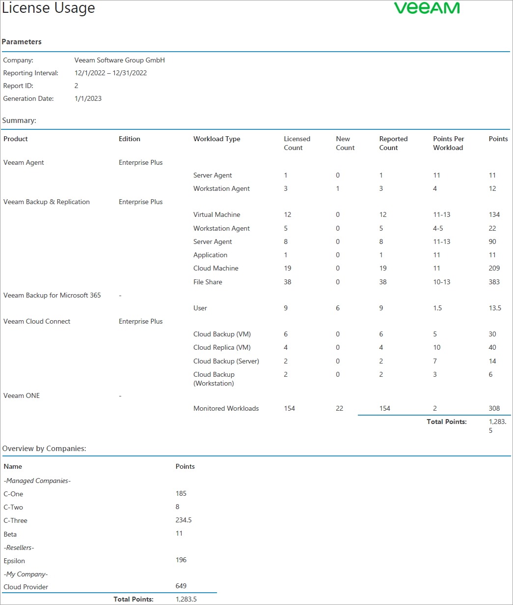
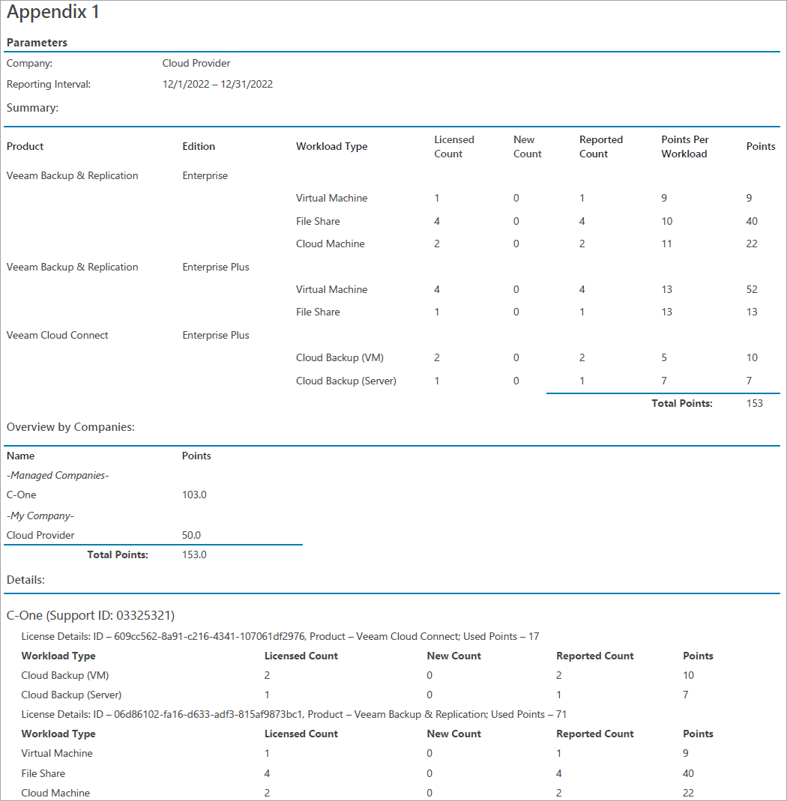

# Viewing License Usage Reports

You can view and download reports that reflect license usage for previous months. License usage reports are available for download as PDF files.

To view and download a consolidated license usage report:

1. Log in to Veeam Service Provider Console.

For details, see [Accessing Veeam Service Provider Console](access_vac.md).

1. At the top right corner of the Veeam Service Provider Console window, click Configuration.
2. In the menu on the left, click License Information.
3. Open the Usage Reports tab.
4. To narrow down the list of reports in the list, you can use the following filters:

* Status — limit the list of reports by approval status (Approved, Waiting for Approval).
* Period — limit the list of reports by time period when the reports were generated.

1. Choose the necessary report in the list and click a link in the Report column.

The report will be saved as a PDF file to the default download location on your computer.

An example of a consolidated license usage report is provided below.

The report shows the following information:

* [For Veeam Service Provider Console] the maximum number of Veeam backup agents managed in Veeam Service Provider Console for the previous month. It shows the number of workstation and server Veeam backup agents managed by each company, and the number of points these Veeam backup agents consume.

* [For Veeam Backup & Replication, Veeam ONE, Veeam Backup for Microsoft 365, Veeam Data Platform] the number of used points submitted in a license usage report on a client or hosted server.

* [For Veeam Cloud Connect] the number of points used to protect client and hosted workloads in Veeam Cloud Connect.

The report also shows the number of workloads removed when the report was adjusted.

|  |
| --- |
| Note: |
| * If you have one license key installed on multiple servers, Veeam Service Provider Console will add up points usage for all servers with the same license key. If you want to report points usage for all servers separately, you must install different license keys on these servers. * If a license installed on a managed server has a company name different from the service provider company, license usage for this server will not be included in the main report. License usage data for this server will be included in the report appendix.  * If you have cloned Veeam Backup & Replication servers with the same installation ID in your managed or hosted infrastructure, license usage data for these servers will not be included in the report. To report on license usage for cloned server, you must reset the backup server installation ID. For details, see [Resetting Veeam Backup & Replication Installation ID](vbr_reset_id.md). * In some cases, data collection from managed or hosted servers may fail. License usage data for these servers will be excluded from the report and you will have to submit license usage for these servers manually. * License usage data for servers with zero usage in the previous month will be excluded from the report. |

The Appendix of the report includes managed companies or resellers who have their own contract with Veeam. For every company and reseller, the Details section shows information on protected workloads including the workload type, number of licensed, new and reported workloads, and the number of consumed points.

