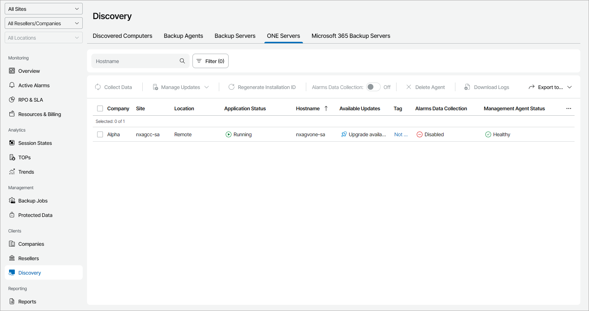

# Viewing and Exporting Veeam ONE Server Details

You can view details on managed Veeam ONE servers and export them to a CSV or XML file:

1. Log in to Veeam Service Provider Console.

For details, see [Accessing Veeam Service Provider Console](access_vac.md).

1. In the menu on the left, click Discovery.
2. Open the ONE Servers tab.

Veeam Service Provider Console will display a list of all managed Veeam ONE servers.

To narrow down the list of servers, you can apply the following filters:

* Application status — limit the list of servers by application status (Running, Not running, Unlicensed, Pending).
* Management agent status — limit the list of servers by management agent status (Healthy, Restarting, Warning, Error).
* Management agent version — limit the list of servers by management agent version (Up-to-date, Out-of-date, Patch available, N/A).
* Alarms data collection — limit the list of servers by alarms synchronization status (Enabled, Disabled, Error, Updating).
* Available updates — limit the list of servers by update status (Up-to-date, Update available, Attention required).

1. To export job details, click Export to and choose a format for the exported data:

* CSV — choose this option to structure exported data as a CSV file.
* XML — choose this option to structure exported data as an XML file.

The file with exported data will be saved to the default download location on your computer.

Each Veeam ONE server in the list is described with a set of properties. By default, some properties in the list are hidden. To display additional properties, click the ellipsis on the right of the list header and choose properties that must be displayed.

* Company — name of a company to which a Veeam ONE server belongs.

* Site — name of the Veeam Cloud Connect site on which the cloud tenant is registered.

* Location — name of a location to which a Veeam ONE server belongs.

* Application Status — status of the application running on a computer (Running, Not running).
* Hostname — name of a computer on which Veeam ONE server is deployed.

* Available Updates — update status of Veeam ONE server (Up-to-date, Upgrade available, Patch available, Manual upgrade required).

* Update Status — status of the Veeam ONE patching or upgrading task.
* Server Version — version of a Veeam ONE server.
* Tag — tag assigned to a Veeam ONE server.
* Alarms Data Collection — status of the alarms synchronization between Veeam ONE server and Veeam Service Provider Console (Enabled, Disabled, Error).
* Last Heartbeat — time period since a Veeam Service Provider Console management agent sent the latest heartbeat to Veeam Service Provider Console.
* Management Agent Status — Veeam Service Provider Console management agent status (Healthy, Warning, Error).

You can click the Error link to view error details.

* Upgrade File Download Status — status of the Veeam ONE upgrade file download.

You can click a link in the Upgrade File Download Status column to view the download progress or cancel the download.

* Scheduled Updates — date and time of the scheduled Veeam ONE patching or upgrading task.

You can click a link in the Scheduled Updates column to reschedule the task, start the task immediately or cancel the scheduled task.

* Management Agent Version — Veeam Service Provider Console management agent version.
* IP Address — IP address of a computer on which Veeam ONE server is deployed.
* [For Portal Administrator] Description — description of a Veeam ONE server.

