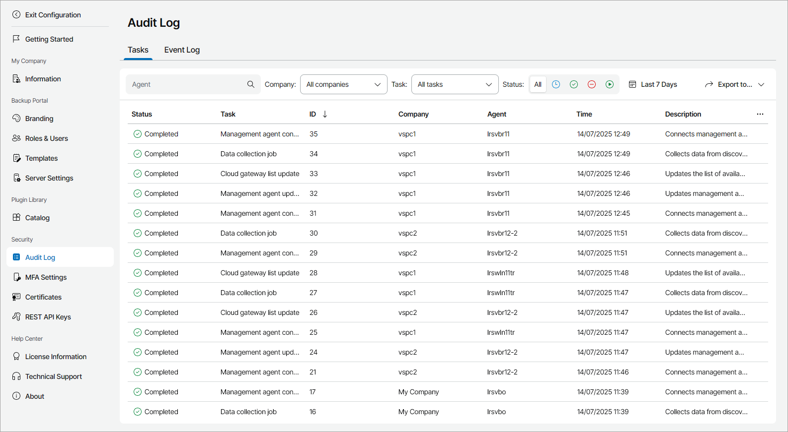
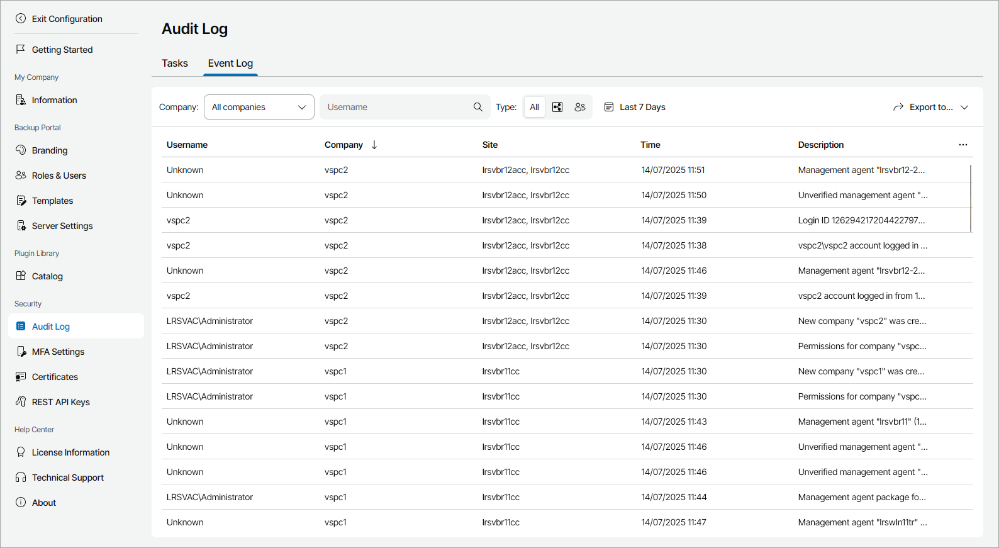

# Viewing and Exporting Task and Event Logs

Veeam Service Provider Console keeps a record of operations in task and event logs. The logs include statistics for the period configured in the retention settings. For details, see [Configuring Retention Settings](configure_retention_settings.md).

Required Privileges

To perform this task, a user must have one of the following roles assigned: Portal Administrator, Site Administrator.

Viewing and Exporting Task Details

The task log keeps a record of the most crucial operations that Veeam Service Provider Console management agents perform in the client managed infrastructure. Tasks include the installation or uninstallation of Veeam backup agents, starting or stopping backup jobs, and so on.

To view task log details and export them to a CSV or XML file:

1. Log in to Veeam Service Provider Console.

For details, see [Accessing Veeam Service Provider Console](access_vac.md).

1. At the top right corner of the Veeam Service Provider Console window, click Configuration.
2. In the configuration menu on the left, click Audit Log.

Veeam Service Provider Console will display the log on the Tasks tab.

1. To narrow down the list of records in the log, you can apply the following filters:

* Agent — search the list of tasks by the name of the machine on which the management agent is installed.
* Company — limit the list of tasks by the company for which the task was performed.
* Task — limit the list of tasks by type.
* Status — limit the list of tasks by status (Queued, Completed, Canceled, Initiated).
* Time period — limit the list of tasks by execution time.

1. To export task details, click Export to and choose the format of the exported data:

* CSV — choose this option to structure exported data as a CSV file.
* XML — choose this option to structure exported data as an XML file.

Veeam Service Provider Console will save the file with the exported data to the default download location on your computer.

Each task in the list is described with a set of properties.

* Status — status of the task.
* Task — type of the task.
* ID — ID of the task.
* Company — name of the company for which the task was performed.
* Site — Veeam Cloud Connect site on which the company is registered.
* Agent — name of the computer on which a Veeam Service Provider Console management agent performed the task.
* Time — time when the task was performed.
* Description — description of the task.

To view all Veeam Service Provider Console tasks and their description, see [Task Reference](appendix_tasks.md).

Viewing and Exporting Event Log Details

The event log keeps track of configuration-, management- and security-related events in Veeam Service Provider Console, for example:

* User account creation and management
* User login attempts and password changes
* Backup policy management
* MFA policy changes
* Company and reseller management

To view event log details and export them to a CSV or XML file:

1. Log in to Veeam Service Provider Console.

For details, see [Accessing Veeam Service Provider Console](access_vac.md).

1. At the top right corner of the Veeam Service Provider Console window, click Configuration.
2. In the configuration menu on the left, click Audit Log and open the Event Log tab.
3. To narrow down the list of records in the log, you can apply the following filters:

* Company — limit the list of events by company for which an event is performed.

* Username — limit the list of events by the name of a user who initiated the event.
* Type — limit the list of events by event type (Internal, External).
* Time period — limit the list of events by time of performance.

1. To export event details, click Export to and choose the format of the exported data:

* CSV — choose this option to structure exported data as a CSV file.
* XML — choose this option to structure exported data as an XML file.

The file with exported data will be saved to the default download location on your computer.

Each event in the list is described with a set of properties.

* Username — name of the user that initiated the event.
* Company — name of the company for which the event was performed.
* Site — Veeam Cloud Connect site on which the company is registered.
* Time — time when the event was performed.
* Description — description of the event.

Note that the event description only provides information about the IP address of the latest proxy server in the network path, and does not include whether the user logged in with MFA.

